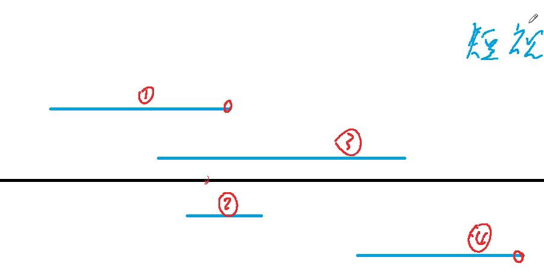

给定N个闭区间[ai,bi]，请你在数轴上选择尽量少的点，使得每个区间内至少包含一个选出的点。

输出选择的点的最小数量。

位于区间端点上的点也算作区间内。

输入格式
第一行包含整数N，表示区间数。

接下来N行，每行包含两个整数ai,bi，表示一个区间的两个端点。

输出格式
输出一个整数，表示所需的点的最小数量。

数据范围
1≤N≤105,
−109≤ai≤bi≤109
输入样例：
3
-1 1
2 4
3 5
输出样例：
2

## 分析


1. 按照区间右端点从小到大排序
2. 从前往后依次枚举每个区间，如果当前区间已经包含点，则直接pass，否则选择区间的最右侧端点（最大可能覆盖更多的区间）。

## 证明

证明A == B可以通过A <= B and B <= A
1. 设cnt是我们的解，ans是答案的最优解，从而得出cnt >= ans
2. 对于没有任何交错的区间，至少需要cnt个点，ans >= cnt
3. cnt == ans

## Code

```c
#include <bits/stdc++.h>

using namespace std;

const int N = 1e5 + 10;
pair<int, int> num[N];

int main() {
    int n;
    cin >> n;
    for (int i = 0; i < n; ++i) {
        scanf("%d %d", &num[i].first, &num[i].second);
    }
    sort(num, num + n, [](pair<int, int>& l, pair<int, int>& r) {
        return l.second < r.second;
    });
    int cMax = -2e9, res = 0;
    for (int i = 0; i < n; ++i) {
        if (num[i].first > cMax) {
            cMax = num[i].second;
            res ++;
        }
    }
    cout << res;
}
```