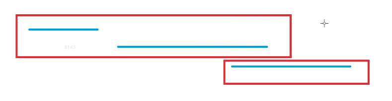

给定N个闭区间[ai,bi]，请你将这些区间分成若干组，使得每组内部的区间两两之间（包括端点）没有交集，并使得组数尽可能小。

输出最小组数。

输入格式
第一行包含整数N，表示区间数。

接下来N行，每行包含两个整数ai,bi，表示一个区间的两个端点。

输出格式
输出一个整数，表示最小组数。

数据范围
1≤N≤105,
−109≤ai≤bi≤109
输入样例：
3
-1 1
2 4
3 5
输出样例：
2

## 分析


1. 所有区间按照左端点排序
2. 从前往后处理每个区间
  1. 判断能否将其放入现在的某个组中L[i] > Max_r（判断上一个区间的最右是否包含当前点的最左端点）
  2. 更新当前的区间的最右

## Code

```c
#include <bits/stdc++.h>

using namespace std;
const int N = 1e5 + 10;
pair<int, int> num[N];
int main() {
    int n;
    cin >> n;
    for (int i = 0; i < n; ++i)
        scanf("%d %d", &num[i].first, &num[i].second);
    sort(num, num + n, [](pair<int, int>& l, pair<int, int>& r) {
        return l.first < r.first;
    });
    priority_queue<int, vector<int>, greater<int>> pq; // min Heap
    for (int i = 0; i < n; ++i) {
        auto r = num[i];    
        // need a new section since all the intervals in front all have an intersection with current one
        if (pq.empty() || pq.top() >= r.first) pq.push(r.second);
        // remove the smallest section and add the new one's end
        else {
            int t = pq.top();
            pq.pop();
            pq.push(r.second);
        }
    }
    cout << pq.size();
}
```

