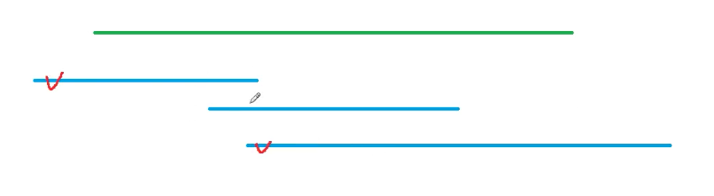

给定N个闭区间[ai,bi]以及一个线段区间[s,t]，请你选择尽量少的区间，将指定线段区间完全覆盖。

输出最少区间数，如果无法完全覆盖则输出-1。

输入格式
第一行包含两个整数s和t，表示给定线段区间的两个端点。

第二行包含整数N，表示给定区间数。

接下来N行，每行包含两个整数ai,bi，表示一个区间的两个端点。

输出格式
输出一个整数，表示所需最少区间数。

如果无解，则输出-1。

数据范围
1≤N≤105,
−109≤ai≤bi≤109,
−109≤s≤t≤109
输入样例：
1 5
3
-1 3
2 4
3 5
输出样例：
2

## 分析



1. 所有区间按照左端点排序（从小到大）
2. 从前往后枚举每个区间，选择右端点最大的区间，将右端点记做`start`，下一次查询的时候比较`start`

## Code

```c
#include <bits/stdc++.h>

using namespace std;
const int N = 1e5 + 10;
pair<int, int> num[N];
int main() {
    int n, s, t;
    cin >> s >> t;
    cin >> n;
    for (int i = 0; i < n; ++i)
        scanf("%d %d", &num[i].first, &num[i].second);
    sort(num, num + n, [](pair<int, int>& l, pair<int, int>& r) {
        return l.first < r.first;
    });
    int res = 0;
    bool success = false;
    for (int i = 0; i < n; ++i) {
        int j = i, r = -2e9;
        // find the largest right from all the interval that left is less than start
        while (j < n && num[j].first <= s) {
            r = max(r, num[j].second);
            j++;
        }
        
        // if still less than s, meaning not possible
        if (r < s) {
            res = -1;
            break;
        }
        res ++;
        
        // if current right already fullfilled the requirement
        if (r >= t) {
            success = true;
            break;
        }
        // update start to current furthest right
        s = r;
        i = j - 1;
    }
    if (!success) cout << -1;
    else cout << res;
}
```