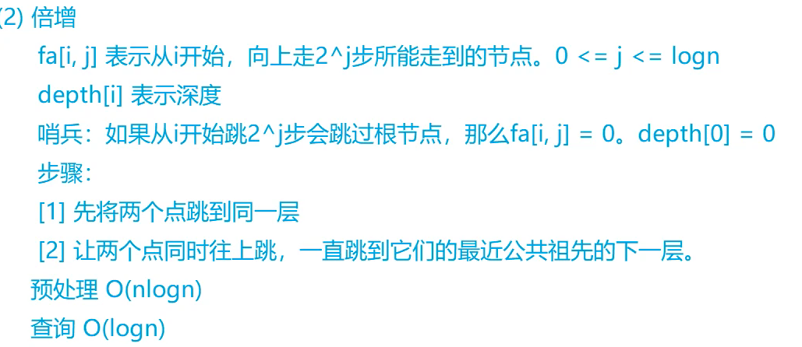

## 祖孙询问

https://www.acwing.com/problem/content/1174/

针对多个询问，但是非动态生成树的做法


### 代码

```c
#include <cstdio>
#include <cstring>
#include <iostream>
#include <algorithm>

using namespace std;

const int N = 40010, M = N * 2;

int n, m;
int h[N], e[M], ne[M], idx;
int depth[N], fa[N][16];
int q[N];

void add(int a, int b)
{
    e[idx] = b, ne[idx] = h[a], h[a] = idx ++ ;
}
// 建树和向上递增序列
void bfs(int root)
{
    memset(depth, 0x3f, sizeof depth);
    depth[0] = 0, depth[root] = 1;
    int hh = 0, tt = 0;
    q[0] = root;
    while (hh <= tt)
    {
        // queue.top() queue.pop()
        int t = q[hh ++ ];
        for (int i = h[t]; ~i; i = ne[i])
        {
            int j = e[i];
            if (depth[j] > depth[t] + 1)
            {
                depth[j] = depth[t] + 1;
                q[ ++ tt] = j;
                fa[j][0] = t;
                for (int k = 1; k <= 15; k ++ )
                    fa[j][k] = fa[fa[j][k - 1]][k - 1];
            }
        }
    }
}

int lca(int a, int b)
{
    if (depth[a] < depth[b]) swap(a, b);
    // 跳到同层
    for (int k = 15; k >= 0; k -- )
        if (depth[fa[a][k]] >= depth[b])
            a = fa[a][k];
    if (a == b) return a;
    // 继续上跳知道相遇
    for (int k = 15; k >= 0; k -- )
        if (fa[a][k] != fa[b][k])
        {
            a = fa[a][k];
            b = fa[b][k];
        }
    return fa[a][0];
}

int main()
{
    scanf("%d", &n);
    int root = 0;
    memset(h, -1, sizeof h);

    for (int i = 0; i < n; i ++ )
    {
        int a, b;
        scanf("%d%d", &a, &b);
        if (b == -1) root = a;
        else add(a, b), add(b, a);
    }

    bfs(root);

    scanf("%d", &m);
    while (m -- )
    {
        int a, b;
        scanf("%d%d", &a, &b);
        int p = lca(a, b);
        if (p == a) puts("1");
        else if (p == b) puts("2");
        else puts("0");
    }

    return 0;
}

作者：yxc
链接：https://www.acwing.com/activity/content/code/content/154772/
来源：AcWing
著作权归作者所有。商业转载请联系作者获得授权，非商业转载请注明出处。
```

