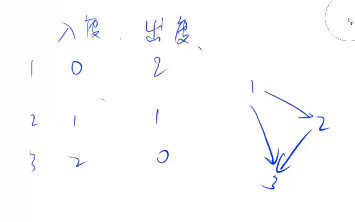

# Topological Sort

## Definition

1. DAG
2. No cycle: if no cycle -> has to have a Topological Sort order.

## in degree and out degree



## Proof on DAG w/o cycle has to have a node with in degree of 0

- Prove by contradiction
  - assume there is a DAG w/o cycle where all the nodes' in degree is greater than 0.
  - because each node has an in-node, we can follow the in node to expand backward, until we reach n nodes. However, for nth node, it also has a in node, which expand to n+1 th node. However, we only have n nodes, so that there is at least one nodes mentioned are the same. If two nodes are the same, then it has a cycle (if a path has two same nodes, then it's cycle for sure). 

## 848. 有向图的拓扑序列

> https://www.acwing.com/problem/content/850/

```c
#include <bits/stdc++.h>

using namespace std;

int main() {
    int n, m;
    cin >> n >> m;
    int degree[n + 1];
    vector<int> graph[n + 1];
    vector<int> order;
    memset(degree, 0, sizeof degree);
    int x, y; 
    queue<int> q;
    for (int i = 0; i < m; ++i) {
        cin >> x >> y;
        graph[x].push_back(y);
        degree[y]++;
    }
    for (int i = 1; i <= n; ++i)
        if (degree[i] == 0) q.push(i);
    while (!q.empty()) {
        int t = q.front();
        order.push_back(t);
        q.pop();
        for (int i = 0; i < graph[t].size(); ++i) {
            if (--degree[graph[t][i]] == 0) q.push(graph[t][i]);
        }
    }
    if (order.size() == n) {
        for (int i : order)
            cout << i << " ";
    } else {
        cout << -1;
    }
}
```