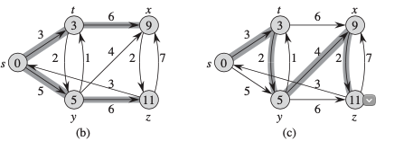

# Shortest Path Problem

## Single Source shortest path problem

1. Find the shortest src to a target dest: reversing the direction of the DAG -> find the shortest path starting from dest
2. Find shortest path between u and v.
3. Find shortest path for all pair u and v.

## Negative Edge

If graph has cycle: short path isn't well defined.

Dijkstra: has to be positive edge, can deal with cycle
Bellman Ford: cannot have a cycle from src but can deal with negative edge (single source shortest path)

Shortest path cannot contain a cycle

## Uniqueness

Shortest paths are not necessary unique:


## Dijkstra

More efficient than Bellman Ford but requires the edges are positive weight.

The algorithm only traverse each node once, and greedily choose the shortest path to reach the current node (using priority queue).

```c
for (int i = 1; i <= n; i++) distance[i] = INF; distance[x] = 0;
q.push({0,x});
while (!q.empty()) {
    int a = q.top().second; 
    q.pop(); 
    if (processed[a]) continue; 
    processed[a] = true;
    for (auto u : adj[a]) {
        int b = u.first, w = u.second;
        if (distance[a]+w < distance[b]) {
            distance[b] = distance[a]+w;
            q.push({-distance[b],b}); 
        }
    } 
}
     
```

Time: $O(n + m log m)$

## Bellman Ford

Find the shortest path from one src to all the others. If there is a negative cycle, it will be able to detect it.

```c
for (int i = 1; i <= n; i++) distance[i] = INF; distance[x] = 0;
for (int i = 1; i <= n-1; i++) {
    for (auto e : edges) {
       int a, b, w;
       tie(a, b, w) = e;
       distance[b] = min(distance[b], distance[a]+w);
    }
}

for (auto e : edge) {
    int a, b, w;
    tie(a, b, w) = e;
    if (distance[a] + w < distance[b])
        return false; // negative cycle
}
```

Time: $O(m \times n)$ n node with m edges

## Floyd-Warshall (find all shortest path for all pairs)

First initialize the distance list with direct connected nodes' distance.

```c
for (int i = 1; i <= n; i++) {
    for (int j = 1; j <= n; j++) {
       if (i == j) distance[i][j] = 0;
       else if (adj[i][j]) distance[i][j] = adj[i][j];
       else distance[i][j] = INF; 
    } 
}

```

Then keep adding the intermediate nodes k, and base on the new graph update the distance list.

```c
for (int k = 1; k <= n; k++) { // added node
    for (int i = 1; i <= n; i++) {
        for (int j = 1; j <= n; j++) {
            distance[i][j] = min(distance[i][j],
                                 distance[i][k] + distance[k][j]);
        } 
    }
}
```

Time: $O(n^3)$ for the second step