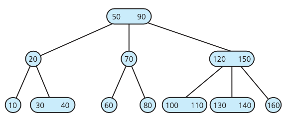
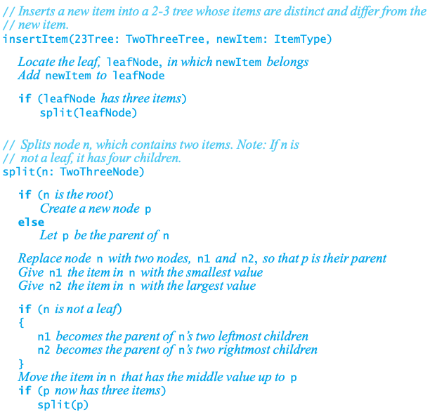
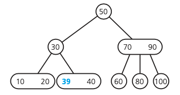
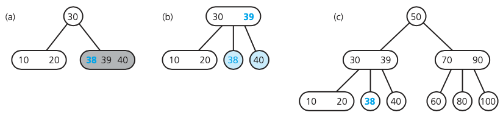
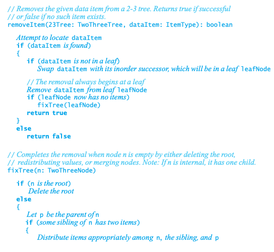
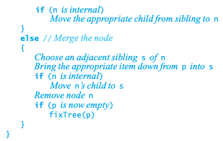

## 2-3 tree

Each node can either have 2 or 3 children (so it's not a binary tree) AND all leaves are at the same level

The 2-3 Tree properties must always hold after we are done with the operation, so that the tree remains balanced. Thus, we must ensure that all leaves are at the same level, two-key nodes have three children, one-key nodes have two children, and we can’t have any number other than 1 or 2 keys in one node.

Note that each node can have either 1 (with 2 children) value or 2 (with 3 children) values. See illustration:



### Define a 2-3 tree

```c++
#ifndef _TRI_NODE
#define _TRI_NODE

template<class ItemType>
class TriNode
{
private:
    ItemType smallItem, largeItem; // Data portion
    TriNode<ItemType>* leftChildPtr;
    TriNode<ItemType>* midChildPtr;
    TriNode<ItemType>* rightChildPtr;
public:
    TriNode();
    TriNode(const ItemType& anItem);
    TriNode(const ItemType& anItem, TriNode<ItemType>* leftPtr, 
            TriNode<ItemType>* midPtr, TriNode<ItemType>* rightPtr);
    bool isLeaf() const;
    bool isTwoNode() const;
    bool isThreeNode() const;
    
    ItemType getSmallItem() const;
    ItemType getLargeItem() const;
    
    void setSamllItem(const ItemType& anItem);
    void setLargeItem(const ItemType& anItem);
    TriNode<ItemType>* getLeftChildPtr() const; 
    TriNode<ItemType>* getMidChildPtr() const; 
    TriNode<ItemType>* getRightChildPtr() const;
    void setLeftChildPtr(TriNode<ItemType>* leftPtr); 
    void setMidChildPtr(TriNode<ItemType>* midPtr); 
    void setRightChildPtr(TriNode<ItemType>* rightPtr);
}; // end TriNode
#include "TriNode"
#endif
```

### Insertion

1. check if the place to be inserted is single node, if yes, make it to two nodes
2. if it is already two nodes, promote the middle node to its parent
3. if parent is full, recursively promote to its parent again
4. if current node after promote (will always create an additional node for current parent) has more than the nodes it could have on the current level, split the root into two parts: left and right, and the mid will be promoted to its parent again.

**psuedo code**



Insert 39:



Insert 38:



### Deletion

**psuedo code**




### Traverse

```c
// Traverses a nonempty 2-3 tree in sorted order. 
inorder(23Tree: TwoThreeTree): void
  if (23Tree’s root node r is a leaf) Visit the data item(s)
  else if (r has two data items) {
      inorder(left subtree of 23Tree’s root) Visit the first data item
      inorder(middle subtree of 23Tree’s root) Visit the second data item
      inorder(right subtree of 23Tree’s root) 
  }
  else // r has one data item {
    inorder(left subtree of 23Tree’s root) Visit the data item
    inorder(right subtree of 23Tree’s root)
  }
```