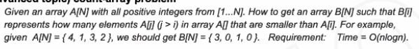
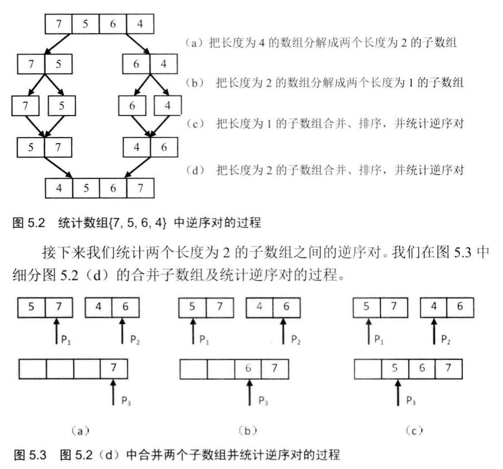
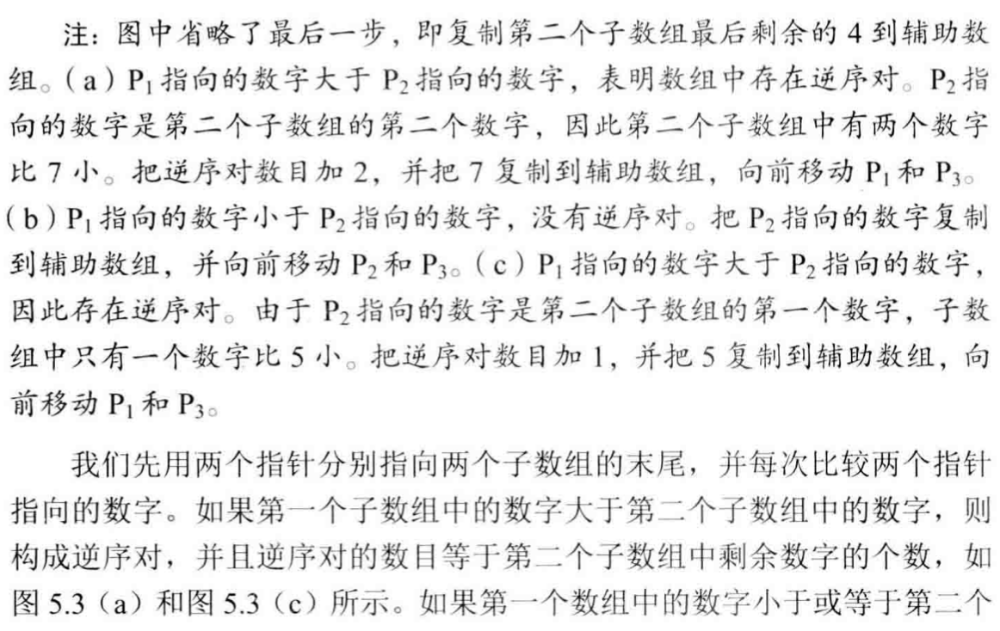
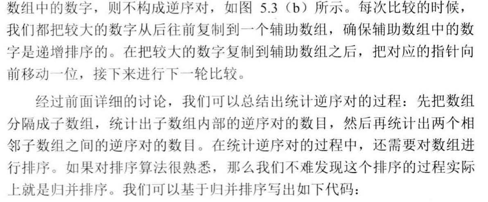

How to make the Time Complexity into O(n * log n)

## Analysis

B[i] represents number of element in A[i-j] that is less than B[i]

使用谁小移谁:





## Code

```c
#include<cstdio>
#include<algorithm>

using namespace std;

typedef long long LL;

const int N = 500010;

int n, m;
int a[N], b[N];

int find(int x)
{
    int l = 1, r = m;
    while(l < r)
    {
        int mid = l + r >> 1;
        if(b[mid] >= x)  r = mid;
        else l = mid + 1;
    }
    return l;
}

int tr[N];

void add(int x)
{
    for(int i = x; i <= m; i += i & -i)  tr[i] ++;
}

int sum(int x)
{
    int res = 0;
    for(int i = x; i; i -= i & -i)  res += tr[i];
    return res;
}

int main()
{
    scanf("%d", &n);
    for(int i = 1; i <= n; i ++)  scanf("%d", &a[i]),  b[i] = a[i];

    sort(b + 1, b + n + 1);

    m = 1;
    for(int i = 2; i <= n; i ++)
        if(b[i] != b[m])  b[++ m] = b[i];

    LL res = 0;
    for(int i = 1; i <= n; i ++)
    {
        int x = find(a[i]);
        res += sum(m) - sum(x);
        add(x);
    }
    printf("%lld", res);
    return 0;
}

作者：滑稽_ωﾉ
链接：https://www.acwing.com/file_system/file/content/whole/index/content/504568/
来源：AcWing
著作权归作者所有。商业转载请联系作者获得授权，非商业转载请注明出处。
```

