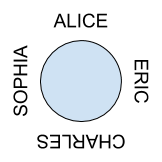

## Q1. Recruiting Event Schedules

Our company is organizing a series of university recruiting events. Each day, we host an event at one university, but sometimes we want to take a break for one day before moving on to the next university.


Given a sequence of universities, print all possible schedules of the recruiting events.


Input: a string of universities. Each university is represented as a single capital letter.

Output: all possible schedules. A lowercase letter “x” means we take a break.


Example

Input: String = “ABC”

Output:

ABC

ABxC

AxBC

AxBxC

### Analysis

- High Level: DFS, where each node has two branches: choose x or not
- There are n levels, and the last level has $2^n$ nodes, which means the time complexity is $O(2^n)$, and space complexity is $O(n)$

### Code

```java
package test;

public class RecruitingEventSchedules {
	private void dfs(String input, StringBuilder curr, int idx) {
		if (idx == input.length()) {
			System.out.println(curr);
			return ;
		}
		// without x
		curr.append(input.charAt(idx));
		dfs(input, curr, idx + 1);
		curr.deleteCharAt(curr.length() - 1);
		
		// with x
		if (curr.length() <= 0) return ;
		curr.append('x');
		curr.append(input.charAt(idx));
		dfs(input, curr, idx + 1);
		curr.deleteCharAt(curr.length() - 1);
		curr.deleteCharAt(curr.length() - 1);
	}

	public static void main(String[] args) {
		// TODO Auto-generated method stub
		String t1 = "ABC";
		String t2 = "A";
		String t3 = "";
		RecruitingEventSchedules sol = new RecruitingEventSchedules();
		/*
		 *	ABC
			ABxC
			AxBC
			AxBxC
		 */
		sol.dfs(t1, new StringBuilder(), 0);
		sol.dfs(t2, new StringBuilder(), 0); // A
		sol.dfs(t3, new StringBuilder(), 0); // ""
	}

}
```

## Q2. Cousins in a Binary Tree

In a binary tree, two nodes are cousins of each other if they are at the same level and have different parents.


For example, in the following tree:


```
                     6

                  /     \

               3            5

            /     \      /     \

           7       8    1       2
```

7 and 1 are cousins.

3 and 5 are not cousins.

7 and 5 are not cousins.


Given a binary tree and two nodes, determine if the two nodes are cousins or not.

### Analysis: BFS method

- Assumption: if two nodes both don't exist, return false
- High Level: Using BFS to do a level-order traversal, then make judgement base on the 1. same parent or not, 2. same level or not.
- Time Complexity: $O(n)$
- Space Complexity: $O(n)$

### Code in Cpp: BFS

```c
/**
 * Definition for a binary tree node.
 * struct TreeNode {
 *     int val;
 *     TreeNode *left;
 *     TreeNode *right;
 *     TreeNode(int x) : val(x), left(NULL), right(NULL) {}
 * };
 */
class Solution {
public:
    bool isCousins(TreeNode* root, int x, int y) {
        queue<TreeNode*> q({root});
        while (!q.empty()) {
            int sz = q.size();
            bool left = false, right = false;
            while (sz--) {
                TreeNode* curr = q.front();
                q.pop();
                if (curr -> val == x)
                    left = true;
                if (curr -> val == y)
                    right = true;              
                if (left && right)
                    return true;
                if (curr -> left)
                    q.push(curr -> left);
                if (curr -> right)
                    q.push(curr -> right);
                // check if sharing same parent for next level, so that on current level we don't need to do a same check again
                if (curr -> left && curr -> right) {
                    if (curr -> left -> val == x && curr -> right -> val == y)
                        return false;
                    else if (curr -> right -> val == x && curr -> left -> val == y)
                        return false;
                }
            }
        }
        return false;
        
    }
};
```

### Analysis: LCA method

- Assumption: if two nodes both don't exist, return false
- High Level: using LCA to find if two nodes share the same ancestor, and then check the level
  - Base case: DFS finish but not be able to find the node -> root == null then return special value -1, DFS current node is one of node a OR node b -> return current level.
  - Recursive Rule: do a Post-order traversal, grab the level of two nodes and check current level, two nodes levels.
  - Return: only return the level that has found the LCA.

### Code: LCA

```c
public boolean findCusion(TreeNode root, TreeNode a, TreeNode b) {
    if (root == null || a == null || b == null) return false;
    boolean[] res = new boolean[]{false};
    dfs(root, a, b, 0, res);
    return res[0];
}

public int dfs(TreeNode root, TreeNode a, TreeNode b, int level, boolean[] res) {
    if (root == null) return -1;
    if (root == a || root == b) return level;
    int left = dfs(root.left, a, b, level + 1, res);
    int right = dfs(root.right, a, b, level + 1, res);
    if (left == right && left - level > 1) res[0] = true;
    return left == -1 ? right : left;
}
```

## Q3. Packing Up the Swags

Given a positive integer n, find the least number of perfect square numbers (for example, 1, 4, 9, 16, ...) which sum to n.

Example 1:

Input: n = 12
Output: 3 
Explanation: 12 = 4 + 4 + 4.
Example 2:

Input: n = 13
Output: 2
Explanation: 13 = 4 + 9.

### Analysis

- Assumption: for n = 0, return 0
- High Level: using DP to record all the previous calculated configuration for 0 to n - 1, and find the smallest one among them to contruct current one
- Recursive Rule: dp[i] = min(dp[i - sqrt(i)] to dp[i - 1]) + 1
- Notice: don't forget the case when n == perfect square number, in this case, set it to 1

### Code: Cpp

```c
class Solution {
public:
    int numSquares(int n) {
        int dp[n + 1], inf = 0x3f3f3f3f;
        memset(dp, inf, sizeof dp);
        for (int i = 0; i <= n; ++i) {
            for (int j = 1; j * j <= i; ++j) {
                if (i - j * j >= 0) dp[i] = min(dp[i], dp[i - j * j] + 1);
                if (j * j == i) dp[i] = 1;
            }
        }
        return dp[n];
    }
};
```

## Q4. Infinite Loop Around the Dinner Table

After the event, our company will take the students out for dinner. The restaurant has a large round table that can fit the whole party. We want to know if we can arrange the students so that the names of all students around the table form an “infinite loop.” For each pair of neighboring students s1 and s2, the last letter of s1’s name must be identical to the first letter of s2’s name.


For example, “ALICE” and “ERIC” can sit together, but “ALICE” and “BOB” cannot.


Given an array of names, determine if it is possible to arrange the students at the round table in this way.


Input: an array of names. Each name contains capital letters only.

Output: true or false.


Example

Input: String[] = {“ALICE”, “CHARLES”, “ERIC”, “SOPHIA”}

Output: true



### Analysis: Check cycle in graph

- Assumption: each string has a length >= 1, if length is 1, then start == end.
- High Level: DFS/BFS to check the cycle in the graph. If the graph has a cycle AND all the nodes has visited, then return true.
- Build Graph: each node is a letter, and it's a DAG. E.g. "ABC" then "A" points to "C", for two letters: "ABC" and "CBF", then the graph will look like A -> C -> F

### Analysis: Permutation

- High Level: because the final configuration has to be one of the permutation of the current array, we can just check all the permutation.
- Time Complexity: $O(n!)$
- Space Compleity: $O(n)$

### Code: Permutation

```java
public boolean canChain(String[] strArr) {
    return helper(strArr, 1);
}

public boolean helper(String[] strArr, int index) {
    if (index == strArr.length) return canConnect(strArr[index - 1], strArr[0]); // head -> tail
    for (int i = index; i < strArr.length; ++i) {
        if (canConnect(strArr[index[i - 1], strArr[i])) {
            swap(strArr, index, i);
            if (helper(strArr, index + 1)) return true;
            swap(strArr, i, index);
        }
    }
    return false;
}

private boolean canConnect(String s1, String s2) {
    return s1.charAt(s1.length() - 1) == s2.charAt(0);
}
```


