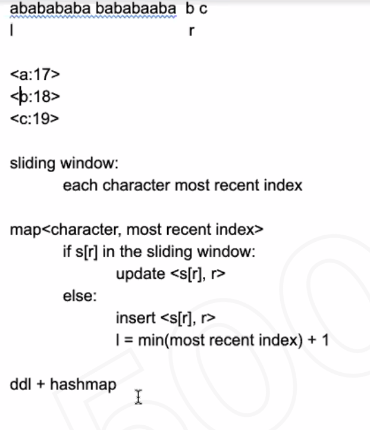

# Find longest substring at most k characters

E.G. s="ddfaaaabbbca", k=2 return 7 (longest substring size with at most k characters)

## Verification/Clarification

1. signacture:`int solve(string, int)`
2. k > 0 and if k > distinct chars size then return string.size()

## Analysis

- Use a sliding window to capture all the substring with distinct chars <= k
- keep current distinct elements
- keep two pointers left and right
  - move right+1 and update current
  - keep moving left until curr is greater than k
  - now left - right has k distinct elements, so update global count
- return global length

## Code

```c
#include <bits/stdc++.h>

using namespace std;

int main() {
  string s;
  int k;
  cin >> k;
  cin >> s;

  int res = 0, curr = 0;
  int cnt[26];
  memset(cnt, 0, sizeof cnt);
  int n = s.size();
  for (int i = 0, j = 0; i < n; ++i) { // j is left, i is right
    if (cnt[s[i] - 'a']++ == 0) curr++; // keep track of the distinct element in [j:i]
    while (curr > k) {
      if (--cnt[s[j] - 'a'] == 0) curr--;
      ++j;
    }
    res = max(res, i - j + 1);
  }
  cout << res;
  return 0;
}
```

## Followup

What if is a stream of data? How to decrease space complexity?

Manage duplcates: 




