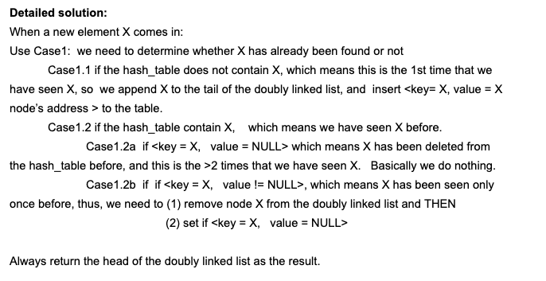

Given a stream of characters, find the first non-repeating character from stream. You need to tell the first non-repeating character in O(1) time at any moment.

Implement two methods of the class:

read() - read one character from the stream
firstNonRepeating() - return the first non-repoeating character from the stream at any time when calling the method, return null if there does not exist such characters
Examples:

read:
```
a   b   c   a   c   c    b
```

firstNonRepeating:

```
a   a   a   b   b   b   null
```

> https://app.laicode.io/app/problem/288

## Analysis

High Level:

1. Need to keep record of all the unique charecter seen so far **in time order* -> linkedlist to keep the order
2. Need to delete the character when there is a duplicate one from the stream -> hashmap to track the relationship between the unique character and its position in the linkedlist
3. Need to add unique character if not been seen so far -> a hashset to keep record all the unique character



## Code

```java
public class Solution {
  static class Node {
    Node prev;
    Node next;
    Character ch;
    Node(Character ch) {
      this.ch = ch;
    }
  }

  // only the char appears once can be appended to the linkedlist
  private Node head, tail;
  private HashMap<Character, Node> singled;
  private HashSet<Character> repeated;
  public Solution() {
    // Initialize the class.
    tail = new Node(null);
    tail.next = tail.prev = tail;
    head = tail;
    singled = new HashMap<Character, Node>();
    repeated = new HashSet<Character>();
  }
  
  public void read(char ch) {
    // appears more than once
    if (repeated.contains(ch)) {
      return ;
    }
    Node node = singled.get(ch);
    if (node == null) { // doesn't exist in the map -> never appear
      node = new Node(ch);
      append(node);
    } else { // appear once
      remove(node);
    }
  }
  private void append(Node node) { // add to the linkedlist and the map
    singled.put(node.ch, node);
    tail.next = node;
    node.prev = tail;
    node.next = head; // circle Linkedlist
    tail = tail.next;
  }
  private void remove(Node node) { // remove from the linkedlist and the map and add to the set (in the future don't accept any)
    node.prev.next = node.next;
    node.next.prev = node.prev;
    if (node == tail) {
      tail = node.prev;
    }
    node.prev = node.next = null;
    repeated.add(node.ch);
    singled.remove(node.ch);
  }
  public Character firstNonRepeating() {
    // Implement this method here.
    if (head == tail) return null;
    return head.next.ch;
  }
}
```