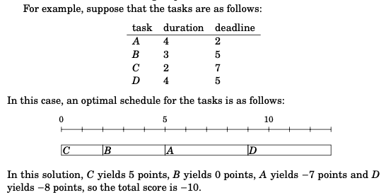

## Coin: goal is to minimize the total number of coins **cannot be solved by using greedy**

Given a list of all avalible coins = ${c_1, c_2, c_3, ..., c_k}$ and each coin can be used as many times as we want, what is the minimum number of coins needed?

NOTE: this problem cannot be solved by greedy algorithm! We can prove that a greedy algorithm does not work by showing a counterexample where the algorithm gives a wrong answer. In this problem we can easily find a counterexample: if the coins are {1,3,4} and the target sum is 6, the greedy algorithm produces the solution 4 + 1 + 1 while the optimal solution is 3 + 3.

## Schedulin: goal is to maximize the **number** of jobs

Given a list of intervals, your job is to find the maximum of intervals from the list that do not intersect with any two. E.G. [1,3],[2,5],[3,9],[6,8] => choose either [[1,3], [3,9]] or [[2,5],[6,8]] will work (notice that you can have multiple answers, but we are looking for the maxmium count/number but not each configurations).

To solve this classic problem, we can sort each interval by its' ending timestamp, then starting from the left (earliest ending time) we choose the intervals that do not intersection will previous right most boundary.

* LC646. Maximum Length of Pair Chain, LC253. Meeting Room II

## Task and deadlines: goal is to maximize the total points/scores

Given a list of tasks with durations and deadlines, your job is to find the maximum points from scheduling these tasks. To calculate score: d(deadline) - x(finish time). E.G. 

To solve this problem, instead of sorting by ending/deadline, we just need to sort by durations. We have to include all the intervals in this case, so the first thing is to make sure shorter tasks get finished earlier so that they won't "lagged back" the remaining tasks, since the score depends the completion time of each interval. From here, we can find that the answer doesn't depend on deadline at all (if we assume score can be negative).