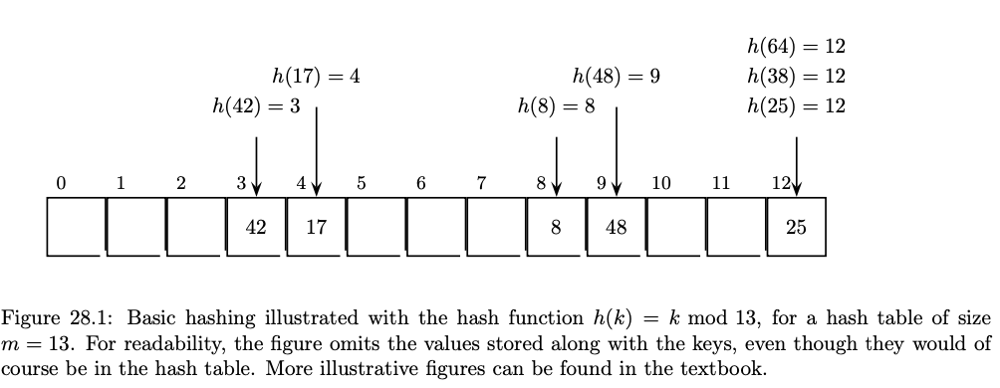

# Hashmap

## Terms

- **Collision**: when two keys' hash values are the same, they are going to map to the two same location in the array.
- **Load Factor**:  assume your hash table has size m, which means that there is room for up to m items in it. But we also care about how many elements we are actually storing in the array right now — we denote this number by s. The ratio $alpha = \frac{s}{m}$ is called the _load factor_ of the hash table. When it is small, there is a lot of room in the table. If it ever exceeds 1, we are guaranteed that a collision must have occurre.


Typically, load factor maintains the ratio of number of `<key, value>` pairs / number of buckets. Usually it's under 1/2.



> This array has a loading factor of 7/13.

- **Hashing Function**: So how many random keys do we need to draw until we expect to see our first collision? There are m possible indices of h(k) we can draw, and if any two draws have the same index, then we have a collision. This is exactly an instance of the Birthday Paradox, so we would expect our first collision to occur around key number $\theta(\sqrt{m})$. In other words, even if we think that the keys are drawn randomly (which should be pretty friendly to the hash table), the first collisions should occur around load factor $\alpha = \theta(\sqrt{m})$. This is all the more reason why we will need to deal with collisions below.

- Modulo Arithmetic: $h(k) = k$ mod $m$ the problem is that it might get very clustered key items in particular digits (e.g. m = 10 then all the if all numbers has the same last two digits will fall into the same key). Solution: choose a large prime number.

- **Chaining**: using a linkedlist to store all the collide values, do a linear scan to check if exist in the linkedlist.

Time Complexity: assume the size of each linkedlist is $l_i$, and we have $s$ elements in total, then the possibability for a given element to fall on $l_i$ is $l_i / s$, it will take $\theta(l_i)$ to find in the linkedlist. Thus the total time complexity is $\theta (\frac{1}{s} \times \sum_i l_i^{2})$

- **Probing or Open Addressing**: use only one list to store all the values, and find the next avaliable location for inserting if there is a collision.

1. Linear Probing: if position i is occupied, then try i + 1, i + 2... until find the first free place. In practice it's a bad idea: assume you have filled 0, ..., m / 2 positions in the list. The possibability of filling next element that will fall in 0, ..., m / 2 is 1/2, which will take m/2 + 1 operations to find the next avaliable place. 

TODO: add open addressing

## Designing Thread Safe Lookup table (hashmap or `std::map<T,T>`)

* One solution to prevent data racing is by adding mutex lock everytime we want to do any operation. Can we do better?
* There are three common ways of implementing an associateive container like lookup table:
  * A balanced binary tree, such as red-black tree (have to lock the root, which has no difference than locking the entire tree)
  * A sorted array (still have to lock the entire array)
  * A hash table (**we can just lock the bucket we are accessing!**)

### Example implementation

```c
template <typename Key, typename Value, typename Hash = std::hash<Key>>
class threadsafe_lookup_table {
private:
  class bucket_type {
  public:
    Value value_for(Key const &key, Value const &default_value) const {
      std::shared_lock<std::shared_mutex> lock(mutex);
      bucket_iterator const found_entry = find_entry_for(key);
      return (found_entry == data.end()) ? default_value : found_entry->second;
    }

    void add_or_update_mapping(Key const &key, Value const &value) {
      std::unique_lock<std::shared_mutex> lock(mutex);
      bucket_iterator const found_entry = find_entry_for(key);
      return (found_entry == data.end()) ? default_value : found_entry->second;
    }

    void remove_mapping(Key const &key) {
      std::unique_lock<std::shared_mutex> lock(mutex);
      bucket_iterator const found_entry = find_entry_for(key);
      if (found_entry != data.end())
        data.erase(found_entry);
    }

  private:
    typedef std::pair<Key, Value> bucket_value;
    typedef std::list<bucket_value> bucket_data;
    typedef typename bucket_data::iterator bucket_iterator;
    bucket_data data;
    mutable std::shared_mutex mutex;

    bucket_iterator find_entry_for(Key const &key) const {
      return std::find_if(
          data.begin(), data.end(),
          [&](bucket_value const &item) { return item.first == key; });
    }
  };
  std::vector<std::unique_lock<bucket_type>> buckets;
  Hash hasher;
  bucket_type &get_bucket(Key const &key) const {
    std::size_t const bucket_index = hasher(key) % buckets.size();
    return *buckets[bucket_index];
  }

public:
  typedef Key key_type;
  typedef Value mapped_type;
  typedef Hash hash_type;
  threadsafe_lookup_table(unsigned num_buckets = 19, // arbitary prime number
                          Hash const &hasher_ = Hash())
      : buckets(num_buckets), hasher(hasher_) {
    for (unsigned i = 0; i < num_buckets; ++i) {
      buckets[i].reset(new bucket_type);
    }
  }
  threadsafe_lookup_table(threadsafe_lookup_table const &other) = delete;
  threadsafe_lookup_table & operator=(threadsafe_lookup_table const &other) = delete;
  Value value_for(Key const &key, Value const &default_value = Value()) const {
    return get_bucket(key).value_for(key, default_value);
  }
  void add_or_update_mapping(Key const &key, Value const &value) {
    get_bucket(key).add_or_update_mapping(key, value);
  }
  void remove_mapping(Key const &key) { get_bucket(key).remove_mapping(key); }
};
```