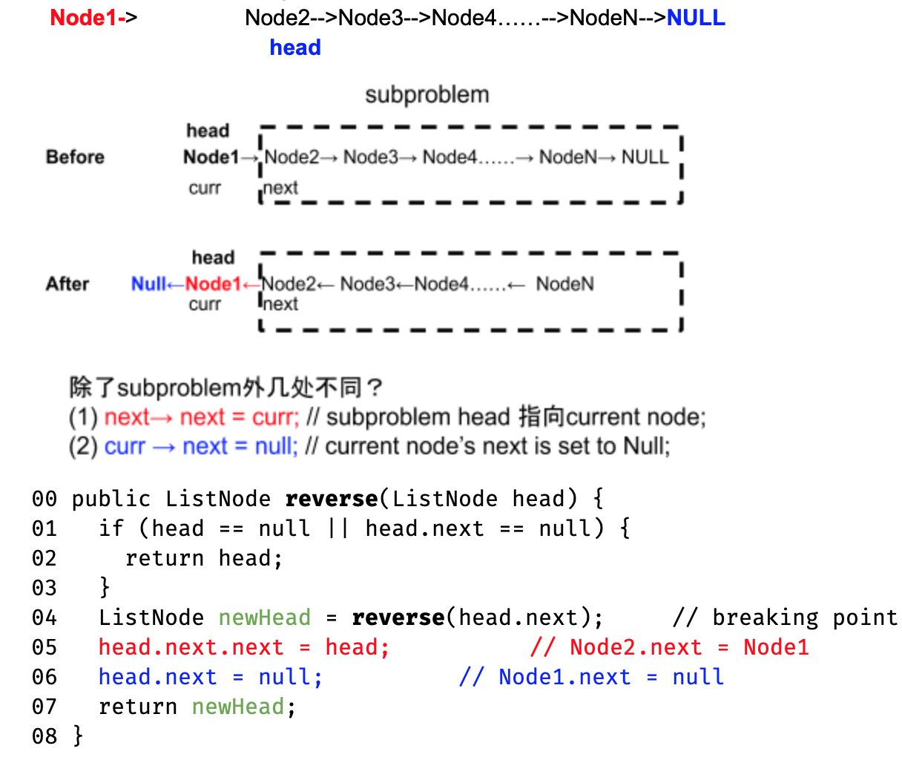

## Define

Logically consecutive list, but physically not consecutive

## Q1: reverse Linkedlist

Need two pointers: one for previous, one for curr; reverse is simply change the direction

### Recursion



```c
ListNode* reverse(ListNode* head) {
    if (!head || !head -> next) return head;
    ListNode* res = reverse(head -> next); // this will get the last node from the origional linkedlist
    head -> next -> next = head;
    head -> next = NULL;
    return res;
}
```

## Q2: insert into sorted linkedlist

```c
ListNode* insert(ListNode* head, int value) {
    // write your solution here
    ListNode* node = new ListNode(value);
    if (!head || head -> value >= value) {
      node -> next = head;
      head = node;
      return head;
    }
    ListNode *curr = head -> next, *pre = head;
    while (curr) {
      if (curr -> value >= value && pre -> value <= value) break;
      curr = curr -> next;
      pre = pre -> next;
    }
    pre -> next = node;
    node -> next = curr;
    return head;
}
```

## Q3: reorganize linkedlist

Reorder the given singly-linked list N1 -> N2 -> N3 -> N4 -> … -> Nn -> null to be N1- > Nn -> N2 -> Nn-1 -> N3 -> Nn-2 -> … -> null

```c
ListNode* reorder(ListNode* head) {
    // write your solution here
    if (!head || !head->next)
      return head;
    ListNode *res = head;
    ListNode *slow = head, *fast = head;
    // find mid point
    while (fast->next && fast->next->next) {
      slow = slow->next;
      fast = fast->next->next;
    }
    ListNode* mid = slow->next;
    slow->next = NULL; // break the list
    // reverse the mid - end
    ListNode *last = mid, *pre = NULL;
    while (last) {
      ListNode* next = last->next;
      last->next = pre;
      pre = last;
      last = next;
    }
    // re-combine together
    while (head && pre) {
      ListNode* next = head->next;
      head->next = pre;
      pre = pre->next;
      head->next->next = next;
      head = next;
    }
    return res;
}
```

## Q4: partition list

L = 2 -> 4 -> 3 -> 5 -> 1 -> null, T = 3, is partitioned to 2 -> 1 -> 4 -> 3 -> 5 -> null

```c
ListNode* partition(ListNode* head, int x) {
    if (head == nullptr) return head;
        
    ListNode lesser, greater;
    ListNode* p1 = &lesser;
    ListNode* p2 = &greater;
    
    while (head) {
        if (head->val < x) {
            p1->next = head;
            p1 = p1->next;
        } else {
            p2->next = head;
            p2 = p2->next;
        }
        head = head->next;
    }

    p1->next = greater.next;
    p2->next = nullptr;
    return lesser.next; 
}
```