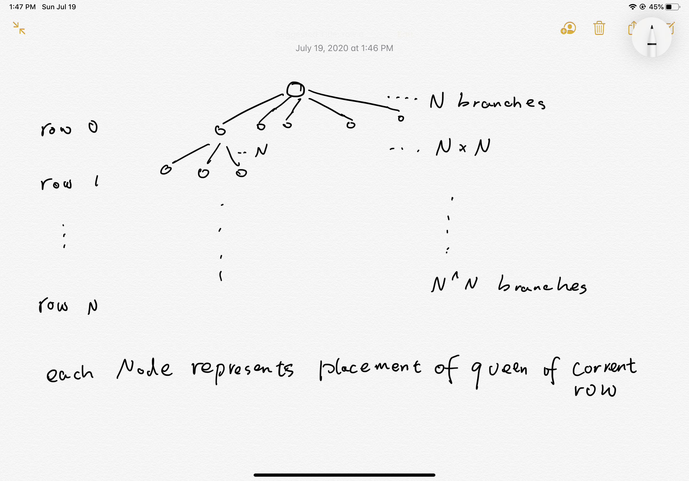
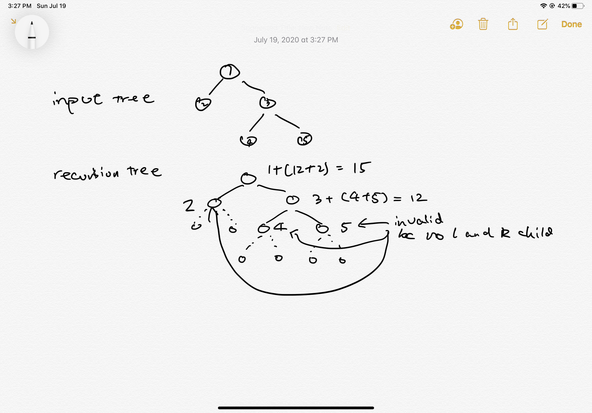
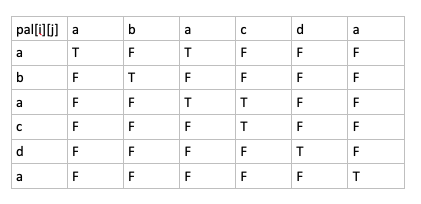
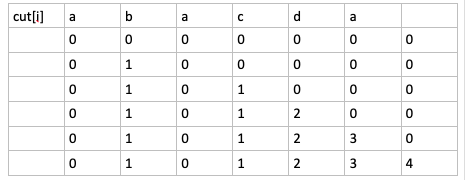
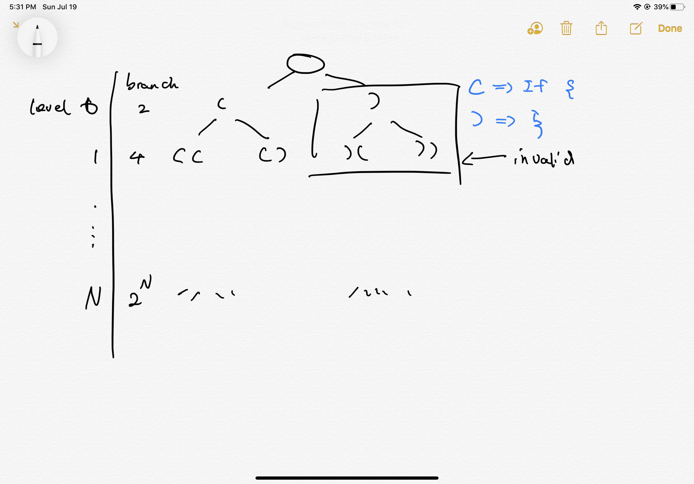

# Midterm

## P1: N queens

Find all valid ways of putting N Queens on an N * N chessboard so that no two Queens can attack each other (two queens can attack each other if they are on the same row/column or same diagonal line). 

You can define your own way of how to print the solution, e.g. using a size N array/List to record which column the queen occupies on each row

### Analysis

Assumption:

1. Use array `curr` to represent the solution: one `index` row, place a queen on `curr[index]` column to represent the complete configuration.
2. If there are no solutions (e.g. when N <= 3), return an empty array.

Approach:
1. High Level: use DFS
2. Details: 
  - Starting from the first row, try placing the queen from the column 0 to column N-1. After the first placement, begin another placement for second row.
  - In order to check if the current row and column can be placed a queen, we need to have a hashset for storing all the visited queens: `column`, `diagonal` and `anti-diagonal`.
    - if (x, y) is in the same column of (i, j), then y == j
    - if (x, y) is in the same diagonal of (i, j), then x + y == i + j
    - if (x, y) is in the same anti-diagonal of (i, j), then y - x + n - 1 == j - i (+ n - 1 because we want to make sure the sum will fit in our boolean array)
  - Base case: if we can successfully reach the last row with all the N placement of the queens, then the current configuration is one of the solution.
3. Recursion Tree: 

Complexity:
- Time: $O(N^N)$
- Space: $O(N)$

### Code

```java
package test;

import java.util.ArrayList;
import java.util.List;

public class test {
	/**
	 * convert int[] to List<Integer>: List can track the size of the container
	 * @param array
	 * @return resulting List<Integer>
	 */
	private List<Integer> toList(int[] array) {
		List<Integer> list = new ArrayList<>();
		for (int num : array) list.add(num);
		return list;
	}
	/**
	 * check if the current placement is valid or not
	 * @param n
	 * @param row
	 * @param column
	 * @param usedColumns
	 * @param usedDiagonals
	 * @param usedAntiDiagonals
	 * @return true: is valid, false: invalid
	 */
	private boolean valid(int n, int row, int column, 
			boolean[] usedColumns, boolean[] usedDiagonals, boolean[] usedAntiDiagonals) {
		return !usedColumns[column] && !usedDiagonals[column + row] && !usedAntiDiagonals[column - row + n - 1];
	}
	/**
	 * mark the current placement (if is valid)
	 * @param n
	 * @param row
	 * @param column
	 * @param usedColumns
	 * @param usedDiagonals
	 * @param usedAntiDiagonals
	 */
	private void mark(int n, int row, int column, 
			boolean[] usedColumns, boolean[] usedDiagonals, boolean[] usedAntiDiagonals) {
		usedColumns[column] = true;
		usedDiagonals[column + row] = true;
		usedAntiDiagonals[column - row + n - 1] = true;
	}
	/**
	 * unmark the current placement
	 * @param n
	 * @param row
	 * @param column
	 * @param usedColumns
	 * @param usedDiagonals
	 * @param usedAntiDiagonals
	 */
	private void unMark(int n, int row, int column, 
			boolean[] usedColumns, boolean[] usedDiagonals, boolean[] usedAntiDiagonals) {
		usedColumns[column] = false;
		usedDiagonals[column + row] = false;
		usedAntiDiagonals[column - row + n - 1] = false;
	}
	/**
	 * main DFS logic to iterate through all the rows and valid columns
	 * @param n
	 * @param row
	 * @param curr
	 * @param result
	 * @param usedColumns
	 * @param usedDiagonals
	 * @param usedAntiDiagonals
	 */
	private void dfs(int n, int row, int[] curr, List<List<Integer>> result, 
			boolean[] usedColumns, boolean[] usedDiagonals, boolean[] usedAntiDiagonals) {
		// base case: reach the last row, so we add the current configuration to the result
		if (row == n) {
			result.add(toList(curr));
			return;
		}
		for (int i = 0; i < n; ++i) {
			// first check if current placement is valid or not
			if (valid(n, row, i, usedColumns, usedDiagonals, usedAntiDiagonals)) {
				// if is valid, mark it down
				mark(n, row, i, usedColumns, usedDiagonals, usedAntiDiagonals);
				curr[row] = i; // place to current column
				dfs(n, row + 1, curr, result, usedColumns, usedDiagonals, usedAntiDiagonals);
				// don't forget to unmark it so that it will go back to the previous stage
				unMark(n, row, i, usedColumns, usedDiagonals, usedAntiDiagonals);
			}
		}
	}
	/**
	 * driver method: user input a n, and we should return all the configurations that it should have
	 * @param n
	 * @return List<List<Integer>> result array (configurations)
	 */
	public List<List<Integer>> nqueens(int n) {
		int[] curr = new int[n];
		List<List<Integer>> result = new ArrayList<List<Integer>>();
		boolean[] usedColumns = new boolean[n];
		boolean[] usedDiagonals = new boolean[2 * n - 1];
		boolean[] usedAntiDiagonals = new boolean[2 * n - 1];
		dfs(n, 0, curr, result, usedColumns, usedDiagonals, usedAntiDiagonals);
		return result;
	}
	public static void main(String[] args) {
		test s = new test();
		List<List<Integer>> list = s.nqueens(4);

		for (List<Integer> l : list) {
			for (Integer i : l)
				System.out.println(i);
			System.out.println();
		}

	}
}
```

## P2: Maximum leaf sum

Given a binary tree in which each node contains an int number.

Find the maximum possible sum from any leaf node to another leaf node.

The maximum sum path may or may not go through root.

Expected time complexity is O(n).

### Analysis

Assumption:

1. If input is `null` (no node), or without left OR right child, return Integer.MIN_VALUE.


Approach:
1. High Level: use Post-order traversal to traverse the binary tree, and calculate the path sum for each path from left leaf - current root - right leaf.
2. Details: 
  - The method signature is `int maxPathSum(TreeNode root)` where root is the input tree's root node, return is the maximum path sum.
  - If input is one of the case mentioned in the assumption, return `Integer.MIN_VALUE`
  - Define another helper method `int postOrder(TreeNode root, int[] result)` where `result` is an array because it will be able to be modified within the recursive method. The return value represents the maximum sum from any leaf to current root.
  - In the traverse: base case is when current `root == null`, it should return 0 as it has reach leaf node. Then there are three cases to be considered:
    1. left and right children are both null: this path is invalid
    2. left or right children have one is null: choose the path that has a leaf
    3. left and right children both exist: choose the maximum path between the two paths
3. Recursion Tree:
    

Complexity:
- Time: $O(N)$
- Space: $O(height)$ or $O(N)$

### Code

```java
/**
 * public class TreeNode {
 *   public int key;
 *   public TreeNode left;
 *   public TreeNode right;
 *   public TreeNode(int key) {
 *     this.key = key;
 *   }
 * }
 */
public class Solution {
  private int postOrder(TreeNode root, int[] result) {
    if (root == null) return 0;
    int leftSum = postOrder(root.left, result);
    int rightSum = postOrder(root.right, result);
    // case 1: if current root has both left and right child,
    // then update the result and choose the bigger sum between the left and right children
    if (root.left != null && root.right != null) {
      result[0] = Math.max(root.key + leftSum + rightSum, result[0]);
      return Math.max(root.key + leftSum, root.key + rightSum);
    }
    // case 2: if only one child exist, return the one with leaf
    if (root.left == null) return root.key + rightSum;
    return root.key + leftSum;
  }
  public int maxPathSum(TreeNode root) {
    if (root == null || root.left == null || root.right == null) 
        return Integer.MIN_VALUE;
    int[] result = {Integer.MIN_VALUE};
    postOrder(root, result);
    return result[0];
  }
}

```

## P3: minimal cuts to form palindrome

Given a string, a partitioning of the string is a palindrome partitioning if every partition is a palindrome.

For example, “aba |b | bbabb |a| b| aba” is a palindrome partitioning of “ababbbabbababa”.

Determine the fewest cuts needed for palindrome partitioning of a given string.

For example,

minimum 3 cuts are needed for “ababbbabbababa”. The three cuts are “a | babbbab | b | ababa”.

If a string is palindrome, then minimum 0 cuts are needed.

Return the minimum cuts.

### Analysis

Assumption:

1. Input string is a valid string: not null

Approach:
1. High Level: because this question is asking the **minimal cuts** but not each configuration/how to cut, we can naturally think to use Dynamic Programming.
2. Details:
  - cuts[i]: minimal cuts from 0-i in char array
  - pal[i][j]: s[i-j] is a palindrome or not
  - base case / how to initialize the cuts array: consider each character in the array is a palindrome itself, so for each string with length n, the maximum cuts requires is n - 1
  - induction rule: cuts[i] = min(cuts[i], cuts[j - 1] + 1) if s[j to i] is a palindrome AND s[i] == s[j]
  - result: cuts[n]
3. Fill "table":
    
    

Complexity:
Time: $O(N^2)$
Space: $O(N^2)$

### Code Java

```java
package test;

public class MinimalCutsPalindrome {
	public int minCuts(String s) {
		char[] ch = s.toCharArray(); // convert to char array so that there is no overhead of substring
		int n = ch.length;
		int[] cut = new int[n]; // cut[i]: minimal cuts from 0-i in ch array
		boolean[][] pal = new boolean[n][n]; // pal[i][j]: s[i-j] is a palindrome or not
		for (int i = 0; i < n; i++) { // grow 1 letter by 1 letter
			int min = i;
			for (int j = 0; j <= i; j++) { // j is the start index of the right section
				if (ch[j] == ch[i] && (j + 1 > i - 1 || pal[j + 1][i - 1])) {
					pal[j][i] = true;
					min = j == 0 ? 0 : Math.min(min, cut[j - 1] + 1);
				}
			}
			cut[i] = min;
			System.out.println();
		}
		
		return cut[n - 1];
	}
	
	public static void main(String[] args) {
		MinimalCutsPalindrome solution = new MinimalCutsPalindrome();
		System.out.println(solution.minCuts("abaacda"));
	}
}
```

### Code Cpp

```c
class Solution {
 public:
  int minCuts(string input) {
    // write your solution here
    int n = input.size(), inf = 0x3f3f3f3f;
    int dp[n];
    bool pal[n][n];
    memset(pal, false, sizeof pal);
    memset(dp, inf, sizeof dp);
    dp[0] = 0;
    for (int i = 0; i < n; ++i) {
      pal[i][i] = true;
    }
    for (int i = 0; i < n; ++i)
      for (int j = 0; j <= i; ++j) {
        if (input[i] == input[j] && (j + 1 > i - 1 || pal[i - 1][j + 1])) {
          if (j == 0) dp[i] = 0; // 
          else dp[i] = min(dp[i], dp[j - 1] + 1);
          pal[i][j] = true;
        }
      }
    return dp[n - 1];
  }
};

```

## P4: Print all the `if {` and `}`

Given an integer n, print/output all possible ways of writing n pairs of if blocks with correct indentation.

Say n=2 output should be


if {

}

if {

}

<newline>

if {

  if {// here should exist two spaces before each inner block

  }

}

### Analysis

Assumption:

1. input is a valid integer and output is a string that has been formatted in the correct indentation
2. if input is less or equal then 0, print nothing

Approach:
1. High Level: use DFS to traverse all the possible combination of `if {` and `}`, and then format the raw string into the correct indented string.
2. Details: 
  - To get the correct combination, we need to track the number of `if {` and `}`, which have to match with each other. We can use the approach introduced in **generated parenthesis** to do so.
  - Format: we need to count the number of space for each level, and I will use `int space` to track.
3. Recursion Tree:
    

Complexity:
Time: $O(2^n)$
Space: $O(2 \times N)$

### Code

```java
package test;

public class PrintAllBlock {
	/**
	 * dfs method that keep generate the valid string of { and }
	 * @param leftRemain
	 * @param rightRemain
	 * @param index
	 * @param curr
	 */
	private void helper(int leftRemain, int rightRemain, int index, char[] curr) {
		// base case
		if (leftRemain == 0 && rightRemain == 0) {
			printBlock(curr);
			return;
		}
		if (leftRemain > 0) {
			curr[index] = '{';
			helper(leftRemain - 1, rightRemain, index + 1, curr);
		}
		if (rightRemain > leftRemain) {
			curr[index] = '}';
			helper(leftRemain, rightRemain - 1, index + 1, curr);
		}
	}
	/**
	 * print the space for indentation
	 * @param n
	 */
	private void printSpace(int n) {
		while (n > 0) {
			System.out.print(" ");
			n--;
		}
	}
	/**
	 * print the corrected format from valid { and } string
	 * @param curr
	 */
	private void printBlock(char[] curr) {
		int space = 0;
		for (int i = 0; i < curr.length; ++i) {
			if (curr[i] == '{') {
				printSpace(space);
				System.out.println("if {");
				space += 2;
			} else {
				space -= 2;
				printSpace(space);
				System.out.println("}");
			}
		}
		System.out.println();
	}
	/**
	 * driver method: takes in a number represents the number of if { and } that it will have
	 * @param n
	 */
	public void printBlocks(int n) {
		if (n <= 0) return;
		char[] curr = new char[2 * n];
		helper(n, n, 0, curr);
	}
	
	
	public static void main(String[] argc) {
		PrintAllBlock s = new PrintAllBlock();
		s.printBlocks(3);
	}
}

```