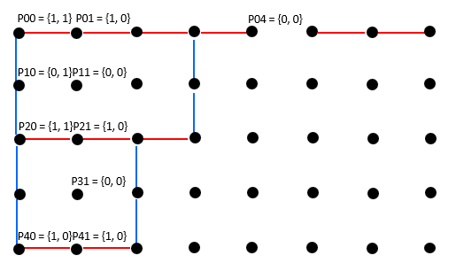

# 2 Dimension Dynamic Programming

## Longest Cross Of 1s

Given a matrix that contains only 1s and 0s, find the largest cross which contains only 1s, with the same arm lengths and the four arms joining at the central point.

Return the arm length of the largest cross.

Assumptions

The given matrix is not null, has size of N * M, N >= 0 and M >= 0.
Examples

{ {0, 0, 0, 0},

  {1, 1, 1, 1},

  {0, 1, 1, 1},

  {1, 0, 1, 1} }

the largest cross of 1s has arm length 2.

### Analysis

Use the same prefix sum technique to solve this problem:
1. prefix sum from left to i, j
2. prefix sum from right to i, j
3. prefix sum from top to i, j
4. prefix sum from bottom to i, j

After finishing the calcualtion, we find the min of each prefix sum on curr i, j, update the answer with the larger min prefix sum.

Time: $O(m \times n)$
Time: $O(m \times n)$

### Code

```c
class Solution {
 public:
  struct Node {
    int left, right, down, up;
    int minVal() {
      return min({left, right, down, up});
    }
    void setRD(int val) {
      right = val;
      down = val;
    }
    void setLU(int val) {
      left = val;
      up = val;
    }
  };
  int largest(vector<vector<int>> matrix) {
    // write your solution here
    int m = matrix.size(), n = matrix[0].size();
    Node dp[m][n];
    memset(dp, 0, sizeof dp);
    int res = 0;
    for (int i = 0; i < m; ++i) {
      for (int j = 0; j < n; ++j) {
        int one = matrix[i][j];
        dp[i][j].setRD(one);
        if (i != 0 && one)
          dp[i][j].right = dp[i - 1][j].right + 1;
        if (j != 0 && one)
          dp[i][j].down = dp[i][j - 1].down + 1;
      }
    }
    // Note: direction is reversed, or there is no precalculation
    for (int i = m - 1; i >= 0; --i) {
      for (int j = n - 1; j >= 0; --j) {
        int one = matrix[i][j];
        dp[i][j].setLU(one);
        if (i != m - 1 && one)
          dp[i][j].left = dp[i + 1][j].left + 1;
        if (j != n - 1 && one)
          dp[i][j].up = dp[i][j + 1].up + 1;
      }
    }

    for (int i = 0; i < m; ++i)
      for (int j = 0; j < n; ++j)
        res = max(res, dp[i][j].minVal());
    return res;

  }
};

```

## Largest X Of 1s

Given a matrix that contains only 1s and 0s, find the largest X shape which contains only 1s, with the same arm lengths and the four arms joining at the central point.

Return the arm length of the largest X shape.

Assumptions

The given matrix is not null, has size of N * M, N >= 0 and M >= 0.
Examples

{ {0, 0, 0, 0},

  {1, 1, 1, 1},

  {0, 1, 1, 1},

  {1, 0, 1, 1} }

the largest X of 1s has arm length 2.

### Analysis

Same as the largest Cross of 1s, it calcualte the the presum for diagonal axis:
1. prefix sum from top left to i, j
2. prefix sum from top right to i, j
3. prefix sum from bottom left to i, j
4. prefix sum from bottom left to i, j


After finishing the calcualtion, we find the min of each prefix sum on curr i, j, update the answer with the larger min prefix sum.

Time: $O(m \times n)$
Time: $O(m \times n)$

### Code

```c
class Solution {
 public:
  struct Node {
    int nw, ne, sw, se;
    void setN(int val) {
      nw = ne = val;
    }

    void setS(int val) {
      sw = se = val;
    }

    int minVal() {
      return min({nw, ne, sw, se});
    }
  };
  int largest(vector<vector<int>> matrix) {
    int res = 0, m = matrix.size(), n = matrix[0].size();
    Node dp[m][n];
    memset(dp, 0, sizeof dp);
    for (int i = 0; i < m; ++i) {
      for (int j = 0; j < n; ++j) {
        int val = matrix[i][j];
        dp[i][j].setN(val);
        if (val == 0) continue;
        if (i != 0 && j != 0) 
          dp[i][j].nw = dp[i - 1][j - 1].nw + 1;
        if (i != 0 && j != n - 1)
          dp[i][j].ne = dp[i - 1][j + 1].ne + 1;
        
      }
    }

    for (int i = m - 1; i >= 0; --i) {
      for (int j = n - 1; j >= 0; --j) {
        int val = matrix[i][j];
        dp[i][j].setS(val);
        if (val == 0) continue;
        if (i != m - 1 && j != 0) 
          dp[i][j].sw = dp[i + 1][j - 1].sw + 1;
        if (i != m - 1 && j != n - 1)
          dp[i][j].se = dp[i + 1][j + 1].se + 1;
      }
    }

    for (int i = 0; i < m; ++i)
      for (int j = 0; j < n; ++j)
        res = max(res, dp[i][j].minVal());
    return res;
  }
};

```

##  Largest Square Surrounded By One

Determine the largest square surrounded by 1s in a binary matrix (a binary matrix only contains 0 and 1), return the length of the largest square.

Assumptions

The given matrix is guaranteed to be of size M * N, where M, N >= 0

Examples

{{1, 0, 1, 1, 1},

 {1, 1, 1, 1, 1},

 {1, 1, 0, 1, 0},

 {1, 1, 1, 1, 1},

 {1, 1, 1, 0, 0}}


The largest square surrounded by 1s has length of 3.

### Analysis

Cannot just count the largest square that is all zero, because below case is also valid:

1111 \
1011 \
1111 \
1111 

and the answer is 4.

In order to find the largest submatrix, we need to determine the smallest "stretching length" for its width and height. To find the "stretching" width and height, we can use prefix sum to do so. After we maintained the two "stretching length", we should find the minimal and find the longest size of the submatrix.

Time: $O(m \times n \times max(m, n))$
Space: $O(m \times n)$

### Code

```c
class Solution {
 public:
  struct Node {
    int hor, ver;
    int minVal() {
      return min(hor, ver);
    }
    void set(int val) {
      hor = ver = val;
    }
  };
  int largestSquareSurroundedByOne(vector<vector<int>> matrix) {
    if (matrix.empty() || matrix[0].empty()) return 0;
    int res = 0, m = matrix.size(), n = matrix[0].size();
    Node dp[m][n];
    memset(dp, 0, sizeof dp);
    for (int i = 0; i < m; ++i) {
      for (int j = 0; j < n; ++j) {
        int val = matrix[i][j];
        dp[i][j].set(val);
        if (val == 1) {
          if (i != 0)
            dp[i][j].ver = dp[i - 1][j].ver + 1;
          if (j != 0)
            dp[i][j].hor = dp[i][j - 1].hor + 1;
        }
      }
    }

    for (int i = m - 1; i >= 0; --i) {
      for (int j = n - 1; j >= 0; --j) {
        int small = dp[i][j].minVal();
        while (small > res) {
          // horizonal grow requires vertial has the same stretching size, vice versa for vertial grow
          if (dp[i][j - small + 1].ver >= small && dp[i - small + 1][j].hor >= small)
            res = small;
          small--;
        }
      }
    }
    return res;
  }
};
```

## Largest Square Of Matches

Determine the largest square surrounded by a bunch of matches (each match is either horizontal or vertical), return the length of the largest square.

The input is a matrix of points. Each point has one of the following values:

0 - there is no match to its right or bottom.

1 - there is a match to its right.

2 - there is a match to its bottom.

3 - there is a match to its right, and a match to its bottom.


Assumptions

The given matrix is guaranteed to be of size M * N, where M, N >= 0


Examples

{{3, 1, 1, 3, 0, 1, 1, 0},

 {2, 0, 0, 2, 0, 0, 0, 0},

 {3, 1, 3, 0, 0, 0, 0, 0},

 {2, 0, 2, 0, 0, 0, 0, 0},

 {1, 1, 0, 0, 0, 0, 0, 0}}


This matrix represents the following bunch of matches:



The largest square has length of 2.

### Analysis

Use the same presum technique by defining two direction: left and top
1. if matrix[i][j] == 1 || matrix[i][j] == 3: dp[i][j].left = dp[i][j + 1].left + 1;
2. if matrix[i][j] == 2 || matrix[i][j] == 3: dp[i][j].top = dp[i + 1][j].top + 1;


Note that it's `[i][j + 1]` and `[i + 1][j]`, which means we need to make sure the two locations have already populated, so we should going from bottom to top and right to left.

Also note that the way to find largest submatrix is different from largest square surround by ones, because the direction of the presum is flipped. And the element stored is offset by 1, because the number represent the number of matches on its right or top, so we need to check one more.

Time: $O(m \times n \times max(n, m))$
Space: $O(m \times n)$

### Code

```c
class Solution {
 public:
  struct Node {
    int left, top;
    int minVal() { return min(left, top); }
    void set(int val) {
    	left = top = val;
    }
  };
  int largestSquareOfMatches(vector<vector<int>> matrix) {
    int res = 0, m = matrix.size(), n = matrix[0].size();
    Node dp[m][n];
    memset(dp, 0, sizeof dp);
    for (int i = m - 1; i >= 0; --i) {
      for (int j = n - 1; j >= 0; --j) {
        int val = matrix[i][j];
        dp[i][j].set(0);
        if ((val == 1 || val == 3) && j != n - 1)
          dp[i][j].left = dp[i][j + 1].left + 1;
        if ((val == 2 || val == 3) && i != m - 1)
          dp[i][j].top = dp[i + 1][j].top + 1;
      }
    }
    for (int i = 0; i < m; ++i) {
      for (int j = 0; j < n; ++j) {
        int small = dp[i][j].minVal();
        while (small > res) {
          // j + small but not j + small - 1
          if (dp[i][j + small].top >= small &&
              dp[i + small][j].left >= small)
            res = small;
          small--;
        }
      }
    }
    return res;
  }
};
```

## Largest SubMatrix Sum

Given a matrix that contains integers, find the submatrix with the largest sum.

Return the sum of the submatrix.

Assumptions

The given matrix is not null and has size of M * N, where M >= 1 and N >= 1
Examples

{ {1, -2, -1, 4},

  {1, -1,  1, 1},

  {0, -1, -1, 1},

  {0,  0,  1, 1} }

the largest submatrix sum is (-1) + 4 + 1 + 1 + (-1) + 1 + 1 + 1 = 7.

### Analysis

Imagine there are two horizon lines split the matrix into three parts:

xxxx
____
yyyy
yyyy
____
xxxx

Your job is to find the maximum area sum generated by the two line (max y's sum). If we can compress the area between the two horizon lines, we can use the technique for finding the largest subarray sum to solve this problem.

Time: $O(n \times n \times m)$ or $O(min(m, n)^2 \times max(m, n))$
Space: because we just need one 1-d presum array: $O(min(m, n))$

### Code

```c
class Solution {
 public:
  int largest(vector<vector<int>> matrix) {
    int res = matrix[0][0], m = matrix.size(), n = matrix[0].size();
    for (int i = 0; i < m; ++i) {
      vector<int> preSum(n); // keep adding from i - j rows' sum
      for (int j = i; j < m; ++j) {
        for (int k = 0; k < n; ++k)
          preSum[k] += matrix[j][k];
        int currMax = preSum[0];
        for (int k = 1; k < n; ++k) { // find largest subarray
          currMax = max(currMax + preSum[k], preSum[k]);
          res = max(res, currMax);
        }
      }
    }
    return res;
  }
};

```

