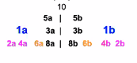
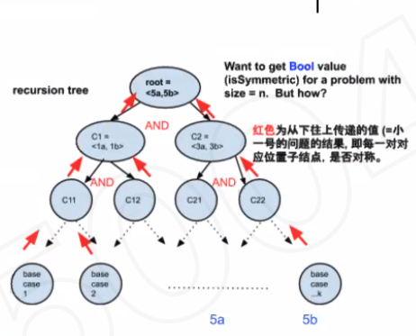

# Recursion and Tree

## Is tree symmetric



### Recurison Tree



### Solution

```c
bool isSymmetric(left, right)
  if left == null and right == null
    return true
  else if left == null || right == null
    return false
  else if left.val != right.val
    return false
  else
    return isSymmetric(left.left, right.right) and isSymmetric(left.right, right.left)
```

Time = O(n/2)=O(n)

## Calculate Time Complexity

Branch Factor: b
Height: h

Total Complexity: $b^h$


