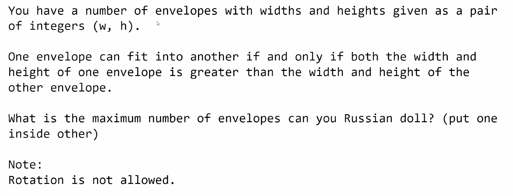
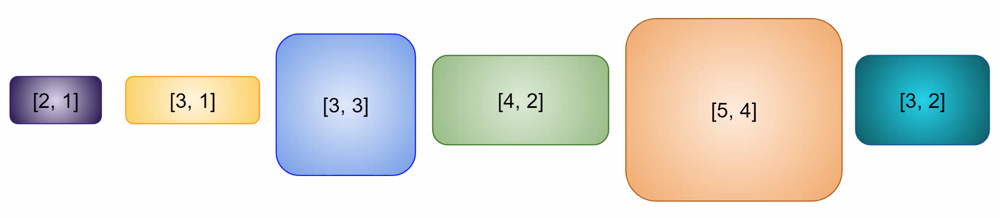
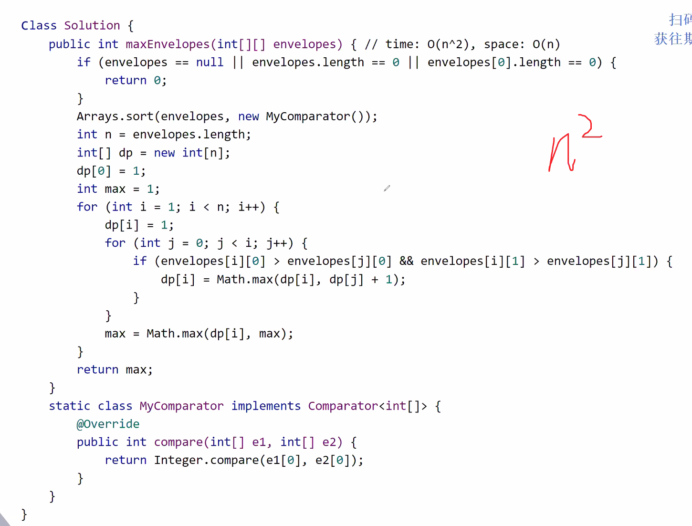
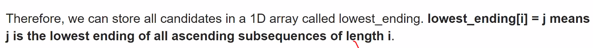

Input:


## Method 1: DFS

Try each envelope as starting point and stack all the other avaliable envelopes.
Level 1: n
Level 2: n * (n - 1)
Level 3: n * (n - 1) * (n - 2)
...
Level n: $O(n!)$

Space: $O(n)$

## Method 2: Sort + DFS

Sort by width and run DFS once: skip all the nodes if already included in previous iteration
Time: $O(n^2)$
Space: $O(n)$ (need to store the previous result)

## Method 3: Sort + DP (longest increasing subsequence)

1. sort by width
2. height after sorted (1,1,3,2,2,4) -- assume using stable sort
3. check LIS from the hight array
  - find the first height to the left of the current height that is less than the current height
  - this will take $O(n)$ to find such element
Time: $O(n^2)$
Space: $O(n)$ (need to store the previous result)

### Solution



### Optimize DP (Space and Time)

delete the previous one (M[i]) if array[i] > array[i+1] and M[i] <= M[i+1]

But if already sorted from low to high -> space stays the same

**create an array for storing the lowest ending at current index**



Then use binary search with $O(log_2{n})$

Time: $O(n \times log_2{n})$
Space: $O(n)$ will be less than n since LIS might not be continuous

#### Pitfall

When sort: if width is the same, higher height sort first (same width cannot stack together)

So we need to rewrite the comparator such that when two width are the same, choose the one with higher height

#### Solution Code

```c
#include <bits/stdc++.h>

using namespace std;

int main() {
	int n;
	cin >> n;
	pair<int,int> env[n];
	for (int i = 0; i < n; ++i) {
		cin >> env[i].first;
		cin >> env[i].second;
	}
	
	sort(env, env + n, [](const pair<int,int>& l, const pair<int,int>& r) {
		return l.first < r.first || (l.first == r.first && l.second > r.second);
	});
	
	vector<int> dp;
	for (auto p : env) {
		int longest = lower_bound(dp.begin(), dp.end(), p.second) - dp.begin();
		if (longest >= dp.size()) dp.push_back(p.second);
		else dp[longest] = p.second;
	}
	cout << dp.size();
	return 0;
}
```


