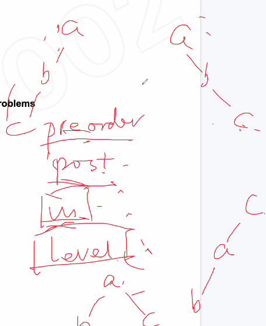
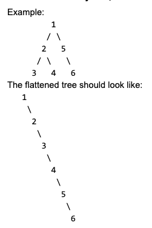
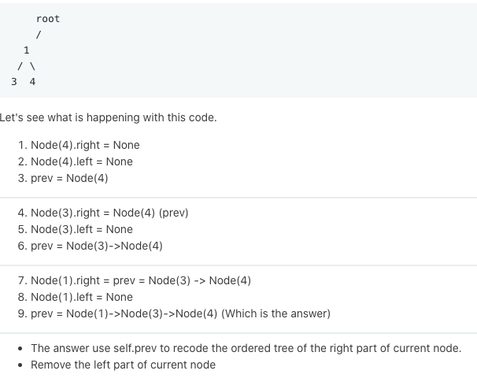
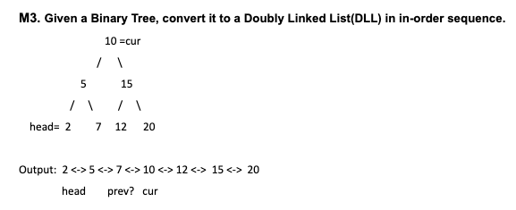

# Serializing and Deserializing a tree



Can do in-order + pre-order, in-order + post-porder, but cannot do pre-order + post-order

## Given a binary tree, flatten it to a linkedlist **in-place**



### Using DFS 



### Code

```c
/**
 * Definition for a binary tree node.
 * struct TreeNode {
 *     int val;
 *     TreeNode *left;
 *     TreeNode *right;
 *     TreeNode(int x) : val(x), left(NULL), right(NULL) {}
 * };
 */
class Solution {
public:
    TreeNode* prev;
    void flatten(TreeNode* root) {
        if (!root) return;
        flatten (root -> right);
        flatten (root -> left);
        root -> right = prev;
        root -> left = NULL;
        prev = root;
    }
    
};
```

### Using iterative

> https://www.acwing.com/video/1469/

1. if left subtree exists, then insert right children of left subtree to the current root's right.
2. if left subtree doesn't exist, visit right subtree of current root, insert left subtree to current root's right.

### Code

```c
/**
 * Definition for a binary tree node.
 * struct TreeNode {
 *     int val;
 *     TreeNode *left;
 *     TreeNode *right;
 *     TreeNode(int x) : val(x), left(NULL), right(NULL) {}
 * };
 */
class Solution {
public:
    void flatten(TreeNode* root) {
        while (root) {
            TreeNode* p = root -> left;
            if (p) {
                while (p -> right) {
                    p = p -> right;
                }
                p -> right = root -> right;
                root -> right = root -> left;
                root -> left = nullptr;
            }
            root = root -> right;
        }
    }
    
};
```

## Given a binary tree, flatten it to a **doubly linkedlist**



### Code

```c
TreeNode* helper(Treenode* root, TreeNode* prev, TreeNode* head) {
    if (!root) return ;
    helper(root -> left, prev, head);
    if (!pre) head = root;
    else {
        root -> left = prev;
        prev -> right = root;
    }
    prev = root;
    helper(root -> right, prev, head);
}

TreeNode* flatten(TreeNode* root) {
    helper(root, prev, head);
    return head;
}
```