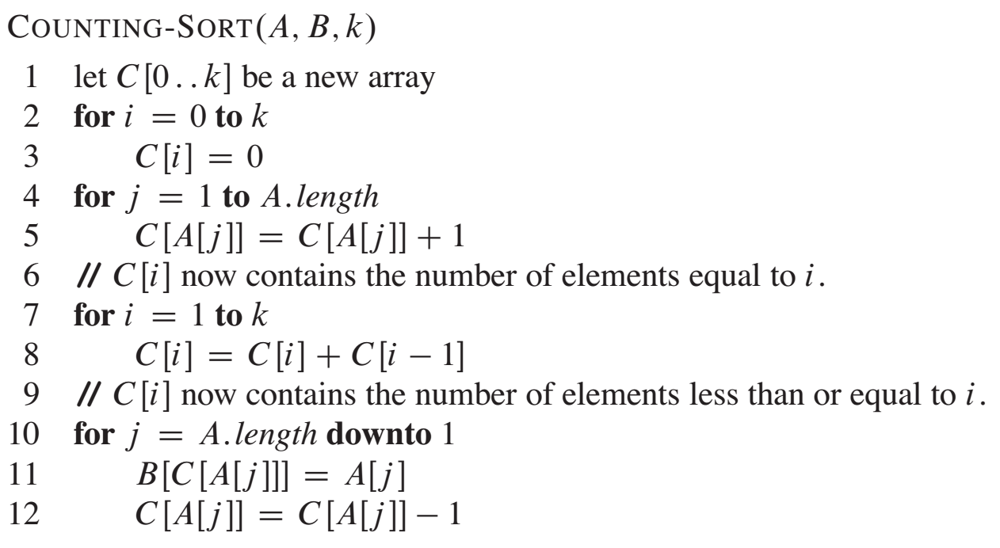
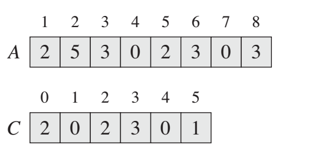
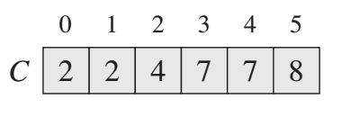

## Overview


## Selection Sort

arr[] = 64 25 12 22 11

// Find the minimum element in arr[0...4]
// and place it at beginning
11 25 12 22 64

// Find the minimum element in arr[1...4]
// and place it at beginning of arr[1...4]
11 12 25 22 64

// Find the minimum element in arr[2...4]
// and place it at beginning of arr[2...4]
11 12 22 25 64

// Find the minimum element in arr[3...4]
// and place it at beginning of arr[3...4]
11 12 22 25 64 

```c
/* a[0] to a[aLength-1] is the array to sort */
int i,j;
int aLength; // initialise to a's length

/* advance the position through the entire array */
/*   (could do i < aLength-1 because single element is also min element) */
for (i = 0; i < aLength-1; i++)
{
    /* find the min element in the unsorted a[i .. aLength-1] */

    /* assume the min is the first element */
    int jMin = i;
    /* test against elements after i to find the smallest */
    for (j = i+1; j < aLength; j++)
    {
        /* if this element is less, then it is the new minimum */
        if (a[j] < a[jMin])
        {
            /* found new minimum; remember its index */
            jMin = j;
        }
    }

    if (jMin != i) 
    {
        swap(a[i], a[jMin]);
    }
}
```

### Complexity

$O(\frac{(n-1)+1}{2} \times (n-1))$ = $O(n^2)$ -- no matter if is pre-sorted or not

### Q1: sort with stacks

sort with two stacks:

```c
#include<bits/stdc++.h>
using namespace std;

int main() {
	int n;
	cin >> n;
	int num[n];
	for (int i = 0; i < n; ++i) cin >> num[i];
	stack<int> s1, s2; // s1: buffer; s2: sorted array in ascending order
	for (int i : num) s1.push(i);
	while (!s1.empty()) {
		int curr = s1.top();
		s1.pop();
		int cnt = 0;
		/*
		s1: C
		s2: LLL	
		*/
		// remove everything that is less than curr in the buffer
		while (!s2.empty() && s2.top() < curr) {
			s1.push(s2.top());
			s2.pop();
			++cnt;
		}
	
		s2.push(curr);
		/*
		s1: LLL
		s2: C
		*/
		// move back
		for (int i = 0; i < cnt; ++i) {
			s2.push(s1.top());
			s1.pop();
		}
		/*
		s1: 
		s2: CLLL
		*/
	}
	
	while (!s2.empty()) {
		cout << s2.top() << " ";
		s2.pop();
	}
	return 0;
}
```

counter: count number of element that is less than current top.
1. compare sorted.top() with item, pop all the elements back to the input stack that are greater than item
2. push the item to the sorted top
3. using the counter to determine when to stop when pushing the pop the input stack
Here input stack's top (from top to top + counter) works as the buffer

## Insertion Sort

```c
for (int i = 0; i < A.size(); ++i) {
    for (int j = i; j > 0 && A[j - 1] > A[j]; --j) { // can terminate early if unsatisfy
        swap(A[j], A[j - 1]);
    }
}
```

1, 4, 7, 11, 6, 2, -3, -8
1...
1, 4...
1, 4, 7...
1, 4, 7, 11...
1, 4, 6, 7, 11...
1, 2, 4, 6, 7, 11...
-3, 1, 2, 4, 6, 11...
-8, -3, 1, 2, 4, 6, 11

if the origional array is pre-sorted, then the complexity is $O(n)$, if not, it will be $O(n^2)$

## Counting Sort



A[] original array to be sorted
B[] sorted array from less to greater
C[] is pre-sum for counting the frequency of each element (element is the index)

on line 11, it keep "filling" the element from right to the left (greater to less) to B[].

### initial



### after pre-sum



### Complexity

Time: $O(n)$, Space: $O(|max - min|)$

## Merge Sort: stable

```c
int tmp[1010];
void merge_sort(vector<int>& q, int l, int r) {
    if (l >= r) return ;
    int mid = (l + r) >> 1;
    merge_sort(q, l, mid);
    merge_sort(q, mid + 1, r);
    
    int k = 0, i = l, j = mid + 1;
    while (i <= mid && j <= r) { // two pointers
        if (q[i] < q[j]) tmp[k ++ ] = q[i ++ ];
        else tmp[k ++ ] = q[j ++ ];
    }
    while (i <= mid) tmp[k ++ ] = q[i ++ ];
    while (j <= r) tmp[k ++ ] = q[j ++ ];
    
    for (i = l, j = 0; i <= r; i ++, j ++ ) q[i] = tmp[j];
}

vector<int> mergeSort(vector<int> array) {
    // write your solution here
    vector<int> res = array;
    merge_sort(res, 0, array.size() - 1);
    return res;
}
```

### Use merge sort to find Inversion Count

Inversion Count: $a_i > a_j$ and $i < j$, to do so, just uncomment line 12.

### Complexity

space:
- call stack: $O(log(n))$
- heap: $O(n)$

### Q1: 

## Quick Sort: not stable

```c
class Solution {
 public:
  void quick_sort(vector<int>& q, int l, int r) {
    if (l >= r) return;
    // pivot at mid
    int i = l - 1, j = r + 1, x = q[(l + r) >> 1];
    while (i < j)
    {
        do i ++ ; while (q[i] < x);
        do j -- ; while (q[j] > x);
        if (i < j) swap(q[i], q[j]);
    }
    quick_sort(q, l, j), quick_sort(q, j + 1, r);
  }

  vector<int> quickSort(vector<int> array) {
    // write your solution here
    quick_sort(array, 0, array.size() - 1);
    return array;
  }
};

```

## Quick select: select kth element

Differ from Merge Sort, Quick sort first split array into two half where the values on the left of x are less than x and values on the right of x are equal or greater than x. 

### Code

```c
#include <bits/stdc++.h>

using namespace std;

const int N = 1010;

int num[N];

int quick_select(int l, int r, int k) {
  if (l == r) return num[l];
  int i = l - 1, j = r + 1, x = num[(l + r) >> 1];
  while (i < j) {
    while (num[++i] < x) ;
    while (num[--j] > x) ;
    if (i < j) swap(num[i], num[j]);
  }
  int offset = j - l + 1;
  if (k <= offset) return quick_select(l, j, k);
  return quick_select(j + 1, r, k - offset);
}

int main() {
  int n, k;
  cin >> n >> k;
  for (int i = 0; i < n; ++i) cin >> num[i];

  cout << quick_select(0, n - 1, k);

  return 0;
}
```

- Auxiliary Space : Mergesort uses **extra space**, quicksort requires little space and exhibits good cache locality. Quick sort is an in-place sorting algorithm. In-place sorting means no additional storage space is needed to perform sorting. Merge sort requires a temporary array to merge the sorted arrays and hence it is not in-place giving Quick sort the advantage of space.
- Worst Cases : The worst case of quicksort $O(n^2)$ can be avoided by using **randomized quicksort**. It can be easily avoided with high probability by choosing the right pivot. Obtaining an average case behavior by choosing right pivot element makes it improvise the performance and becoming as efficient as Merge sort.
- Locality of reference : Quicksort in particular exhibits good **cache locality** and this makes it faster than merge sort in many cases like in virtual memory environment.
- **Merge sort is better for large data structures**: Mergesort is a **stable sort**, unlike quicksort and heapsort, and can be easily adapted to operate on **linked lists** and very large lists stored on slow-to-access media such as disk storage or network attached storage.

Best time complexity: $O(n \log n)$, Worst: $O(n^2)$. It works great in small size array, and for large size array it's better to use merge sort.

### Q1: moving zeros

Move 0s to the right end of the array, no need to keep the relative order of the elements in the origional array

```c
vector<int> moveZeros(vector<int> arr) {
    if (arr.size() <= 1) return arr;
    int l = 0, r = arr.size() - 1;
    while (l <= r) {
        if (arr[l] != 0) l++;
        else if (arr[r] == 0) r--;
        else swap(arr[l++], arr[r--]);
    }
    return arr;
}
```

### Q2: rainbow sort

sort the array by three color (a,b,c represent three colors).
e.g. given [a,b,a,a,a,c,b,a] -> [a,a,a,a,a,b,b,c]

i): all elements to the left of arr[i] are a
[i-j): all elements between arr[i] ~ arr[j] are b
[j-k]: all elements between arr[j] ~ arr[k] are unexplored range
[k: all elements to the right of arr[k] are c

if arr[j] == a: swap(arr[i++], arr[j++]) // i++ because i~j are b, and after sway, arr[i] is a
if arr[j] == b: j++
if arr[j] == c: swap(arr[j], arr[k--]) // don't need to j++ becasue arr[j] is unknown

```c
void rainbowSort(vector<char>& arr) {
    if (arr.size() <= 1) return ;
    int i = 0, j = 0, k = arr.size() - 1;
    while (j <= k) {
        if (arr[j] == 'a') swap(arr[i++], arr[j++]);
        else if (arr[j] == 'b') j++;
        else swap(arr[j], arr[k--]);
    }
}
```

### Q3: sort four color

[aaa i0) [bbb i1) [ccc i2) [dddd i3) XXXX
a=0,b=1,c=2,d=3

i0): all elements to the left of arr[i0] are a
[i0-i1): all elements between arr[i0] ~ arr[i1] are b
[i1-i2): all elements between arr[i1] ~ arr[i2] are c
[i2-i3): all elements between arr[i2] ~ arr[i3] are d
[i3: all elements to the right of arr[i3] are unexplored range

if arr[i3] == d: i3++
if arr[i3] == c: swap(arr[i3++], arr[i2++])
if arr[i3] == b: swap(arr[i3++], arr[i2++]), swap(arr[i1++, i2])
if arr[i3] == a: swap(arr[i3++], arr[i2++]), swap(arr[i1++], arr[i2]) , swap(arr[i0++], arr[i1])

```java
public int[] rainbowSortII(int[] array) {
    // Write your solution here
    int i0 = 0;
    int i1 = 0;
    int i2 = 0;
    int i3 = 0;
    while(i3 < array.length) {
      if(array[i3] == 3) {
        i3++;
      } else if(array[i3] == 2) {
        swap(array, i2, i3);
        i2++;
        i3++;
      } else if(array[i3] == 1) {
        swap(array, i2, i3);
        swap(array, i1, i2);
        i1++;
        i2++;
        i3++;
      } else {
        swap(array, i2, i3);
        swap(array, i1, i2);
        swap(array, i0, i1);
        i0++;
        i1++;
        i2++;
        i3++;
      }
    }
    return array;
  }
```

### Q4: What about k color?

use counting sort, sort in linear time!

```java
class Solution {
 public:
  vector<int> rainbowSortIII(vector<int> a, int k) {
    vector<int> cnt(k + 1); // accumulate cnt of each element (from 0 - k)
    int n = a.size();
    for (int i = 0; i < n; ++i) cnt[a[i]]++;
    for (int i = 1; i <= k; ++i) cnt[i] = cnt[i] + cnt[i - 1];
    vector<int> res(n);
    for (int i = n - 1; i >= 0; --i) {
      res[cnt[a[i]] - 1] = a[i];
      cnt[a[i]]--;
    }
    return res;
  }
};
```

#### 复杂度分析
时间：$O(n)$
空间：$O(n)$ <- this is not a in-place algorithm

#### 分析
如果有k个color，那么如果想要知道每个color应该放在哪里需要知道以下信息：
1. 当前颜色在array中的开始位置
2. 当前颜色在array中已经存在的个数
这两个信息虽然看似没有关联实际上是：当知道所有在当前颜色之前的颜色*每个个数之后，那么就可以知道当前颜色在array中的开始位置。那么就是要处理如何知道当前颜色之前的所有颜色*个数。
这里就可以想到accumulate list或者pre sum list来处理。 

```cpp
for (int i = 0; i < n; ++i) cnt[a[i]]++;
for (int i = 1; i <= k; ++i) cnt[i] = cnt[i] + cnt[i - 1];
```
这两行做的事情分别是找到每一个元素的数量，然后计算presum，这里的presum便是上面说的**当前颜色之前的颜色*每个个数**。当知道了这两个信息之后便可以把他们一个一个放到sort好的res数组了。
```cpp
for (int i = n - 1; i >= 0; --i) {
      res[cnt[a[i]] - 1] = a[i];
      cnt[a[i]]--;
}
```
注意：每次遍历的时候需要更新cnt(cnt --)，同时因为数组是0 base，但是颜色是从[1～k]，所以每次res的index要-1.

### 如何解决非数字问题
假如颜色不是1～k的数字，那么为了计算presum，我们需要找到某种方法来知道每两个元素的相对位置：
假设objA < objB，那么我们可以用一个`unordered_map<Obj, int> mapping`来为每个元素赋值。即：
```cpp
for (int i = 0; i < n; ++i) cnt[mapping[a[i]]]++;
for (int i = 1; i <= k; ++i) cnt[i] = cnt[i] + cnt[i - 1];
```
### In-place sort: space O(k), time O(n)
```cpp
vector<int> rainbowSortIII(vector<int> a, int k) {
  vector<int> cnt(k + 1);  // cnt of each element (from 0 - k)
  int n = a.size();
  for (int i = 0; i < n; ++i) cnt[a[i]]++;
  for (int i = 1, idx = 0; i <= k; ++i) {
    while (cnt[i] != 0) {
      a[idx++] = i;
      cnt[i]--;
    }
  }
  return a;
}
```

### Q5: reorder the array

An array contains both pos and neg numbers in random order. Order the array elements so that pos and neg are placed alternatively. If there are more pos they appear at the end of the array. If there are more neg, they also appear at the end of the array.

e.g.
input: [1,2,3,4,5,-1,-1,-1], 
output: [1,-1,2,-1,3,-1,4,5] (the ordering of pos/neg number doesn't matter)

#### Analysis

Use quick sort's partition to split the array into two half, then put them back to the new array alternatively

#### Code

```c
#include <bits/stdc++.h>

using namespace std;

#define N 1010

int nums[N];
int main() {
	int n;
	cin >> n;
	for (int i = 0; i < n; ++i) cin >> nums[i];
	int x = 0, l = 0, r = n - 1;
	while (l < r) {
		while (nums[++l] > x);
		while (nums[--r] < x);
		if (l < r) swap(nums[l], nums[r]);
	}
	
	cout << nums[l] << " " << nums[r] << endl; 
	int res[n];
	memset(res, -1, sizeof res);
	int idx = 0;
	for (int i = 0; idx <= r; i += 2) {
		res[i] = nums[idx++];
	}
	for (int i = 1; idx < n; i += 2) {
		res[i] = nums[idx++];
	}
	
	for (int i : res) cout << i << " ";
	return 0;
}
```

