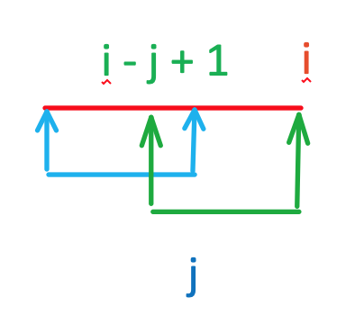
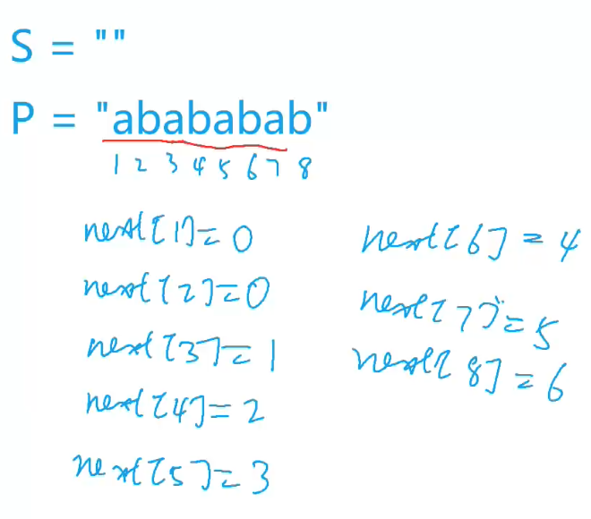
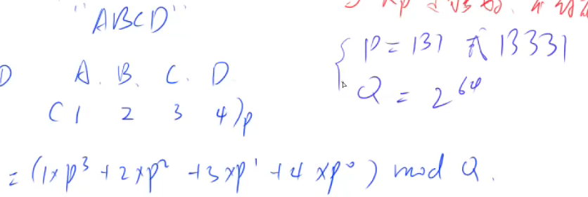

## Problem

Determine if a small string is a substring of another large string.

Return the index of the first occurrence of the small string in the large string.

Return -1 if the small string is not a substring of the large string.

Consider the case:

mississippi issip -> return 4

## KMP

### `next` array physcial meaning



next[i] = j means p[1, j] = p[i - j + 1, i] (blue part is same with grean part)

What it does is keep checking the longest suffix (ending at j) with prefix (starting at 0)

Or: longest ending index j that makes 0 ~ j == i - j + 1 ~ i

e.g. P = "ababababab"


### psuedocode

#### Part 1: form the next array

- check if small[i] == small[j + 1]
  - if not, meaning 0 ~ i - 1 matches 0 ~ j but i doesn't match j + 1
    - to find last match (0 ~ i matches i - j + 1 ~ j + 1)
  - if yes, meaning 0 ~ i matches 0 ~ j + 1, so keep matching and update j
- set next[i] = j // last match

#### Part 2: find in the original string

- check if large[i] == small[j + 1]
  - if not, meaning large[0 ~ i] matches small[0 ~ j] but i doesn't match j + 1 (same as part 1)
    - try last match
  - if yes, meaning 0 ~ i matches 0 ~ j + 1, so keep matching and update j
- check if reach the end

### Code

```c
class Solution {
 public:
  int strstr(string large, string small) {
    if (small == "") return 0;
    int m = large.size(), n = small.size();
    vector<int> next(n, -1);
    for (int i = 1, j = -1; i < n; ++i) {
        // either not start matching yet
        // or find previous one that stops at current i
    	while (j >= 0 && small[j + 1] != small[i]) j = next[j]; 
    	// check if current one is matched
    	if (small[j + 1] == small[i]) j++;
    	// now 
    	next[i] = j;
    }
    for (int i = 0, j = -1; i < m; ++i) {
      while (j != -1 && large[i] != small[j + 1]) j = next[j];
      if (large[i] == small[j + 1]) j ++;
      if (j == n - 1) return i - j;
    }
    return -1;
  }
};

```

## String Hashing or RabinKarp Algorithm

* First calculate the hash value for subtring from 0 ~ i in large
* Second calculate the hash value for substring from i ~ j given hash values of 0 ~ i and 0 ~ j

To Prevent collision, use a large prime for P.



1. Why use `unsigned long long`? Because `unsigned long long`'s max is $2^{64}$, if add one more, it will become $0$, which makes sure all the values are in the range of 0 ~ $2^{64}$ -- works like a module operation.
2. Why `h[i - 1] * p[n]`? Because to find out the hash value for substring of i + n - 1 (right) to i - 1 (left), we need to find p[i + n - 1 (right) - i + 1 (left)], which yields p[n].

### Code

**before Optimization**

```c
class Solution {
 public:
  int strstr(string large, string small) {
    if (small == "") return 0;
    int m = large.size(), n = small.size();
    typedef unsigned long long ULL;
    int P = 131;
    vector<ULL> p(m + 1, 1), h(m + 1, 1);
    for (int i = 1; i <= m; ++i) {
      h[i] = h[i - 1] * P + large[i - 1];
      p[i] = p[i - 1] * P;
    }
    ULL check = 1;
    for (int i = 1; i <= n; ++i) {
      check = check * P + small[i - 1];
    }
    check = check - p[n];
	
    for (int i = 1; i <= m - n + 1; ++i) {
	  ULL hash = h[i + n - 1] - h[i - 1] * p[n];
      if (h[i + n - 1] - h[i - 1] * p[n] == check)
    	return i - 1;
    }
    return -1;
  }
};
```

**after optimization**

```c
class Solution {
 public:
  int strstr(string large, string small) {
    if (small == "") return 0;
    int m = large.size(), n = small.size();
    typedef unsigned long long ULL;
    int P = 131;
    vector<ULL> h(m + 1, 1);
    ULL p = 1, check = 1;
    for (int i = 1; i <= m; ++i) {
      h[i] = h[i - 1] * P + large[i - 1];
      if (i <= n) {
      	p *= P;
      	check = check * P + small[i - 1];
      }
    }
    check = check - p;
    for (int i = 1; i <= m - n + 1; ++i) {
      if (h[i + n - 1] - h[i - 1] * p == check)
    	return i - 1;
    }
    return -1;
  }
};
```