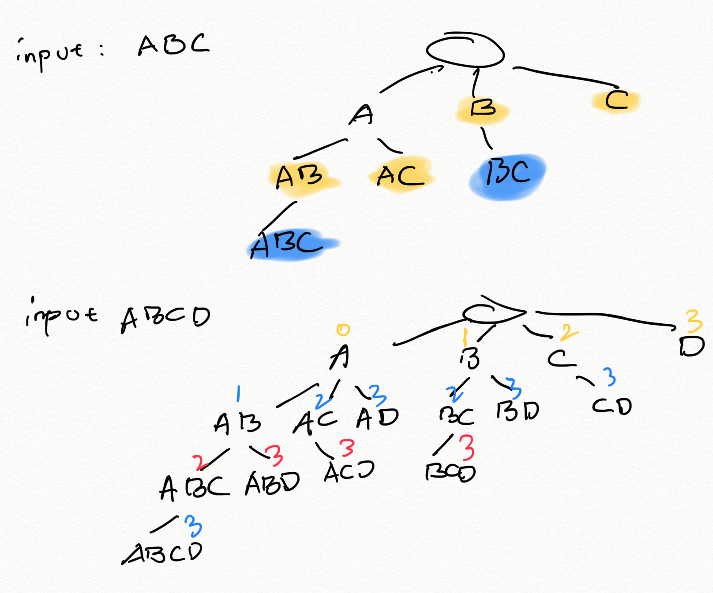
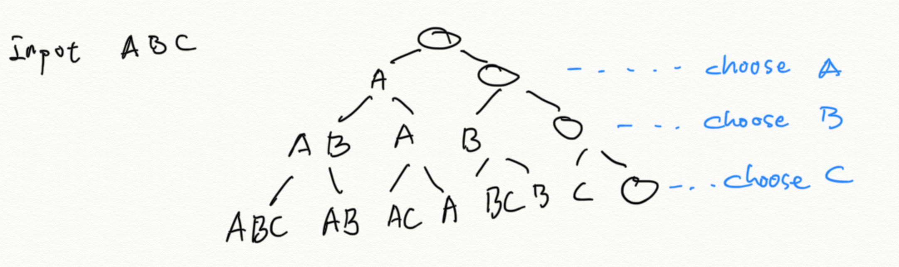
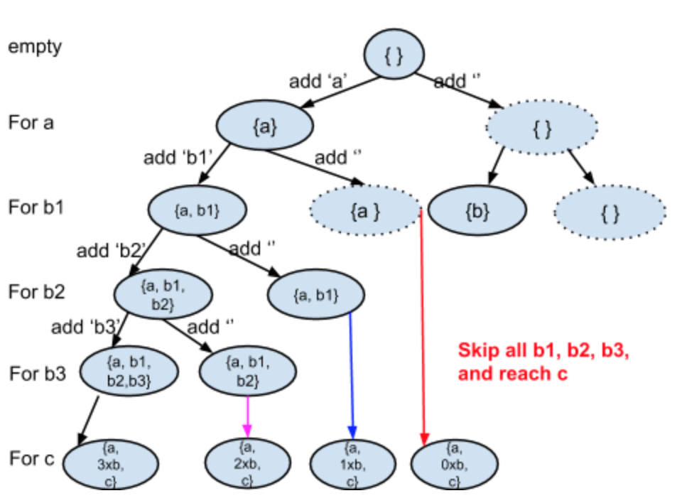

# Subset, combination, Permutation Problems

## Generate all **subset** duplicate character can exist in the single set of a sequence

### All elements are distinct

Given a set of distinct integers, nums, return all possible subsets (the power set).

Note: The solution set must not contain duplicate subsets.

Example:

Input: nums = [1,2,3]
Output:
[
  [3],
  [1],
  [2],
  [1,2,3],
  [1,3],
  [2,3],
  [1,2],
  []
]

#### Analysis

Since each element can either be included or not included, we have $2^N$ subsets.

1. branch factor = 1 to n, height = 1 to n
    
2. branch factor = 2 (choose or not choose), height = n
    

#### Code 1: using bitwise manipulation

```c
class Solution {
public:
    // use binary increment for listing all the combination of bits
    // converting the binary representation to subset representation
    vector<vector<int>> subsets(vector<int>& nums) {
        vector<vector<int>> res;
        for (int i = 0; i < 1 << nums.size(); ++i) {
            vector<int> temp;
            for (int j = 0; j < nums.size(); ++j) {
                // check if current bit is 1, if so, add the value to list
                if ((i >> j) & 1)
                    temp.push_back(nums[j]);
            }
            res.push_back(temp);
        }
        return res;
    }
};
```

#### Code 2: using backtracking/dfs with varied branch factor

```c
class Solution {
public:
    vector<vector<int>> ret;
    vector<vector<int>> subsets(vector<int>& nums) {
        vector<int> v;
        helper(v, nums, 0);
        return ret;
    }
    
    void helper(vector<int> curr, vector<int>& nums, int i) {
        ret.push_back(curr);
        for (; i < nums.size(); ++i) {
            curr.push_back(nums[i]);
            helper(curr, nums, i + 1);
            curr.pop_back();
        }
    }
};
```

#### Code 3: using backtracking/dfs with choose or not

```c
class Solution {
public:
    vector<vector<int>> res;
    
    void dfs(vector<int>& nums, int i, vector<int>& curr) {
        if (i == nums.size()) {
            res.push_back(curr);
            return;
        }
        // choose current element from nums[i]
        curr.push_back(nums[i]);
        dfs(nums, i + 1, curr);
        curr.pop_back();
        // not choose
        dfs(nums, i + 1, curr);
    }
    
    vector<vector<int>> subsets(vector<int>& nums) {
        vector<int> curr;
        dfs(nums, 0, curr);
        return res;
    }
};
```

### There are duplicates in the given nums

Given a collection of integers that might contain duplicates, nums, return all possible subsets (the power set).

Note: The solution set must not contain duplicate subsets.

Example:

Input: [1,2,2]
Output:
[
  [2],
  [1],
  [1,2,2],
  [2,2],
  [1,2],
  []
]

#### Anaylsis

Different from the distinct element subset problem, now we need to decide how to deal with duplicate:

1,2 and 1,2,2 are two different subsets, so we need to decide when to **stop** the recursion. In the previous problem, using "choose or not choose" we stop as we have reach to the end of the elements to be chosen. See the recursion tree for this particular problem:


#### Code 1: using backtracking/dfs with varied branch factor

```c
class Solution {
public:
    vector<vector<int>> subsetsWithDup(vector<int> &S) {
        if (S.empty()) return {};
        vector<vector<int>> res;
        vector<int> out;
        sort(S.begin(), S.end());
        getSubsets(S, 0, out, res);
        return res;
    }
    void getSubsets(vector<int> &S, int pos, vector<int> &out, vector<vector<int>> &res) {
        res.push_back(out);
        for (int i = pos; i < S.size(); ++i) {
            out.push_back(S[i]);
            getSubsets(S, i + 1, out, res);
            out.pop_back();
            while (i + 1 < S.size() && S[i] == S[i + 1]) ++i;
        }
    }
};
```

#### Code 2: using backtracking/dfs with choose or not

```c
class Solution {
    public:
    vector<vector<int>> res;

    void dfs(int i, vector<int>& s, vector<int>& curr) {
        if (i == s.size()) {
            res.push_back(curr);
            return;
        }
        // choose current s[i]
        curr.push_back(s[i]);
        dfs(i + 1, s, curr);
        curr.pop_back();
        // not choose current s[i] and skip all the rest that are duplicated with s[i]
        int idx = i;
        while (i < s.size() && s[idx] == s[i]) i++;
        dfs(i, s, curr);
    }
    
    vector<vector<int>> subsetsWithDup(vector<int>& nums) {
        sort(nums.begin(), nums.end());
        vector<int> curr;
        dfs(0, nums, curr);
        return res;
    }
};
```

## Combination

