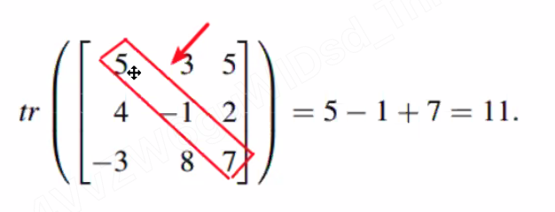

# Useful notes and codes for Java

* 1D/2D Array
  * constructor
  * initialization
  * read/write
  * length/dimension
  * traversal
* Main Function
  * public static void main(String[] args)
  * signacture
* OOD or OOP
  * class, object, reference, dereference
  * Student tom = new Student("Tom", 5, 4.0);
    * Declaration
    * Instantiation
    * Initialization
    * Assignment

## Array

### 1-D array

create: `int[] array = new int[10];` once create, size cannot be modified

```java
int[] numbers = new int[]{1,2,3,4};
int num =  numbers[2];
number[4] = 15;
int size = numbers.length;

for (int index = 0; index < number.length; ++index) {}
for (int num : numbers) {}
```

### Max value

```java
Integer.MAX_VALUE
Integer.MIN_VALUE
```

### Insert

```java
public int[] reverse(int[] arr) {
    int[] new_arr = new int[arr.length - 1];
    for (int i = 0; i < position; ++i) {
        new_arr[i] = arr[i];
    }
    new_arr[position] = element;
    for (int i = position; i < arr.length; ++i) {
        new_arr[i + 1] = arr[i];
    }
    return new_arr;
}
```

### Reverse Array

swap

```java
public int[] reverse(int[] arr) {
    int i = 0, j = arr.length - 1;
    while (i < j) {
        int tmp = array[i];
        array[i] = array[j];
        array[j] = tmp;
        i++, j--;
    }
    return arr;
}
```

## 2-D Array

### create

```java
int[][] matrix = new int[][]{{2,1},{4,7},{5,9}};
int[] firstRow = matrix[0];
int firstElementOfSecondRow = matrix[1][0];
int rows = matrix.length;
// (row = 3 because the array has 3 elements)
int cols = matrix[0].length;
```

### calculate "g": the diagonal -- has to be square matrix



```java
public int[] reverse(int[][] matrix) {
    int g = 0;
    for (int i = 0; i < matrix.length; ++i) {
        g += matrix[i][i];
    }
    return g;
}
```

### calculate sum of two matrix -- has to be same dimension


```java
public int[][] reverse(int[][] matrix1, int[][] matrix2) {
    int row = matrix1.length;
    int col = matrix1[0].length;
    int[][] result = new int[][];
    for (int i = 0; i < row; ++i) {
        for (int j = 0; j < col; ++j) {
            result[i][j] = matrix1[i][j] + matrix2[i][j];
        }
    }
    return result;
}
```

## Main Function

```java
public static void main(String[] args) {
    System.out.println("hello world.");
}
```

## OOD or OOP

### Memory Layout

Stack: local variable (in function or scope)
Heap: all the object

