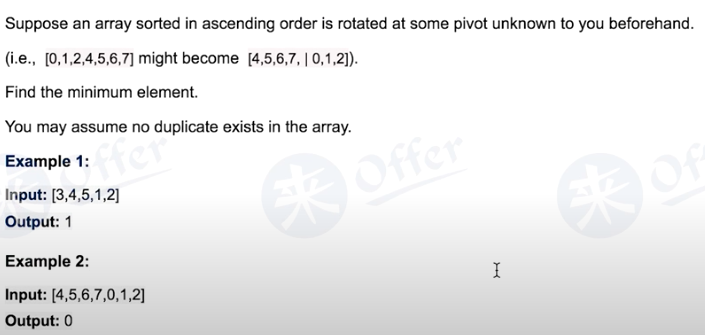

# LaiCode 23



# Idea

Two Situations:
2 4 5 6 0 1: mid (5) > r (1) -> l-mid is sorted and pivot is on the right -> if [right] < [left] then min is not on the l-mid -> search mid+1 - right (mid cannot be the minimum).
6 0 1 2 4 5: mid (1) < r -> right is sorted -> l-mid is what to be searched (minimum is located) -> mid can be the minimum (e.g. 6 7 | 1 2 4 5)

```java
// Assume array != null, array.length >= 2
public static int shiftedMin(int[] array) {
    int l = 0, r = array.length - 1;
    while (l < r) { 
    	int mid = (l + r) / 2;
    	if (array[mid] < array[r]) r = mid;
    	else if (array[mid] > array[r]) l = mid + 1;
    	else r = mid;
    }
    return array[r];
}
```

strict -> loose
1. left <= right: 1 element can still jump in to the while loop
2. left < right: >= 2 elements
3. left < right - 1: >= 3 elements

## Two elements left (l < r - 1)

```java
public static int shiftedMin(int[] array) {
    int l = 0, r = array.length - 1;
    while (l < r - 1) {
    	int mid = (l + r) / 2;
    	if (array[mid] < array[r]) r = mid;
    	else if (array[mid] > array[r]) l = mid + 1;
    	else r = mid;
    }
    return array[l] < array[r] ? array[l] : array[r];
}
```