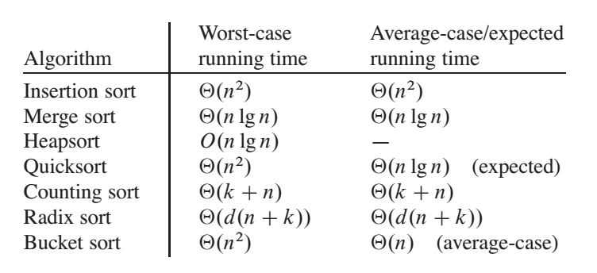

# Overview



# Selection Sort

arr[] = 64 25 12 22 11

// Find the minimum element in arr[0...4]
// and place it at beginning
11 25 12 22 64

// Find the minimum element in arr[1...4]
// and place it at beginning of arr[1...4]
11 12 25 22 64

// Find the minimum element in arr[2...4]
// and place it at beginning of arr[2...4]
11 12 22 25 64

// Find the minimum element in arr[3...4]
// and place it at beginning of arr[3...4]
11 12 22 25 64 

```c
/* a[0] to a[aLength-1] is the array to sort */
int i,j;
int aLength; // initialise to a's length

/* advance the position through the entire array */
/*   (could do i < aLength-1 because single element is also min element) */
for (i = 0; i < aLength-1; i++)
{
    /* find the min element in the unsorted a[i .. aLength-1] */

    /* assume the min is the first element */
    int jMin = i;
    /* test against elements after i to find the smallest */
    for (j = i+1; j < aLength; j++)
    {
        /* if this element is less, then it is the new minimum */
        if (a[j] < a[jMin])
        {
            /* found new minimum; remember its index */
            jMin = j;
        }
    }

    if (jMin != i) 
    {
        swap(a[i], a[jMin]);
    }
}
```

## Complexity

$O(\frac{(n-1)+1}{2} \times (n-1))$ = $O(n^2)$ -- no matter if is pre-sorted or not

## Q1: sort with three stack

stack 1: [3 2 4 1
stack 2: [1 4 2 3 global min: 1
stack 3(res): keep push the global min

# Insertion Sort

```c
for (int i = 0; i < A.size(); ++i) {
    for (int j = i; j > 0 && A[j - 1] > A[j]; --j) { // can terminate early if unsatisfy
        swap(A[j], A[j - 1]);
    }
}
```

1, 4, 7, 11, 6, 2, -3, -8
1...
1, 4...
1, 4, 7...
1, 4, 7, 11...
1, 4, 6, 7, 11...
1, 2, 4, 6, 7, 11...
-3, 1, 2, 4, 6, 11...
-8, -3, 1, 2, 4, 6, 11

if the origional array is pre-sorted, then the complexity is $O(n)$, if not, it will be $O(n^2)$

# Counting Sort


A[] original array to be sorted
B[] sorted array from less to greater
C[] is pre-sum for counting the frequency of each element (element is the index)

on line 11, it keep "filling" the element from right to the left (greater to less) to B[].

## initial


## after pre-sum


## Complexity

Time: $O(n)$, Space: $O(|max - min|)$

# Merge Sort: stable

```c
int tmp[1010];
void merge_sort(vector<int>& q, int l, int r) {
    if (l >= r) return ;
    int mid = (l + r) >> 1;
    merge_sort(q, l, mid);
    merge_sort(q, mid + 1, r);
    
    int k = 0, i = l, j = mid + 1;
    while (i <= mid && j <= r) { // two pointers
        if (q[i] < q[j]) tmp[k ++ ] = q[i ++ ];
        else tmp[k ++ ] = q[j ++ ];
    }
    while (i <= mid) tmp[k ++ ] = q[i ++ ];
    while (j <= r) tmp[k ++ ] = q[j ++ ];
    
    for (i = l, j = 0; i <= r; i ++, j ++ ) q[i] = tmp[j];
}

vector<int> mergeSort(vector<int> array) {
    // write your solution here
    vector<int> res = array;
    merge_sort(res, 0, array.size() - 1);
    return res;
}
```

## Use merge sort to find Inversion Count

Inversion Count: $a_i > a_j$ and $i < j$, to do so, just uncomment line 12.

## Complexity}

space:
- call stack: $O(log(n))$
- heap: $O(n)$

# Quick Sort: not stable

```c
class Solution {
 public:
  void quick_sort(vector<int>& q, int l, int r) {
    if (l >= r) return;
    // pivot at mid
    int i = l - 1, j = r + 1, x = q[(l + r) >> 1];
    while (i < j)
    {
        do i ++ ; while (q[i] < x);
        do j -- ; while (q[j] > x);
        if (i < j) swap(q[i], q[j]);
    }
    quick_sort(q, l, j), quick_sort(q, j + 1, r);
  }

  vector<int> quickSort(vector<int> array) {
    // write your solution here
    quick_sort(array, 0, array.size() - 1);
    return array;
  }
};

```

Differ from Merge Sort, Quick sort first split array into two half where the values on the left of x are less than x and values on the right of x are equal or greater than x. 

- Auxiliary Space : Mergesort uses **extra space**, quicksort requires little space and exhibits good cache locality. Quick sort is an in-place sorting algorithm. In-place sorting means no additional storage space is needed to perform sorting. Merge sort requires a temporary array to merge the sorted arrays and hence it is not in-place giving Quick sort the advantage of space.
- Worst Cases : The worst case of quicksort $O(n^2)$ can be avoided by using **randomized quicksort**. It can be easily avoided with high probability by choosing the right pivot. Obtaining an average case behavior by choosing right pivot element makes it improvise the performance and becoming as efficient as Merge sort.
- Locality of reference : Quicksort in particular exhibits good **cache locality** and this makes it faster than merge sort in many cases like in virtual memory environment.
- **Merge sort is better for large data structures**: Mergesort is a **stable sort**, unlike quicksort and heapsort, and can be easily adapted to operate on **linked lists** and very large lists stored on slow-to-access media such as disk storage or network attached storage.

Best time complexity: $O(n \log n)$, Worst: $O(n^2)$. It works great in small size array, and for large size array it's better to use merge sort.

