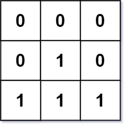

# 0542. 01 Matrix

Given an `m x n` binary matrix `mat`, return *the distance of the nearest* `0` *for each cell*.

The distance between two adjacent cells is `1`.

 

**Example 1:**


```
Input: mat = [[0,0,0],[0,1,0],[0,0,0]]
Output: [[0,0,0],[0,1,0],[0,0,0]]
```

**Example 2:**



```
Input: mat = [[0,0,0],[0,1,0],[1,1,1]]
Output: [[0,0,0],[0,1,0],[1,2,1]]
```

 

**Constraints:**

- `m == mat.length`
- `n == mat[i].length`
- `1 <= m, n <= 104`
- `1 <= m * n <= 104`
- `mat[i][j]` is either `0` or `1`.
- There is at least one `0` in `mat`.

## Analysis

### Using BFS to find the shortest path for each point

Compare to single source BFS, we can regard each "0" as a source and run the search from each point. BFS will guarantee shortest path, so we can return the search results immediately after each search.

1. Scan through all the "0" and insert their coordinates into the search queue.
2. 