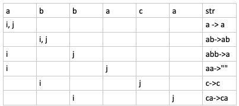

# 1047. Remove all Adjacent Duplicates in String

Given a string `S` of lowercase letters, a *duplicate removal* consists of choosing two adjacent and equal letters, and removing them.

We repeatedly make duplicate removals on S until we no longer can.

Return the final string after all such duplicate removals have been made. It is guaranteed the answer is unique.

 

**Example 1:**

```
Input: "abbaca"
Output: "ca"
Explanation: 
For example, in "abbaca" we could remove "bb" since the letters are adjacent and equal, and this is the only possible move.  The result of this move is that the string is "aaca", of which only "aa" is possible, so the final string is "ca".
```

 

**Note:**

1. `1 <= S.length <= 20000`
2. `S` consists only of English lowercase letters.

## Analysis: using stack

Because it requires to continuously merge and delete char that are the same, we should think about using stack to solve this problem.

### Code 1

Using a stack to maintain resulting string, if there is a duplicate with the ongoing char, we just keep popping the stack (the top) in $O(1)$ and put ongoing char back to the stack.

```c
class Solution {
public:
    string removeDuplicates(string s) {
        int n = s.length();
        string res;
        for (int i = 0; i < n; ++i) {
            if (!res.empty() && res.back() == s[i])
                res.pop_back();
            else 
                res += s[i];
        }
        return res;
    }
};
```

## Analysis: two pointers

The first solution requires to allocate a new string to be return (as a stack), which will create space overhead for the new string (if the string is all distinct, then the return string will have the same size of the input string). To solve this, we can use two pointer to mimic the stack operations, and then use `substr` from C++ to split the string (although `substr` also make copy, but if it's a linkedlist, we can just delete the remaining part in place).

1. i: everything from 0:i are distinct (our returned string).
2. j: probing pointer that will exam if our new string need to be "shrink" or not.
3. assign s[i] = s[j]
4. exam if s[i] == s[i - 1], if so, that means the jth char is invalid, we just need to step back by 2 (previous one is also going to be deleted).

e.g. s = "abbaca"



### Code 2

```c
class Solution {
public:
    string removeDuplicates(string s) {
        int i = 0, n = s.length();
        for (int j = 0; j < n; ++j, ++i) {
            s[i] = s[j];            
            if (i > 0 && s[i - 1] == s[i])
                i -= 2; // not only remove itself but also the remaining one in previous iteration
        }
        return s.substr(0, i);
    }
};
```