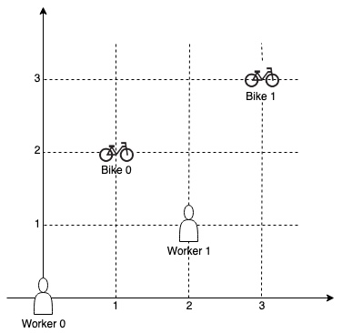
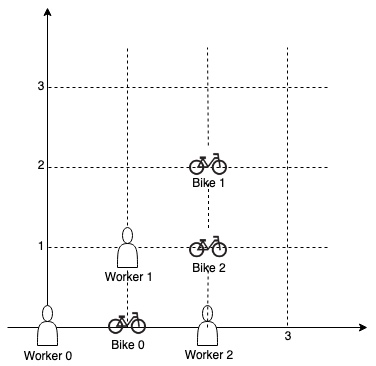
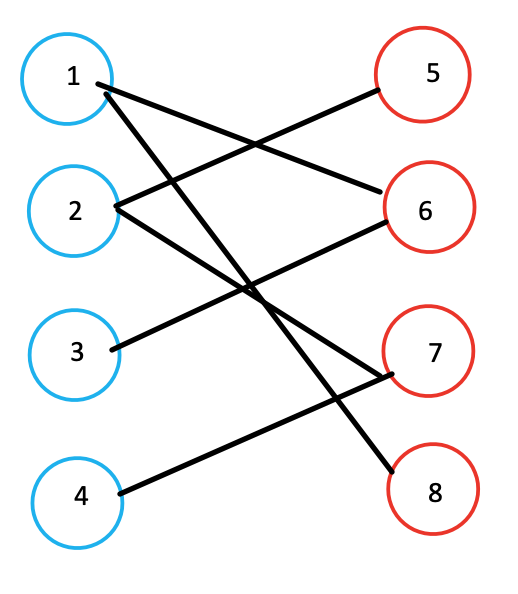
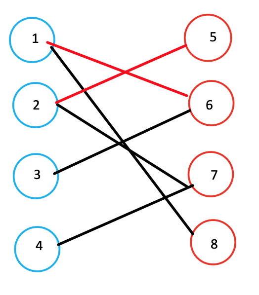
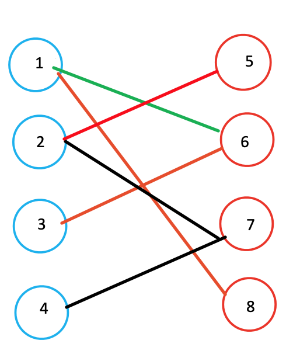
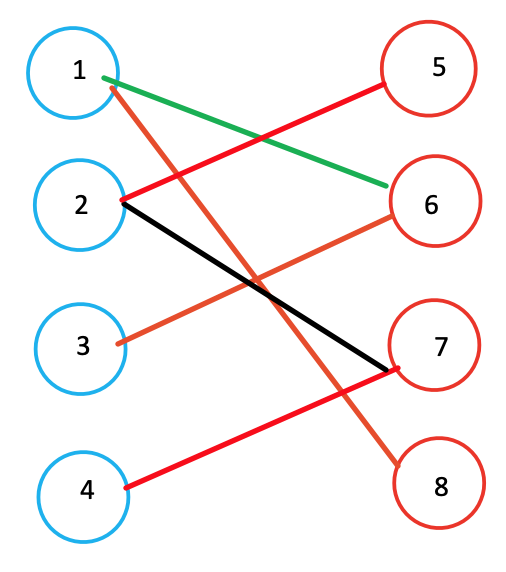
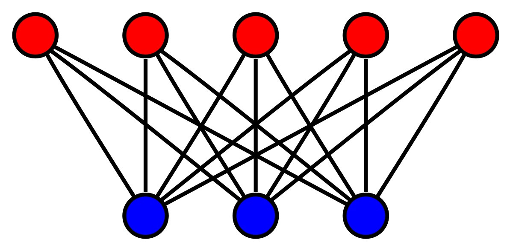

# Campus Bikes

On a campus represented as a 2D grid, there are N workers and M bikes, with N <= M. Each worker and bike is a 2D coordinate on this grid.
Our goal is to assign a bike to each worker. Among the available bikes and workers, we choose the (worker, bike) pair with the shortest Manhattan distance between each other, and assign the bike to that worker. (If there are multiple (worker, bike) pairs with the same shortest Manhattan distance, we choose the pair with the smallest worker index; if there are multiple ways to do that, we choose the pair with the smallest bike index). We repeat this process until there are no available workers.
The Manhattan distance between two points p1 and p2 is Manhattan(p1, p2) = |p1.x - p2.x| + |p1.y - p2.y|. Return a vector ansof length N, where ans[i]is the index (0-indexed) of the bike that the i-th worker is assigned to.
Example 1:

Input: 
workers = [[0,0],[2,1]], 
bikes = [[1,2],[3,3]]
Output: 
[1,0]
Explanation: 

Worker 1 grabs Bike 0 as they are closest (without ties), and Worker 0 is assigned Bike 1. So the output is [1, 0].
Example 2:


Input: 
workers = [[0,0],[1,1],[2,0]], 
bikes = [[1,0],[2,2],[2,1]]
Output: 
[0,2,1]
Explanation: 

Worker 0 grabs Bike 0 at first. Worker 1 and Worker 2 share the same distance to Bike 2, thus Worker 1 is assigned to Bike 2, and Worker 2 will take Bike 1. So the output is [0,2,1].

Note:
0 <= workers[i][j], bikes[i][j] < 1000
All worker and bike locations are distinct.
1 <= workers.length <= bikes.length <= 1000

## Analysis

Sort based on
1. Manahattan distance between bike and worker
2. Worker index
3. Bike index

Using Priority Queue if the input is unbounded.

## Code

```c
/*
 * tmp.cpp
 * Copyright (C) 2020 Haoyang <me@peterchen.xyz>
 *
 * Distributed under terms of the MIT license.
 */

#include <bits/stdc++.h>

using namespace std;
typedef tuple<int, int, int> TII;
int inline manhattan(vector<int>& p1, vector<int>& p2) {
  return abs(p1[0] - p2[0]) + abs(p1[1] - p2[1]);
}
vector<int> assignBikes(vector<vector<int>>& workers,
                        vector<vector<int>>& bikes) {
  /*
   *auto cmp = [](const TII& l, const TII& r) {
   *  int ld = get<0>(l), rd = get<0>(r), wl = get<1>(l), wr = get<1>(r),
   *      bl = get<2>(l), br = get<2>(r);
   *  if (ld != rd)
   *    return ld > rd;
   *  else if (wl != wr)
   *    return wl > wr;
   *  else
   *    return bl > br;
   *};
   */
  //priority_queue<TII, vector<TII>, decltype(cmp)> pq(cmp);
   priority_queue<TII, vector<TII>, greater<TII>> pq;
  for (int i = 0; i < workers.size(); ++i) {
    for (int j = 0; j < bikes.size(); ++j) {
      pq.push({manhattan(workers[i], bikes[j]), i, j});
    }
  }
  vector<int> wo(workers.size(), -1), bi(bikes.size(), -1);
  int assigned = 0;
  while (!pq.empty() && assigned < workers.size()) {
    TII t = pq.top();
    printf("after: %d, %d, %d\n", get<0>(t), get<1>(t), get<2>(t));
    pq.pop();
    if (wo[get<1>(t)] == -1 && bi[get<2>(t)] == -1) {  // both unassigned
      wo[get<1>(t)] = get<2>(t);
      bi[get<2>(t)] = get<1>(t);
      assigned++;
    }
  }
  return wo;
}

int main() {
  int w, b;
  cin >> w;
  vector<vector<int>> workers, bikes;
  for (int i = 0; i < w; ++i) {
    int x, y;
    cin >> x >> y;
    workers.push_back({x, y});
  }
  cin >> b;
  for (int i = 0; i < b; ++i) {
    int x, y;
    cin >> x >> y;
    bikes.push_back({x, y});
  }

  vector<int> res = assignBikes(workers, bikes);
  for (int i : res) cout << i << " ";
  return 0;
}

```

## Variant 1: match as much as possible

Find the assignment such that the most workers can be matched (there are obstacle that **some bikes ain't reachabe by certain cars**).

### Using Hungarian algorithm

1. match the workers in the order of manhattan distance (it actually doesn't matter, the order can be random) to the bike, keep matching until there is a tie.
2. find the one with tie's other matches (same distance but different bike).

Find the max # of matches for this bipartite graph



Start from node 1, matches with 6 (because 6 < 8), then node 2 matches with 5 (5 < 7): mark matches with red lines



When it comes to node 3, it can only matches with 6, but node 6 is already matched with 1. However, since node 1 can also matches with 8, node 1 will concede 6 and gives 6 to node 3.



Final match: 4 pairs



### Complete Bipartite graph

Since all workers can freely assigned with all the bikes, and bikes can "choose" any of the workers. It's a complete bipartitie graph. We should assume # of bikes != # of workes, or the ans is simply # of bikes or # of workers.



```c
#include<iostream>
#include<cstring>
using namespace std;
const int N = 510 , M = 100010;
int n1,n2,m;
int h[N],ne[M],e[M],idx;
bool st[N];
int match[N];

void add(int a , int b)
{
    e[idx] = b, ne[idx] = h[a], h[a] = idx++;
}

void init()
{
    memset(h,-1,sizeof h);
}

int find(int x)
{
    //遍历自己喜欢的女孩
    for(int i = h[x] ; i != -1 ;i = ne[i])
    {
        int j = e[i];
        if(!st[j])//如果在这一轮模拟匹配中,这个女孩尚未被预定
        {
            st[j] = true;//那x就预定这个女孩了
            //如果女孩j没有男朋友，或者她原来的男朋友能够预定其它喜欢的女孩。配对成功
            if(!match[j]||find(match[j]))
            {
                match[j] = x;
                return true;
            }

        }
    }
    //自己中意的全部都被预定了。配对失败。
    return false;
}
int main()
{
    init();
    cin>>n1>>n2>>m;
    while(m--)
    {
        int a,b;
        cin>>a>>b;
        add(a,b);
    }


    int res = 0;
    for(int i = 1; i <= n1 ;i ++)
    {  
         //因为每次模拟匹配的预定情况都是不一样的所以每轮模拟都要初始化
          memset(st,false,sizeof st);
        if(find(i)) 
          res++;
    }  

    cout<<res<<endl;
}

作者：在线白给
链接：https://www.acwing.com/solution/content/5334/
来源：AcWing
著作权归作者所有。商业转载请联系作者获得授权，非商业转载请注明出处。
```

### Variant 2: find the max manhattan to be the smallest

> https://www.acwing.com/problem/content/259/

Property of the max distance:
- dis > max: can assign all the bikes and workers whose manhattan distance are greater than max distance into other pairs (already assigned, so even if they have higher manhattan distance, they can still get the bike)
- dis < max: there is a at least one bike and worker cannot be assigned whose distance is greater than max distance

Use binary search for finding the biggest distance where the graph is still bipartite
Use dfs to check if all the other can have the coloring

**Now we have a different problem: find the if the graph is bipartitie if max = ?, and we find the smallest max**

```c
#include <cstdio>
#include <cstring>
#include <iostream>
#include <algorithm>

using namespace std;

const int N = 20010, M = 200010;

int n, m;
int h[N], e[M], w[M], ne[M], idx;
int color[N];

void add(int a, int b, int c)
{
    e[idx] = b, w[idx] = c, ne[idx] = h[a], h[a] = idx ++ ;
}

bool dfs(int u, int c, int limit)
{
    color[u] = c; // color current node to c
    for (int i = h[u]; ~i; i = ne[i])
    {
        if (w[i] <= limit) continue; // weight is less than current found max wight
        int j = e[i];
        if (color[j])
        {
            if (color[j] == c) return false; // in the same group
        }
        else if (!dfs(j, 3 - c, limit)) return false; // check alternative coloring => place j to another group
    }

    return true;
}

bool check(int limit)
{
    memset(color, 0, sizeof color);

    for (int i = 1; i <= n; i ++ )
        if (color[i] == 0)
            if (!dfs(i, 1, limit)) // start with coloring current node with 1, any that couldn't make it work will return false
                return false;
    return true;
}

int main()
{
    scanf("%d%d", &n, &m);

    memset(h, -1, sizeof h);
    while (m -- )
    {
        int a, b, c;
        scanf("%d%d%d", &a, &b, &c); // a: bike id, b: worker id, c: weight
        add(a, b, c);
        add(b, a, c);
    }

    int l = 0, r = 1e9;
    while (l < r)
    {
        int mid = l + r >> 1;
        if (check(mid)) r = mid;
        else l = mid + 1;
    }

    printf("%d\n", l);
    return 0;
}

作者：yxc
链接：https://www.acwing.com/solution/content/3042/
来源：AcWing
著作权归作者所有。商业转载请联系作者获得授权，非商业转载请注明出处。
```


