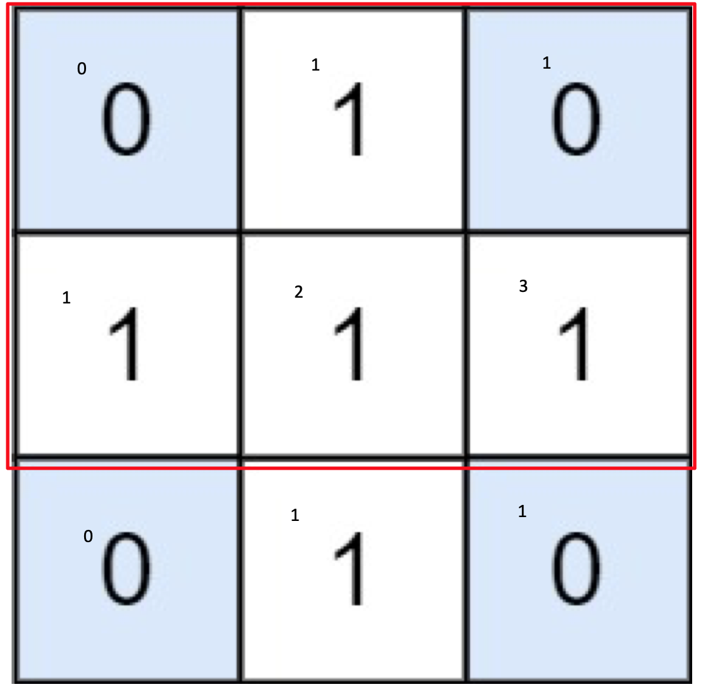

# 1074. Number of Submatrices that sum to Target

Given a `matrix` and a `target`, return the number of non-empty submatrices that sum to target.

A submatrix `x1, y1, x2, y2` is the set of all cells `matrix[x][y]` with `x1 <= x <= x2` and `y1 <= y <= y2`.

Two submatrices `(x1, y1, x2, y2)` and `(x1', y1', x2', y2')` are different if they have some coordinate that is different: for example, if `x1 != x1'`.

 

**Example 1:**


```
Input: matrix = [[0,1,0],[1,1,1],[0,1,0]], target = 0
Output: 4
Explanation: The four 1x1 submatrices that only contain 0.
```

**Example 2:**

```
Input: matrix = [[1,-1],[-1,1]], target = 0
Output: 5
Explanation: The two 1x2 submatrices, plus the two 2x1 submatrices, plus the 2x2 submatrix.
```

**Example 3:**

```
Input: matrix = [[904]], target = 0
Output: 0
```

 

**Constraints:**

- `1 <= matrix.length <= 100`
- `1 <= matrix[0].length <= 100`
- `-1000 <= matrix[i] <= 1000`
- `-10^8 <= target <= 10^8`

## Analysis: using two fixed points

Use prefix sum we can get the area of any submatrix in $O(1)$. For example:

Original matrix:

```
0 1 0
1 1 1
0 1 0
```

After prefix sum  `area from (0,0) to (x,y) = sum(x,y-1)+sum(x-1,y)-sum(x-1,y-1)+matrix(x-1,y-1)`:

```
0 0 0 0
0 0 1 1
0 1 3 4
0 1 4 5
```

To calculate any submatrix sum from (x1, y1) to (x2, y2) where x1 < x2 and y1 < y2.

For example, if (x1, y1) = (1, 1), (x2, y2) = (2, 2), area of (1+1, 1+1) to (2, 2) square is: 3-1-1+0=1

```
we are calculating this part of the submatrix (just a single element):
1

and the prefix sum is:
0 1
1 3
```

The formula for calculating the area for any submatrix is thus:

`sum[x2][y2]-sum[x1][y2]-sum[x2][y1]+sum[x1][y1]` and the area that it represents is from `(x1+1,y1+1)` to `(x2,y2)`

* Time: $O(n^4)$ since we need to iterate through all the possible two coordinates (two fix points)
* Space: $O(n^2)$ for the prefix sum matrix

## Code

```c++
class Solution {
public:
    int numSubmatrixSumTarget(vector<vector<int>>& d, int target) {
        int m = d.size(), n = d[0].size(), res = 0;
        vector<vector<int>> sum(m+1,vector<int>(n+1,0));
        for (int i = 1; i <= m; ++i)
            for (int j = 1; j <= n; ++j) {
                sum[i][j]=sum[i-1][j]+sum[i][j-1]-sum[i-1][j-1]+d[i-1][j-1];
            }

        for (int x1 = 0; x1 < m; ++x1) {
            for (int y1 = 0; y1 < n; ++y1) {
                for (int x2 = x1+1; x2 <= m; ++x2) {
                    for (int y2 = y1+1; y2 <= n; ++y2) {
                        int area = sum[x2][y2]-sum[x1][y2]-sum[x2][y1]+sum[x1][y1];
                        if (area ==target) 
                            res++;
                    }
                }
            }
        }
        return res;
    }
```

## Analysis: using map

Similar to finding the [target subarray](../0560.-Subarray-Sum-Equals-K), this problem can use a map to record all the previous existing sum, and try to find the complement for the current sum.

The smaller number represents the prefix sum by row:



The red rectangular represents the condition when we want to calculate all the submatrix sum from `left=0` and `right=2` and `row=1`. To find if current [i, j] is the right down point of the target submatrix (and how many), we just need to check if there are any submatrix whose area is equal to the complement of the current sum.

For example, on `row=0`, the map changes from:

{{0,1}} -> {{0,2}} on right = 0 and update our res **before we update the map** -> {{0,2}, {1,1}} on right = 1 -> {{0,2}, {1,2}} on right = 2 


* Time: $O(n^3)$ using map will reduce the time for finding duplicate submatrices that has the same complement sum
* Space: $O(n^2)$ we could possibly have $m \times n$ different sum

## Code

```c++
class Solution {
public:
    int numSubmatrixSumTarget(vector<vector<int>>& A, int target) {
        int res = 0, m = A.size(), n = A[0].size();
        for (int i = 0; i < m; i++)
            for (int j = 1; j < n; j++)
                A[i][j] += A[i][j - 1];

        unordered_map<int, int> counter; // area: count
        for (int i = 0; i < n; i++) { // left
            for (int j = i; j < n; j++) { // right
                counter = {{0,1}}; // init counter each time for a new right
                int cur = 0;
                for (int row = 0; row < m; row++) {
                    cur += A[row][j] - (i > 0 ? A[row][i - 1] : 0);
                  	// update res first
                    res += counter.count(cur - target) ? counter[cur - target] : 0;
                    counter[cur]++;
                }
            }
        }
        return res;
    }
};
```

