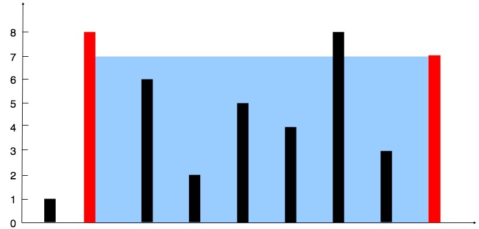

# Container with Most Water

Given n non-negative integers a1, a2, ..., an , where each represents a point at coordinate (i, ai). n vertical lines are drawn such that the two endpoints of line i is at (i, ai) and (i, 0). Find two lines, which together with x-axis forms a container, such that the container contains the most water.



Note: You may not slant the container and n is at least 2.

## Using two pointers

```c
if $a_i$ > $a_j$:
  then j --
else
  then i ++
until two pointers have met 
```

**Proof**:
Assume the answer is $i^{'}$ and $j^{'}$ where $(i^{'} < j^{'})$, use $S^{'}$ to represent the total water. Also assume $a_i > a_j$, so i to j - 1 should have the answer. We need to prove it is correct by showing optimal isn't in i + 1 to j
Assume there is another $S$ that is greater than $S^{'}$, then
S = min(a_i, a_j) * (j - i)$ and $j > j^{'}$
$= a_i \times (j - i)$
$> a_i \times (j^{'} - i)$
$\geqslant min(a_i, a_{j^{'}}) \times (j^{'} - i) = S^{'}$

## Code

```c
class Solution {
public:
    int maxArea(vector<int>& height) {
        int res = 0;
        for (int i = 0, j = height.size() - 1; i < j; )
        {
            res = max(res, 
                  min(height[i], height[j]) * (j - i));
            if (height[i] > height[j]) j -- ;
            else i ++ ;
        }
        return res;
    }
};
```

