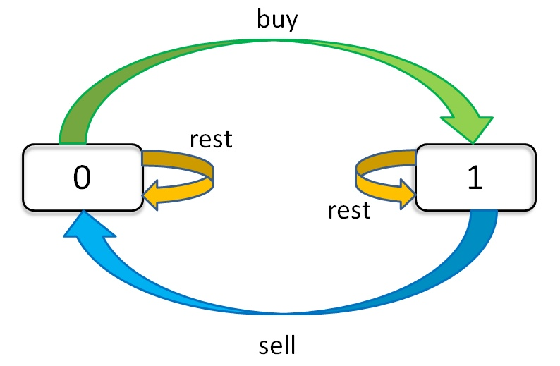

# Best Time to Buy and Sell Stock -- Summary

>solution all referenced from:

作者：labuladong
链接：https://leetcode-cn.com/problems/best-time-to-buy-and-sell-stock-iii/solution/yi-ge-tong-yong-fang-fa-tuan-mie-6-dao-gu-piao-wen/
来源：力扣（LeetCode）
著作权归作者所有。商业转载请联系作者获得授权，非商业转载请注明出处。

Say you have an array for which the ith element is the price of a given stock on day i.

If you were only permitted to complete at most one transaction (i.e., buy one and sell one share of the stock), design an algorithm to find the maximum profit.

Note that you cannot sell a stock before you buy one.

Example 1:

Input: [7,1,5,3,6,4]
Output: 5
Explanation: Buy on day 2 (price = 1) and sell on day 5 (price = 6), profit = 6-1 = 5.
             Not 7-1 = 6, as the selling price needs to be larger than buying price.
Example 2:

Input: [7,6,4,3,1]
Output: 0
Explanation: In this case, no transaction is done, i.e. max profit = 0.

## presumptions

1. there is only one stock to be bought
2. no consecutive buy or sell happens (buy on day one and buy one day two, instead, can only choose rest or sell)

## state machine



**representation**
dp[i][j][k]
1. i: current day from day zero
2. j: transections left
3. k: {1,0} own (rest) or sold (sell)

dp[i][k][0] = max(dp[i-1][k][0], dp[i-1][k][1] + prices[i])
              max(   选择 rest  ,           选择 sell      )

解释：今天我没有持有股票，有两种可能：
要么是我昨天就没有持有，然后今天选择 rest，所以我今天还是没有持有；
要么是我昨天持有股票，但是今天我 sell 了，所以我今天没有持有股票了。

dp[i][k][1] = max(dp[i-1][k][1], dp[i-1][k-1][0] - prices[i])
              max(   选择 rest  ,           选择 buy         )

解释：今天我持有着股票，有两种可能：
要么我昨天就持有着股票，然后今天选择 rest，所以我今天还持有着股票；
要么我昨天本没有持有，但今天我选择 buy，所以今天我就持有股票了。

**inital**:
dp[-1][k][0] = 0
解释：因为 i 是从 0 开始的，所以 i = -1 意味着还没有开始，这时候的利润当然是 0 。
dp[-1][k][1] = -infinity
解释：还没开始的时候，是不可能持有股票的，用负无穷表示这种不可能。
dp[i][0][0] = 0
解释：因为 k 是从 1 开始的，所以 k = 0 意味着根本不允许交易，这时候利润当然是 0 。
dp[i][0][1] = -infinity
解释：不允许交易的情况下，是不可能持有股票的，用负无穷表示这种不可能。

## part 1: one transection

dp[i][1][0] = max(dp[i-1][1][0], dp[i-1][1][1] + prices[i])
dp[i][1][1] = max(dp[i-1][1][1], dp[i-1][0][0] - prices[i]) 
            = max(dp[i-1][1][1], -prices[i])
解释：k = 0 的 base case，所以 dp[i-1][0][0] = 0。

现在发现 k 都是 1，不会改变，即 k 对状态转移已经没有影响了。
可以进行进一步化简去掉所有 k：
dp[i][0] = max(dp[i-1][0], dp[i-1][1] + prices[i])
dp[i][1] = max(dp[i-1][1], -prices[i])

```c
for (int i = 0; i < n; i++) {
    if (i - 1 == -1) { // i==0
        dp[i][0] = 0;
        // 解释：
        //   dp[i][0] 
        // = max(dp[-1][0], dp[-1][1] + prices[i])
        // = max(0, -infinity + prices[i]) = 0
        dp[i][1] = -prices[i];
        //解释：
        //   dp[i][1] 
        // = max(dp[-1][1], dp[-1][0] - prices[i])
        // = max(-infinity, 0 - prices[i]) 
        // = -prices[i]
        continue;
    }
    dp[i][0] = max(dp[i-1][0], dp[i-1][1] + prices[i]);
    dp[i][1] = max(dp[i-1][1], -prices[i]); // now is sell, if last is sold now has to hold
                                            //              if last is buy, now is rest
}
return dp[n - 1][0];
```

## part 2: k transections

dp[i][k][0] = max(dp[i-1][k][0], dp[i-1][k][1] + prices[i])
dp[i][k][1] = max(dp[i-1][k][1], dp[i-1][k-1][0] - prices[i])
            = max(dp[i-1][k][1], dp[i-1][k][0] - prices[i])

我们发现数组中的 k 已经不会改变了，也就是说不需要记录 k 这个状态了：
dp[i][0] = max(dp[i-1][0], dp[i-1][1] + prices[i])
dp[i][1] = max(dp[i-1][1], dp[i-1][0] - prices[i])

```c
int maxProfit_k_inf(vector<int> prices) {
    int n = prices.size();
    int dp_i_0 = 0, dp_i_1 = INT_MIN;
    for (int i = 0; i < n; i++) {
        int temp = dp_i_0; // last state is 
        dp_i_0 = max(dp_i_0, dp_i_1 + prices[i]);
        dp_i_1 = max(dp_i_1, temp - prices[i]);
    }   
    return dp_i_0;
}
```


  