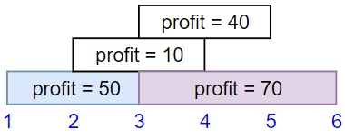
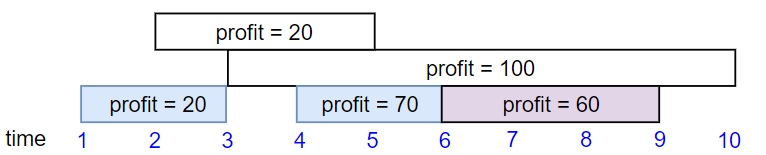
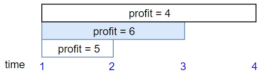

# Maximum Profit in job scheduling

We have n jobs, where every job is scheduled to be done from startTime[i] to endTime[i], obtaining a profit of profit[i].

You're given the startTime , endTime and profit arrays, you need to output the maximum profit you can take such that there are no 2 jobs in the subset with overlapping time range.

If you choose a job that ends at time X you will be able to start another job that starts at time X.

 

Example 1:



Input: startTime = [1,2,3,3], endTime = [3,4,5,6], profit = [50,10,40,70]
Output: 120
Explanation: The subset chosen is the first and fourth job. 
Time range [1-3]+[3-6] , we get profit of 120 = 50 + 70.
Example 2:




Input: startTime = [1,2,3,4,6], endTime = [3,5,10,6,9], profit = [20,20,100,70,60]
Output: 150
Explanation: The subset chosen is the first, fourth and fifth job. 
Profit obtained 150 = 20 + 70 + 60.
Example 3:



Input: startTime = [1,1,1], endTime = [2,3,4], profit = [5,6,4]
Output: 6


Constraints:

1 <= startTime.length == endTime.length == profit.length <= 5 * 10^4
1 <= startTime[i] < endTime[i] <= 10^9
1 <= profit[i] <= 10^4

## Analysis

For this problem, we cannot use greedy algorithm, since each interval's contribution isn't uniform (not all 1), so we need dp to solve. Different from classic dp problem, which we need to store all the timestamp, in this problem, we just care about the timestamp that is one of the ending time of any task. For example:

```
// if t is between two interval (w/o any intersection), dp[t] is equal to [dp[job1.end], dp[job1.start]], we don't need to record all the timestamp
job1: -----[ t ]
job2:           ------
```

Now we can define our dp[i] as maximum profits from (0, i] timestamp. We can derive that for any dp[i]:
* if we choose to take job x, dp[x.end] = dp[last job end before x.start] + job x's profit
* if we choose not to take job x, dp[x.end] =  dp[last job's end]

Our answer will be dp[last job ending time].

Time: $O(n \log(n))$ for sorting, $O(n \log(n))$ for search last job ending (choose case from dp)
Space:$O(n)$ we need to store all the interval in the map.

## Code [Link](https://leetcode.com/problems/maximum-profit-in-job-scheduling/discuss/409009/JavaC%2B%2BPython-DP-Solution)

```c++
class Solution {
public:
    int jobScheduling(vector<int>& startTime, vector<int>& endTime, vector<int>& profit) {
        int n = startTime.size();
        vector<vector<int>> jobs;
        for (int i = 0; i < n; ++i) {
            jobs.push_back({endTime[i], startTime[i], profit[i]});
        }
        sort(jobs.begin(), jobs.end()); // sort by ending time
        map<int, int> dp = {{0, 0}};
        for (auto job : jobs) {
            // find the last ending which end before current start time, so that we can schedule current job
            int last_ending_profit = prev(dp.upper_bound(job[1])) -> second; 
            // if by adding current job will cause a higher profit, we can update current ending time's profit
            if (last_ending_profit + job[2] > dp.rbegin() -> second)
                dp[job[0]] = last_ending_profit + job[2];
        }
        return dp.rbegin() -> second;
    }
};
```

## Misc

In c++, `dp.rbegin()` will return the last sorted pair from map, whereas `dp.end()` should return an empty nothing. source: http://www.cplusplus.com/reference/map/map/end/