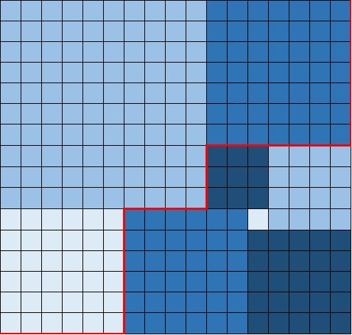

# 1240. Tiling a Rectangle with the Fewest Squares

Given a rectangle of size `n` x `m`, find the minimum number of integer-sided squares that tile the rectangle.

 

**Example 1:**


```
Input: n = 2, m = 3
Output: 3
Explanation: 3 squares are necessary to coverthe rectangle.
2 (squares of 1x1)
1 (square of 2x2)
```

**Example 2:**


```
Input: n = 5, m = 8
Output: 5
```

**Example 3:**


```
Input: n = 11, m = 13
Output: 6
```

 

**Constraints:**

- `1 <= n <= 13`
- `1 <= m <= 13`

## Analysis

If you think about using greedy to solve this problem, you will probably fail. If you try to fill the rectangular space from largest to smallest, it will not guarantee to be the most optimal solution. Check 

On the middle right, it has splayed the right down region with the upper right region, which breaks the greedy algorithm.


So we go back to use the rudimentary DFS search solution. Imagine you can fill the rectangular as a skyline problem (from left to right, bottom to top). You task is to fill all parts of the rectangular. We use a `height[i]` array to represent the skyline. If our skyline has the same height as the given height `m`, then we have reach our base case. We update the answer with the current minimal.

```c++
if (min_height == m) {
  res = min(cnt, res);
  return;
}
```

To place next block, we try to eagerly find the next square from the current concave shape skyline. We need to first determine the largest block to be filled with, and then update the new height with the current skyline.

```c++
int left = 0, min_height = m;
for (int i = 0; i < n; ++i) {
  if (heights[i] < min_height)
    min_height = heights[left = i];
}

if (min_height == m) {
  res = min(cnt, res);
  return;
}
int right = left;
// giving space for square with width and height equal to min_height
while (right < n && heights[left] == heights[right] &&
       // check width to fit in m
       right - left + min_height < m)
  right++;
// update the new height
for (int i = left; i < right; ++i)
  heights[i] += right - left;
```

Now we have filled the next largest piece of square in the block, and we need to recursively find the next one from the current shape. However, at this point we cannot just keep doing it greedily , since we have prove it won't work for some cases. What we do is try all the square starting from the current largest square we have occupied, and decrease the `height[i]` one by one.

```c++
 for (int size = right - left; size >= 1; --size) {
   // try the largest square first
   dfs(n, m, heights, cnt + 1, res);
   // try other squares by decreasing the size of it, or "recover" the original block
   for (int i = left; i < left + size - 1; ++i)
     heights[i] --;
   heights[left + size - 1] -= size;
 }
```

* Time: $O(n^4)$, in each iteration we have $n^2$ complexity, and we can run the program from any point of the 2d matrix, so in total is $n^2 \times n^2$
* Space: $O(n^2)$ both the stack space and the `height[i]` array.

## Code

```c++
class Solution {
    public:
    void dfs(int n, int m, vector<int>& heights, int cnt, int& res) {
        if (cnt >= res) return;
        // left: min_height's index, if there are multiple min_height, it uses the left most min_height's index
        int left = 0, min_height = m;
        for (int i = 0; i < n; ++i) {
            if (heights[i] < min_height)
                min_height = heights[left = i];
        }
        
        if (min_height == m) {
            res = min(cnt, res);
            return;
        }
        int right = left;
        // giving space for square with width and height equal to min_height
        while (right < n && heights[left] == heights[right] && right - left + min_height < m)
            right++;
        for (int i = left; i < right; ++i)
            heights[i] += right - left;
        for (int size = right - left; size >= 1; --size) {
            dfs(n, m, heights, cnt + 1, res);
            for (int i = left; i < left + size - 1; ++i)
                heights[i] --;
            heights[left + size - 1] -= size;
        }
        
    }
    int tilingRectangle(int n, int m) {
        if (n > m) return tilingRectangle(m, n);
        vector<int> heights(n);
        int res = INT_MAX;
        dfs(n, m, heights, 0, res);
        return res;
    }
};
```

