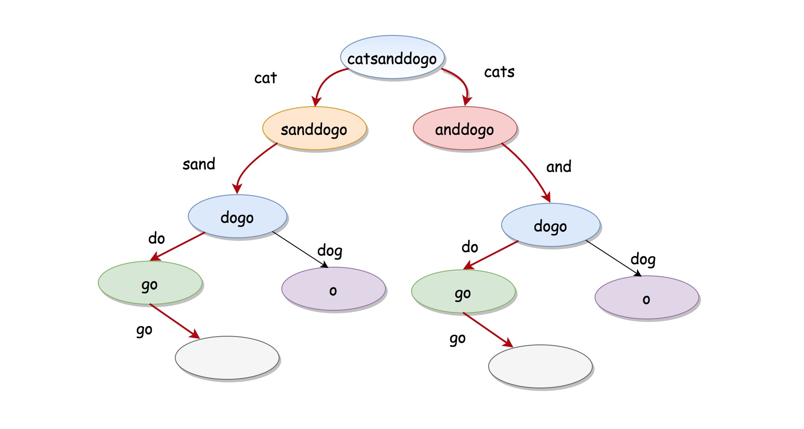
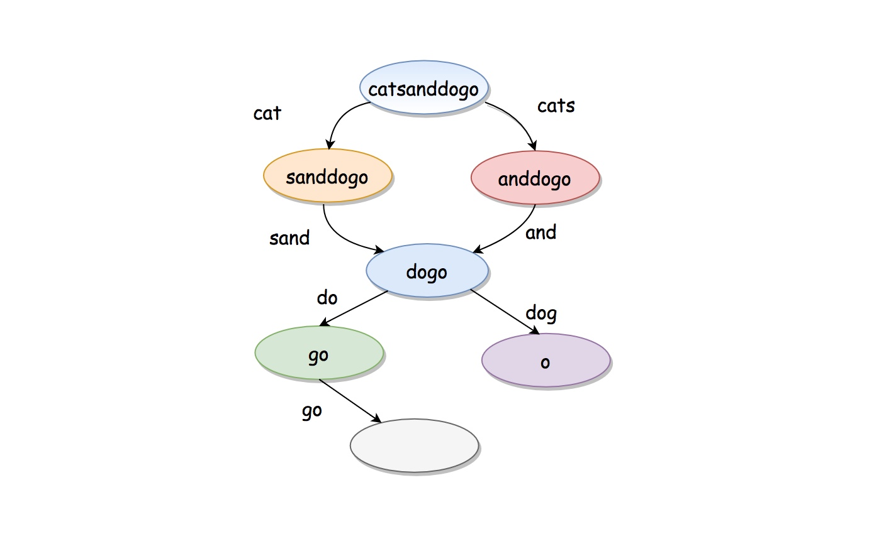

# Word Break II

Given a string `s` and a dictionary of strings `wordDict`, add spaces in `s` to construct a sentence where each word is a valid dictionary word. Return all such possible sentences in **any order**.

**Note** that the same word in the dictionary may be reused multiple times in the segmentation.

 

**Example 1:**

```
Input: s = "catsanddog", wordDict = ["cat","cats","and","sand","dog"]
Output: ["cats and dog","cat sand dog"]
```

**Example 2:**

```
Input: s = "pineapplepenapple", wordDict = ["apple","pen","applepen","pine","pineapple"]
Output: ["pine apple pen apple","pineapple pen apple","pine applepen apple"]
Explanation: Note that you are allowed to reuse a dictionary word.
```

**Example 3:**

```
Input: s = "catsandog", wordDict = ["cats","dog","sand","and","cat"]
Output: []
```

 

**Constraints:**

- `1 <= s.length <= 20`
- `1 <= wordDict.length <= 1000`
- `1 <= wordDict[i].length <= 10`
- `s` and `wordDict[i]` consist of only lowercase English letters.
- All the strings of `wordDict` are **unique**.

## dfs w/ memo

```java
class Solution {
    unordered_map<string, vector<string>> m;

    vector<string> combine(string word, vector<string> prev){
        for(int i=0;i<prev.size();++i){
            prev[i]+=" "+word;
        }
        return prev;
    }

public:
    vector<string> wordBreak(string s, unordered_set<string>& dict) {
        if(m.count(s)) return m[s]; //take from memory
        vector<string> result;
        if(dict.count(s)){ //a whole string is a word
            result.push_back(s);
        }
        for(int i=1;i<s.size();++i){
            string word=s.substr(i);
            if(dict.count(word)){//s[0:i] and s[i:], s[i:] is checked, now check s[0:i]
                string rem=s.substr(0,i);
                vector<string> prev=combine(word,wordBreak(rem,dict));
                result.insert(result.end(),prev.begin(), prev.end());
            }
        }
        m[s]=result; //memorize
        return result;
    }
};
```

1. dfs always takes in from s[0:i], and check s[i:] for current branch
2. the cache is the map of current s[0:i] to all the combination for this substring, so for s[0:i+1], to check s[0:i], just uses the cached one and combine with s[:i]

## Another way w/ memo


After memo:


```java
class Solution {
public:
    vector<string> wordBreak(string s, vector<string>& wordDict) {
        unordered_map<string, vector<string>> m; // word segment -> using what words to form
        return helper(s, wordDict, m);
    }
    // will return all ways to combine this word
    vector<string> helper(string s, vector<string>& wordDict, unordered_map<string, vector<string>>& m) {
        if (m.count(s)) return m[s];
        if (s.empty()) return {""};
        vector<string> res;
        for (string word : wordDict) { // try all words
            if (s.substr(0, word.size()) != word) continue;
            vector<string> rem = helper(s.substr(word.size()), wordDict, m);
            for (string str : rem) {
                res.push_back(word + (str.empty() ? "" : " ") + str);
            }
        }
        return m[s] = res;
    }
};
```