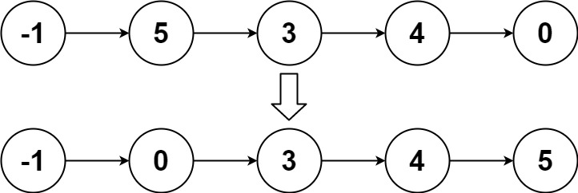

# 0148. Sort List

Given the `head` of a linked list, return *the list after sorting it in **ascending order***.

**Follow up:** Can you sort the linked list in `O(n logn)` time and `O(1)` memory (i.e. constant space)?

 

**Example 1:**


```
Input: head = [4,2,1,3]
Output: [1,2,3,4]
```

**Example 2:**



```
Input: head = [-1,5,3,4,0]
Output: [-1,0,3,4,5]
```

**Example 3:**

```
Input: head = []
Output: []
```

 

**Constraints:**

- The number of nodes in the list is in the range `[0, 5 * 104]`.
- `-105 <= Node.val <= 105`

## Analysis

To sort a linkedlist with constant space, we can use merge sort (for array it will be $O(N)$ space).

Let's recap what to do if we are sorting an array:

0. define base case: there is only one element
1. find mid and split the array into left - mid and mid+1 - right
2. recurse left part and right part
3. use a temporary array to store the sorted array in range of current left - right
4. reassign back to the original array from the temporary array

Convert to linkedlist:

0. define base case: only one node (listnode)
1. use slow-fast pointers to find mid
  - set mid -> next = NULL so it will split left - mid -> NULL and mid + 1 - right
2. recurse left and right
3. create a dummy list node and use two pointers to append
  - append the one with a smaller value first
4. since we didn't create a new list, we can just return now

Time: $O(n \times log_2{n})$ for each break: $O(n)$ + for merge: $O(n)$ + for height $O(log_2{n})$

## Code

```c++
class Solution {
public:
    ListNode* h(ListNode* head) {
        if (!head || !head -> next) return head;
        // find mid
        ListNode *pre = head, *slow = head -> next, *fast = head -> next;
        while (fast && fast -> next) {
            pre = pre -> next;
            slow = slow -> next;
            fast = fast -> next -> next;
        }
        // break
        pre -> next = NULL;
        ListNode *left = h(head), *right = h(slow);
        // merge
        ListNode res(-1);
        ListNode *curr = &res;
        while (left && right) {
            if (left -> val < right -> val) {
                curr -> next = left;
                left = left -> next;
            }
            else {
                curr -> next = right;
                right = right -> next;
            }
            curr = curr -> next;
        }
        // append the rest
        if (left) curr -> next = left;
        if (right) curr -> next = right;
        return (&res) -> next;
    }
    
    ListNode* sortList(ListNode* head) {
        return h(head);
    }
};
```


