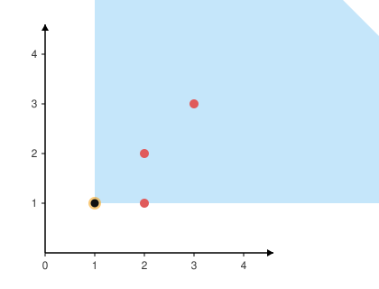
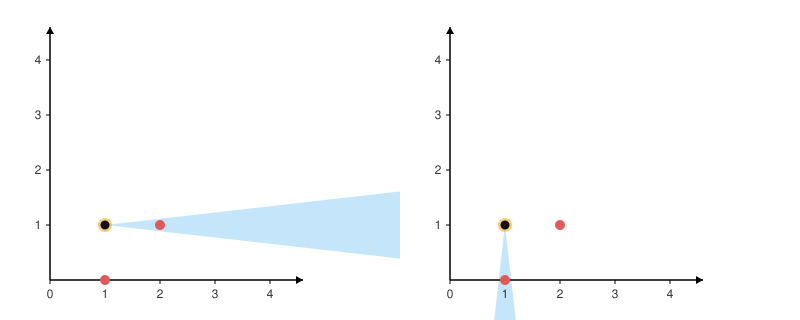

# 1610. Maximum Number of Visible Points

You are given an array `points`, an integer `angle`, and your `location`, where `location = [posx, posy]` and `points[i] = [xi, yi]` both denote **integral** coordinates on the X-Y plane.

Initially, you are facing directly east from your position. You *cannot* move from your position, but you can *rotate*. In other words, `posx` and `posy` cannot be changed. Your field of view in **degrees** is represented by `angle`, determining how wide you can see from any given view direction. Let `d` be the angle between the initial direction of your gaze and the direction of a point from your location. If `d <= angle / 2`, then the point is visible to you, regardless of your distance from it. You can rotate your gaze clockwise or counterclockwise a full 360 degrees.

Return *the maximum number of points you can see*.

Note that multiple points can coincide with your location, and in such cases, they are always counted as visible.

 

**Example 1:**



```
Input: points = [[2,1],[2,2],[3,3]], angle = 90, location = [1,1]
Output: 3
Explanation: The shaded region represents your field of view. All points can be made visible in your field of view, including [3,3] even though [2,2] is in front and in the same line of sight.
```

**Example 2:**

```
Input: points = [[2,1],[2,2],[3,4],[1,1]], angle = 90, location = [1,1]
Output: 4
Explanation: All points can be made visible in your field of view, including the one at your location.
```

**Example 3:**



```
Input: points = [[1,0],[2,1]], angle = 13, location = [1,1]
Output: 1
Explanation: You can only see one of the two points, as shown above.
```

 

**Constraints:**

- `1 <= points.length <= 10^5`
- `points[i].length == 2`
- `location.length == 2`
- `0 <= angle < 360`
- `0 <= posx, posy, xi, yi <= 100`

## Analysis

First, translate every point into an angle relative to `location` using `atan2(dy, dx)`, converted from radians to degrees. Points that sit exactly on `location` have no well-defined angle, so we count those separately (`same`) — they're always visible regardless of gaze direction.

Once every point has an angle in `[-180, 180)`, sort them. The problem is now "find the maximum number of angles that fit inside a sliding window of width `angle`" — a classic two-pointer sliding-window problem, except the window can wrap around past 360 degrees (imagine gazing due north when points are clustered just west and just east of due north). To handle the wraparound without special-casing it, we append a second copy of every angle, each shifted by `+360`, onto the end of the sorted array. A window that "wraps around" in the original circular arrangement now shows up as an ordinary contiguous window somewhere in this doubled array.

We then slide a window `[l, r]` across the doubled array, shrinking from the left whenever `angles[r] - angles[l] > angle`, and track the widest window seen. Finally we add back the `same` count, since those points are visible no matter how we orient our gaze.

* Time: $O(n \log n)$ for the sort; the two-pointer scan over the doubled array is $O(n)$.
* Space: $O(n)$ for the angle array.

## Code

```c++
class Solution {
public:
    int visiblePoints(vector<vector<int>>& points, int angle, vector<int>& location) {
        vector<double> angles;
        int same = 0;
        for (auto& p : points) {
            int dx = p[0] - location[0], dy = p[1] - location[1];
            if (dx == 0 && dy == 0) {
                same++;
                continue;
            }
            angles.push_back(atan2(dy, dx) * 180.0 / acos(-1.0));
        }
        sort(angles.begin(), angles.end());
        int n = angles.size();
        for (int i = 0; i < n; ++i)
            angles.push_back(angles[i] + 360.0);

        int res = 0, l = 0;
        for (int r = 0; r < (int)angles.size(); ++r) {
            while (angles[r] - angles[l] > angle) l++;
            res = max(res, r - l + 1);
        }
        return res + same;
    }
};
```
