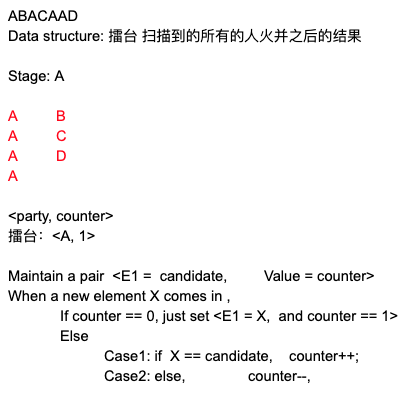

# Majority Element

Given an array of size n, find the majority element. The majority element is the element that appears more than ⌊ n/2 ⌋ times.

You may assume that the array is non-empty and the majority element always exist in the array.

Example 1:

Input: [3,2,3]
Output: 3
Example 2:

Input: [2,2,1,1,1,2,2]
Output: 2

## Analysis

Using [Boyer-Moore majority vote algorithm](https://en.wikipedia.org/wiki/Boyer%E2%80%93Moore_majority_vote_algorithm).



* Time: $O(n)$
* Space: $O(1)$

## Code

```c
class Solution {
public:
    int majorityElement(vector<int>& nums) {
        int cnt = 0, candidate = nums[0];
        for (int e : nums) {
            if (cnt == 0) candidate = e, cnt = 1;
            else if (candidate == e) cnt++;
            else cnt--;
        }
        return candidate;
        
    }
};
```