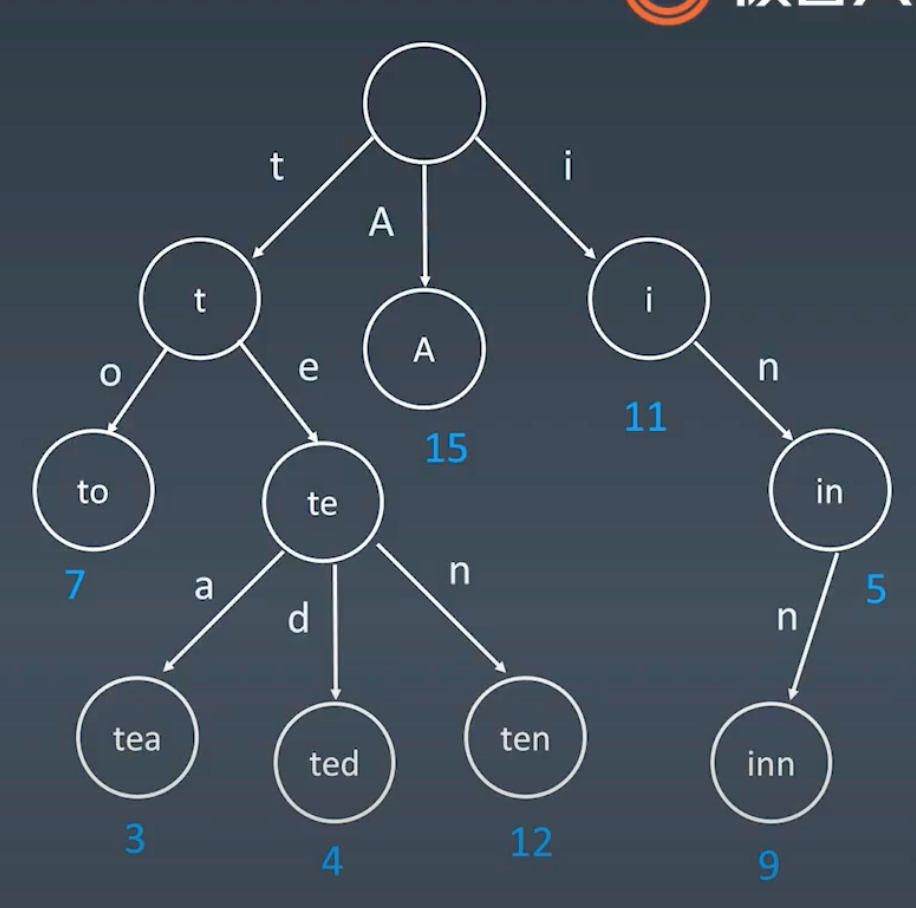
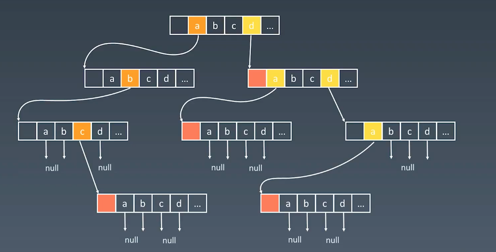

# Implement Trie (Prefix Tree)

Trie (we pronounce "try") or prefix tree is a tree data structure used to retrieve a key in a strings dataset. There are various applications of this very efficient data structure, such as autocomplete and spellchecker.

Implement the Trie class:

- `Trie()` initializes the trie object.
- `void insert(String word)` inserts the string `word` to the trie.
- `boolean search(String word)` returns `true` if the string `word` is in the trie (i.e., was inserted before), and `false` otherwise.
- `boolean startsWith(String prefix)` returns `true` if there is a previously inserted string `word` that has the prefix `prefix`, and `false` otherwise.

 

**Example 1:**

```
Input
["Trie", "insert", "search", "search", "startsWith", "insert", "search"]
[[], ["apple"], ["apple"], ["app"], ["app"], ["app"], ["app"]]
Output
[null, null, true, false, true, null, true]

Explanation
Trie trie = new Trie();
trie.insert("apple");
trie.search("apple");   // return True
trie.search("app");     // return False
trie.startsWith("app"); // return True
trie.insert("app");
trie.search("app");     // return True
```

 

**Constraints:**

- `1 <= word.length, prefix.length <= 2000`
- `word` and `prefix` consist of lowercase English letters.
- At most `3 * 104` calls will be made to `insert`, `search`, and `startsWith`.

## Property for Trie Tree



1. each node does not store complete word
2. each path has a character, the word to current node is the path with all the characters
3. each leaf node marks as `end` for telling it's a complete word
4. each leaf can store the frequency (7, 3, 4, 15, 12, 11, 5, 9) in this case
5. in the same level, all the silbilings are not the same
6. if just typing in the prefix, trie can print out all the suggesting silbilings



each node can has 26 (all lower case) children - **pretty bad space complexity**

## cpp: dynamically generate 26 nodes all the time

```c++
struct TrieNode {
    TrieNode* next[26];
    bool is_word;
    TrieNode(bool b = false)
        : is_word(b)
    {
        memset(next, 0, sizeof(next)); // next store address instead of the value itself
    }
};

class Trie {
private:
    TrieNode* root;
    TrieNode* find(string key)
    {
        TrieNode* p = root;
        for (int i = 0; i < key.size() && p != NULL; ++i) {
            p = p->next[key[i] - 'a'];
        }
        return p;
    }

public:
    /** Initialize your data structure here. */
    Trie() { root = new TrieNode(); }

    /** Inserts a word into the trie. */
    void insert(string word)
    {
        TrieNode* p = root;
        for (int i = 0; i < word.size(); ++i) {
            if (p->next[word[i] - 'a'] == NULL) // not assign any value yet
                p->next[word[i] - 'a'] = new TrieNode(); // only new when 
            p = p->next[word[i] - 'a'];
        }
        p->is_word = true;
    }

    /** Returns if the word is in the trie. */
    bool search(string word)
    {
        TrieNode* p = find(word);
        return p != NULL && p->is_word;
    }

    /** Returns if there is any word in the trie that starts with the given
     * prefix. */
    bool startsWith(string prefix) { return find(prefix) != NULL; }
};

/**
 * Your Trie object will be instantiated and called as such:
 * Trie* obj = new Trie();
 * obj->insert(word);
 * bool param_3 = obj->search(word);
 * bool param_3 = obj->startsWith(prefix);
 */

```