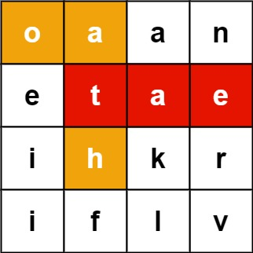

# Word Search II

Given an `m x n` `board` of characters and a list of strings `words`, return *all words on the board*.

Each word must be constructed from letters of sequentially adjacent cells, where **adjacent cells** are horizontally or vertically neighboring. The same letter cell may not be used more than once in a word.

 

**Example 1:**



```
Input: board = [["o","a","a","n"],["e","t","a","e"],["i","h","k","r"],["i","f","l","v"]], words = ["oath","pea","eat","rain"]
Output: ["eat","oath"]
```

**Example 2:**


```
Input: board = [["a","b"],["c","d"]], words = ["abcb"]
Output: []
```

 

**Constraints:**

- `m == board.length`
- `n == board[i].length`
- `1 <= m, n <= 12`
- `board[i][j]` is a lowercase English letter.
- `1 <= words.length <= 3 * 104`
- `1 <= words[i].length <= 10`
- `words[i]` consists of lowercase English letters.
- All the strings of `words` are unique.

## Analysis

Notation:

1. size of words: w
2. board width: n, board height: m
3. average length of words: len

1. Using DFS: for each additional branch (adding a character from all four neighbours), there is no way to know if the additional will work or not, and we can only know until we have iterated through the entire matrix (requires $O(m \times n)$ for a single check). The total time is: $O(w \times m \times n \times 4^{len})$ 
2. Using Trie: we can do better for elimating the unnecessary checks mentioned in the DFS. We can cut off early if the neigbour of current Trie node doesn't exist, and we only proceed if exist. Thus, the optimized time complexity is $O(w \times len + m \times n \times 4 ^ {len})$ [building Trie + dfs search].

## Code

```c
class Solution {
public:
  struct Node {
    Node *nei[26];
    bool end = false;
  };
  Node *root = new Node();
  void insert(string s) {
    Node *curr = root;
    for (char c : s) {
      if (!curr->nei[c - 'a'])
        curr->nei[c - 'a'] = new Node();
      curr = curr->nei[c - 'a'];
    }
    curr->end = true;
  }

  int dir[4][2] = {{1, 0}, {-1, 0}, {0, 1}, {0, -1}};
  unordered_set<string> res;
  vector<vector<char>> matrix;
  int m, n;
  bool vis[1010][1010] = {{0}};
  // O(m * n)
  void dfs(int i, int j, string path, Node *curr) {
    if (!curr)
      return;
    if (curr->end)
      res.insert(path);
    vis[i][j] = true;
    for (auto d : dir) {
      int x = i + d[0], y = j + d[1];
      if (x < 0 || x >= m || y < 0 || y >= n ||
          !curr->nei[matrix[x][y] - 'a'] || vis[x][y])
        continue;
      dfs(x, y, path + matrix[x][y], curr->nei[matrix[x][y] - 'a']);
    }
    vis[i][j] = false;
  }
  vector<string> findWords(vector<vector<char>> &board, vector<string> &words) {
    m = board.size();
    n = board[0].size();

    for (string &str : words) {
      insert(str);
    }
    matrix = board;
    for (int i = 0; i < m; ++i) {
      for (int j = 0; j < n; ++j) {
        if (root->nei[matrix[i][j] - 'a']) {
          string s(1, matrix[i][j]);
          dfs(i, j, s, root->nei[matrix[i][j] - 'a']);
        }
      }
    }
    return vector<string>(res.begin(), res.end());
  }
};

```