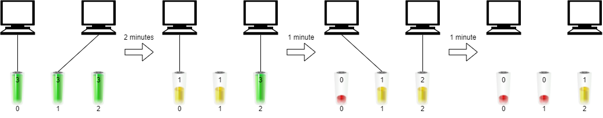
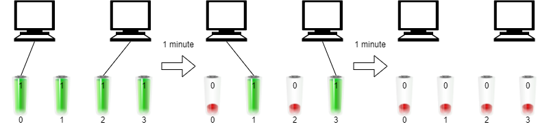

# Maximum Running Time of N Computers

You have `n` computers. You are given the integer `n` and a **0-indexed** integer array `batteries` where the `ith` battery can **run** a computer for `batteries[i]` minutes. You are interested in running **all** `n` computers **simultaneously** using the given batteries.

Initially, you can insert **at most one battery** into each computer. After that and at any integer time moment, you can remove a battery from a computer and insert another battery **any number of times**. The inserted battery can be a new battery or a battery from another computer. You may assume that the removing and inserting processes take no time.

Note that the batteries cannot be recharged.

Return *the **maximum** number of minutes you can run all the* `n` *computers simultaneously.*

 

**Example 1:**



```
Input: n = 2, batteries = [3,3,3]
Output: 4
Explanation: 
Initially, insert battery 0 into the first computer and battery 1 into the second computer.
After two minutes, remove battery 1 from the second computer and insert battery 2 instead. Note that battery 1 can still run for one minute.
At the end of the third minute, battery 0 is drained, and you need to remove it from the first computer and insert battery 1 instead.
By the end of the fourth minute, battery 1 is also drained, and the first computer is no longer running.
We can run the two computers simultaneously for at most 4 minutes, so we return 4.
```

**Example 2:**



```
Input: n = 2, batteries = [1,1,1,1]
Output: 2
Explanation: 
Initially, insert battery 0 into the first computer and battery 2 into the second computer. 
After one minute, battery 0 and battery 2 are drained so you need to remove them and insert battery 1 into the first computer and battery 3 into the second computer. 
After another minute, battery 1 and battery 3 are also drained so the first and second computers are no longer running.
We can run the two computers simultaneously for at most 2 minutes, so we return 2.
```

 

**Constraints:**

- `1 <= n <= batteries.length <= 105`
- `1 <= batteries[i] <= 109`

## Analysis

I have tried using the priority queue to solve this problem initially, but it won't work since we can change the battery before it drained (as shown in the first example). Then a different way to solve this problem is by "guessing the answer", and it turns out we can use binary search to "guess" the largest result. 

#### Binary search

We can think of the problem as given a target time, can we charge all the computers altogether? To find out, we can observe that the total time to charge is always a fixed value: `total_minutes * number_of_batteries`. To find out if current batteries can charge all the computers, we just need to check the value for each battery with the minutes we want. We can compute the total minutes for the current array, and if the battery can hold longer than what we need, we can drop the redundant battery minutes and just use the required minutes. Another thing to make binary search work is that if the current target time works, that means for all the time that is less than the current target time will still work. 

* Time: $O(n \log (N))$ where `n` is the size of the batteries array
* Space: $O(1)$

### Greedy

Similar to binary search, we can minimize the computation of each target time's required time. Consider that the more batteries we have from the current batteries list, the higher chance we can reach the longest minutes. Another thing that bounds the resultant minutes is the largest battery. If we have a battery that is large enough to charge all the time, the total time we need is decided by all the batteries that are smaller than the current largest battery. How do we calculate the time? Using the equation: `total_battery_minutes / number_of_computers`. We should try to maximize the `total_battery_minutes`. ref: [Leetcode solution](https://leetcode.com/problems/maximum-running-time-of-n-computers/discuss/1693347/Heap-vs.-Binary-Search)

* Time: $O(n \log(K))$ where `k` is the number of computers
* Space: $O(n)$ for sort/priority queue

## Code

## Binary search

```c++
#define LL long long

class Solution {
private:
    bool check(LL t, int n, const vector<int> &batteries) {
        LL tot = 0;
        for (LL x : batteries)
            tot += min(t, x);

        return tot >= t * n;
    }

public:
    LL maxRunTime(int n, vector<int>& batteries) {
        LL l = 1, r = 100000000000000ll;
        while (l < r) {
            LL mid = (l + r) >> 1;
            if (check(mid + 1, n, batteries)) l = mid + 1;
            else r = mid;
        }

        return l;
    }
};

作者：wzc1995
链接：https://www.acwing.com/solution/content/85703/
来源：AcWing
著作权归作者所有。商业转载请联系作者获得授权，非商业转载请注明出处。
```

### Greedy

#### Priority queue

```c++
long long maxRunTime(int n, vector<int>& bat) {
    long long sum = accumulate(begin(bat), end(bat), 0LL);
    priority_queue<int> pq(begin(bat), end(bat));
    while (pq.top() > sum / n) {
        sum -= pq.top(); pq.pop();
        --n;
    }
    return sum / n;
}
```

#### Sort

```c++
#define LL long long

class Solution {
public:
    LL maxRunTime(int n, vector<int>& batteries) {
        const int m = batteries.size();
        sort(batteries.begin(), batteries.end());

        LL sum = 0;
        for (int x : batteries)
            sum += x;

        for (int i = m - 1; i >= 0; i--) {
            LL avg = sum / n;
            if (batteries[i] <= avg)
                return avg;

            n--;
            sum -= batteries[i];
        }

        return 0;
    }
};

作者：wzc1995
链接：https://www.acwing.com/solution/content/85703/
来源：AcWing
著作权归作者所有。商业转载请联系作者获得授权，非商业转载请注明出处。
```


