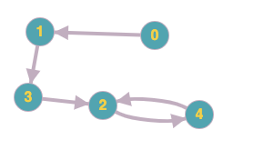

# 287. Find the Duplicate Number

Given an array of integers `nums` containing `n + 1` integers where each integer is in the range `[1, n]` inclusive.

There is only **one repeated number** in `nums`, return *this repeated number*.

 

**Example 1:**

```
Input: nums = [1,3,4,2,2]
Output: 2
```

**Example 2:**

```
Input: nums = [3,1,3,4,2]
Output: 3
```

**Example 3:**

```
Input: nums = [1,1]
Output: 1
```

**Example 4:**

```
Input: nums = [1,1,2]
Output: 1
```

 

**Constraints:**

- `2 <= n <= 3 * 104`
- `nums.length == n + 1`
- `1 <= nums[i] <= n`
- All the integers in `nums` appear only **once** except for **precisely one integer** which appears **two or more** times.

 

**Follow up:**

- How can we prove that at least one duplicate number must exist in `nums`?
- Can you solve the problem **without** modifying the array `nums`?
- Can you solve the problem using only constant, `O(1)` extra space?
- Can you solve the problem with runtime complexity less than `O(n2)`?

## Analysis

We can think about this problem similar to [linkedlist cycle II](https://leetcode.com/problems/linked-list-cycle-ii/). For each element in the array:
**i has an edge to nums[i]**. If we find a cycle, that means there are two indexes pointing to the same element from the array.

For example, nums = [1,3,4,2,2], using graph it will represent:


There is one and only one node with in degree of two, which makes the "linkedlist" a cycle, and our task is to find the one with an in-degree of two.

1. using two pointers to get into the cycle: one pointer moves by one step each time, the other move by two steps.
2. reset one of the pointers to 0, so that it's outside the cycle, keep going the other one and the current one until they meet. The only node that these two pointers will meet is the one with an in-degree of 2.

* Time: $O(2 \times n)$
* Space: $O(1)$

## Code

```c++
class Solution {
public:
    int findDuplicate(vector<int>& nums) {
        int a = 0, b = 0;
        do { // do while since 0 == 0 is our initial condition
            a = nums[nums[a]];
            b = nums[b];
        }  while (a != b) ;
        a = 0;
        while (a != b) {
            a = nums[a];
            b = nums[b];
        }
        return a;
    }
};
```

