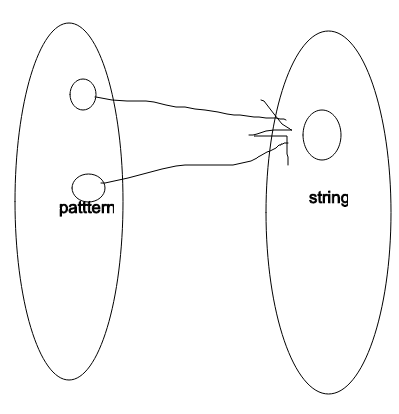

# Word Pattern

Given a pattern and a string s, find if s follows the same pattern.

Here follow means a full match, such that there is a bijection between a letter in pattern and a non-empty word in s.

 

Example 1:

Input: pattern = "abba", s = "dog cat cat dog"
Output: true
Example 2:

Input: pattern = "abba", s = "dog cat cat fish"
Output: false
Example 3:

Input: pattern = "aaaa", s = "dog cat cat dog"
Output: false
Example 4:

Input: pattern = "abba", s = "dog dog dog dog"
Output: false


Constraints:

1 <= pattern.length <= 300
pattern contains only lower-case English letters.
1 <= s.length <= 3000
s contains only lower-case English letters and spaces ' '.
s does not contain any leading or trailing spaces.
All the words in s are separated by a single space.

## Analysis

Valid matching:


Invalid matching 1:


Invalid matching 2:


To check if both cases are valid, we can keep two hashmap for storing the current mapping
1. if ps[a] != b return false else put {a,b} to ps
2. if sp[b] != a return false else put {b,a} to sp

Time: $O(n)$
Space: $O(n)$

## Code

```java
class Solution {
public:
    bool wordPattern(string pattern, string s) {
        map<char, string> ps;
        map<string, char> sp;
        istringstream ss(s);
        int p = 0;
        for (string word; ss >> word; ++p) {
            char currp = pattern[p];
            if (ps.count(currp) && ps[currp] != word) return false;
            ps[currp] = word;
            if (sp.count(word) && sp[word] != currp) return false;
            sp[word] = currp;
        }
        return p == pattern.size();
    }
};
```