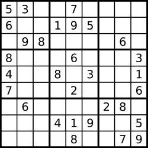

# Valid Sudoku

Determine if a `9 x 9` Sudoku board is valid. Only the filled cells need to be validated **according to the following rules**:

1. Each row must contain the digits `1-9` without repetition.
2. Each column must contain the digits `1-9` without repetition.
3. Each of the nine `3 x 3` sub-boxes of the grid must contain the digits `1-9` without repetition.

**Note:**

- A Sudoku board (partially filled) could be valid but is not necessarily solvable.
- Only the filled cells need to be validated according to the mentioned rules.

 

**Example 1:**



```
Input: board = 
[["5","3",".",".","7",".",".",".","."]
,["6",".",".","1","9","5",".",".","."]
,[".","9","8",".",".",".",".","6","."]
,["8",".",".",".","6",".",".",".","3"]
,["4",".",".","8",".","3",".",".","1"]
,["7",".",".",".","2",".",".",".","6"]
,[".","6",".",".",".",".","2","8","."]
,[".",".",".","4","1","9",".",".","5"]
,[".",".",".",".","8",".",".","7","9"]]
Output: true
```

**Example 2:**

```
Input: board = 
[["8","3",".",".","7",".",".",".","."]
,["6",".",".","1","9","5",".",".","."]
,[".","9","8",".",".",".",".","6","."]
,["8",".",".",".","6",".",".",".","3"]
,["4",".",".","8",".","3",".",".","1"]
,["7",".",".",".","2",".",".",".","6"]
,[".","6",".",".",".",".","2","8","."]
,[".",".",".","4","1","9",".",".","5"]
,[".",".",".",".","8",".",".","7","9"]]
Output: false
Explanation: Same as Example 1, except with the 5 in the top left corner being modified to 8. Since there are two 8's in the top left 3x3 sub-box, it is invalid.
```

 

**Constraints:**

- `board.length == 9`
- `board[i].length == 9`
- `board[i][j]` is a digit or `'.'`.

## Analysis

There are three things we need to keep track: # of distinct row values, # of distinct columns values, # of box values. To calculate the first twos are fairly simple: keep a boolean array of size of 9, set row i to true for each iteration and check for conflict. 


To calculate box index, we can use the same method. By observation: 
For row number 0-2, the box_index
can only be 0, 1, or 2, which can be determined by column number
divided by 3 : col / 3. For row number 3-5, the box_index is 3, 4, 5,
which can be determined by (1 * 3 + col / 3), and 1 = row / 3.
Same reason for row number 6-8, the box_index is
(2 * 3 + col / 3), and 2 = row / 3. As to why multiply by 3 is because
every 3 row from left to right contains 3 boxes.

## Code

```c
class Solution {
#define B(i, j) (3 * (i / 3) + j / 3)
    public:
        bool isValidSudoku(vector<vector<char>>& board) {
            if (board.empty() || board[0].empty()) {
                return false; 
            }

            int m = board.size(), n = board[0].size();

            vector<vector<bool>> row(m, vector<bool>(n, false)); // n = 9
            vector<vector<bool>> col(m, vector<bool>(n, false));
            vector<vector<bool>> box(m, vector<bool>(n, false));
            
            for (int i = 0; i < m; ++i) {
               for (int j = 0; j < n; ++j) {
                    if (board[i][j] == '.') {
                        continue; 
                    }

                    int value = board[i][j] - '1'; // so that '1' -> 0
                    if (row[i][value] || col[value][j] || box[B(i, j)][value]) {
                        return false; 
                    } else {
                        row[i][value] = true;
                        col[value][j] = true;
                        box[B(i, j)][value] = true;
                    }
               } 
            }
            return true;
        }
};
```