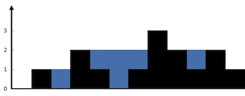
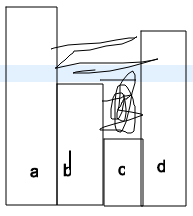

# Trapping Rain Water

Given n non-negative integers representing an elevation map where the width of each bar is 1, compute how much water it is able to trap after raining.



The above elevation map is represented by array [0,1,0,2,1,0,1,3,2,1,2,1]. In this case, 6 units of rain water (blue section) are being trapped. Thanks Marcos for contributing this image!

Example:

Input: [0,1,0,2,1,0,1,3,2,1,2,1]
Output: 6

## Analysis

To trap water, there should be a U shape, which means we need to have three points: left (high), mid (low) and right (high). To find satisfied points, we need to maintain a monontonic stack, which only accept points that is less than current one, so that when new points coming in, we can find the satified three points. 


Taking this example, we can see that for d, it will start trap water for b, c, d first: area = (min(b, d) - c) * (distance between b and d). We can do this calculation for a, b, d as well: area = (min(a, d) - b) * (distance between a and d). By obervation, we can see that we are just calculating the area in the rectangular: lying down with height as the height difference and width is the distance between two bars.

* Time: $O(n)$ we push each element exactly once, and we pop each element exactly once.
* Space: $O(n)$ stack can contain all the elements.

## Code

```c
class Solution {
public:
    int trap(vector<int>& height) {
        int n = height.size(), res = 0;
        stack<int> st;
        for (int i = 0; i < n; ++i) {
            if (st.empty()) st.push(i);
            else {
                while (!st.empty() && height[st.top()] < height[i]) {
                    int t = st.top();
                    st.pop();
                    if (st.empty()) break;
                    res += (i - st.top() - 1) * (min(height[i], height[st.top()]) - height[t]);
                }
                st.push(i);
            }
        }
        return res;
    }
};
```