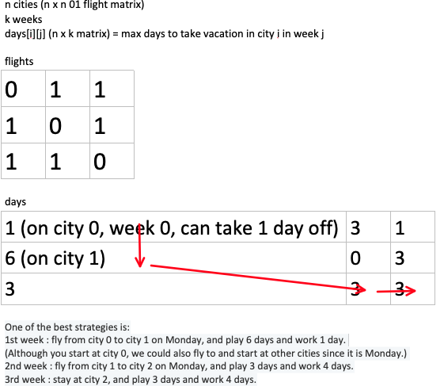

# 0568. Maximum Vacation Days

LeetCode wants to give one of its best employees the option to travel among **N** cities to collect algorithm problems. But all work and no play makes Jack a dull boy, you could take vacations in some particular cities and weeks. Your job is to schedule the traveling to maximize the number of vacation days you could take, but there are certain rules and restrictions you need to follow.

**Rules and restrictions:**

1. You can only travel among **N** cities, represented by indexes from 0 to N-1. Initially, you are in the city indexed 0 on **Monday**.
2. The cities are connected by flights. The flights are represented as a **N\*N** matrix (not necessary symmetrical), called **flights** representing the airline status from the city i to the city j. If there is no flight from the city i to the city j, **flights[i][j] = 0**; Otherwise, **flights[i][j] = 1**. Also, **flights[i][i] = 0** for all i.
3. You totally have **K** weeks (**each week has 7 days**) to travel. You can only take flights at most once **per day** and can only take flights on each week's **Monday** morning. Since flight time is so short, we don't consider the impact of flight time.
4. For each city, you can only have restricted vacation days in different weeks, given an **N\*K** matrix called **days** representing this relationship. For the value of **days[i][j]**, it represents the maximum days you could take vacation in the city **i** in the week **j**.


You're given the **flights** matrix and **days** matrix, and you need to output the maximum vacation days you could take during **K** weeks.

**Example 1:**

```
Input:flights = [[0,1,1],[1,0,1],[1,1,0]], days = [[1,3,1],[6,0,3],[3,3,3]]
Output: 12
Explanation: 
Ans = 6 + 3 + 3 = 12. 

One of the best strategies is:
1st week : fly from city 0 to city 1 on Monday, and play 6 days and work 1 day. 
(Although you start at city 0, we could also fly to and start at other cities since it is Monday.) 
2nd week : fly from city 1 to city 2 on Monday, and play 3 days and work 4 days.
3rd week : stay at city 2, and play 3 days and work 4 days.
```


**Example 2:**

```
Input:flights = [[0,0,0],[0,0,0],[0,0,0]], days = [[1,1,1],[7,7,7],[7,7,7]]
Output: 3
Explanation: 
Ans = 1 + 1 + 1 = 3. 

Since there is no flights enable you to move to another city, you have to stay at city 0 for the whole 3 weeks. 
For each week, you only have one day to play and six days to work. 
So the maximum number of vacation days is 3.
```


**Example 3:**

```
Input:flights = [[0,1,1],[1,0,1],[1,1,0]], days = [[7,0,0],[0,7,0],[0,0,7]]
Output: 21
Explanation:
Ans = 7 + 7 + 7 = 21

One of the best strategies is:
1st week : stay at city 0, and play 7 days. 
2nd week : fly from city 0 to city 1 on Monday, and play 7 days.
3rd week : fly from city 1 to city 2 on Monday, and play 7 days.
```


**Note:**

1. **N and K** are positive integers, which are in the range of [1, 100].
2. In the matrix **flights**, all the values are integers in the range of [0, 1].
3. In the matrix **days**, all the values are integers in the range [0, 7].
4. You could stay at a city beyond the number of vacation days, but you should **work** on the extra days, which won't be counted as vacation days.
5. If you fly from the city A to the city B and take the vacation on that day, the deduction towards vacation days will count towards the vacation days of city B in that week.
6. We don't consider the impact of flight hours towards the calculation of vacation days.

## Analysis

I've created an illustration for this problem:



From the days matrix, we can only move from left to right (except for day 1, which we can move up and down) **or** left to down right by certain amount of unit. Now the problem becomes find the highest weight path from top left to down right (with restriction of `flights` matrix and direction).

Let's discuss more about the moving direction. In the `days` matrix, row represents the city number, and column represents the week number. We can fly from any city to another one if there is a flight from the `flights` matrix. Or:

```
if flights[i][j] == 1:
	then we can update from day[i][current week] to day[j][current week + 1]
```

We have `n` cities to try, so we need to loop to check all of the cities.

```
for j in 0 to n:
	if flights[i][j] == 1:
		then we can update from day[i][current week] to day[j][current week + 1]
```

We need something to hold the current maximum, but we also know local maximum cannot represent the global optimal, so we use dynamic programming. We use `dp[i][j]` to represent on city i, week j, what is the maximum vacation to take. As we make progress to another week, we bascially just try out all the previous maximum with current choice, and see if we should make the current decision.

```
for k in 0 to k - 1: try all weeks
  for i in 0 to n: try all starting cities
    for j in 0 to n: try all destination cities
        if flights[i][j] == 1: if there is flight between
          then we can update dp[i][k] from dp[i][k] to dp[i][k] + day[j][k + 1]
```

* Time: $O(n^3)$
* Space: $O(n^2)$ for the `dp` matrix

## Code

Since I don't have prime for leetcode, this code is copied and pasted from [Grandyang's blog](https://www.cnblogs.com/grandyang/p/6919389.html)

```c++
class Solution {
public:
    int maxVacationDays(vector<vector<int>>& flights, vector<vector<int>>& days) {
        int n = flights.size(), k = days[0].size(), res = 0;
        vector<vector<int>> dp(n, vector<int>(k, 0));
        for (int j = k - 1; j >= 0; --j) { // week j
            for (int i = 0; i < n; ++i) { // city 1
                dp[i][j] = days[i][j];
                for (int p = 0; p < n; ++p) {// city 2
                    if ((i == p || flights[i][p]) // city 1 == city 2 or there is flight
                        && j < k - 1) { // and it's not the last week
                        dp[i][j] = max(dp[i][j], dp[p][j + 1] // since we progress down, we populated the week j + 1 before week j
                                       + days[i][j]);
                    }
                    if (j == 0 // we only update res when we reach starting city 0
                        && (i == 0 || flights[0][i])) // either current city is already city 0 or there is flight from current city to city 0
                      res = max(res, dp[i][0]);
                }
            }
        }
        return res;
    }
};
```

