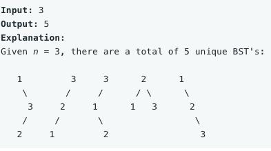

Given n, how many structurally unique BST's (binary search trees) that store values 1 ... n?

Example:

Input: 3

Output: 5



## Analysis

We don't need to find the detail configuration for the trees, so we can use DP.

DP[i]: from 0~i, total number of subtrees
DP[i + 1] = left subtree * right subtree = dp[left to root] * dp[root to right] 

Time Complexity: $O(n^2)$
Space Complexity: $O(n)$

## Code

```c
class Solution {
public:
    int numTrees(int n) {
        int dp[n + 1];
        memset(dp, 0, sizeof dp);
        dp[1] = 1;
        dp[0] = 1;
        for (int i = 2; i <= n; ++i) {
            for (int j = 1; j <= i; ++j) // j is root
                dp[i] += dp[j - 1] * dp[i - j]; // left subtree * right subtree
        }
        return dp[n];
    }
};
```