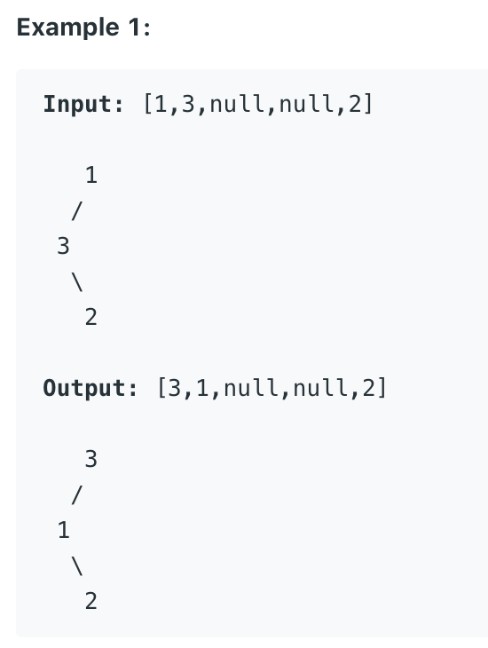
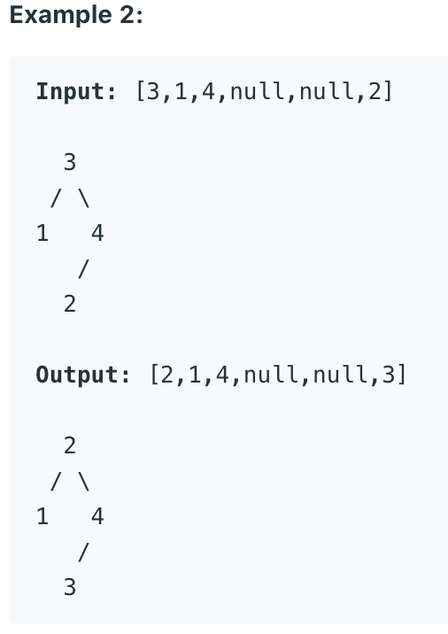

# Recover Binary Search Tree

Two elements of a binary search tree (BST) are swapped by mistake.

Recover the tree without changing its structure.



Follow up:

A solution using O(n) space is pretty straight forward.
Could you devise a constant space solution?

## Analysis

Use in-order tree traverse, we can find that all the left < root > right. If there is any invalid nodes, we should find left(prev) > root. We keep track of last level's root as prev where current root is it's left child.

There are two situations:
1. first isn't populated, so the first two node should be swapped are pre and root.
2. first is populated, then we traverse all the way down to find the last pre that is greater than root.

Time Complexity: $O(n)$ as it's an in-order traversal
Space Complexity: $O(n)$ worst case the tree is a linkedlist

## Code

```c
/**
 * Definition for a binary tree node.
 * struct TreeNode {
 *     int val;
 *     TreeNode *left;
 *     TreeNode *right;
 *     TreeNode() : val(0), left(nullptr), right(nullptr) {}
 *     TreeNode(int x) : val(x), left(nullptr), right(nullptr) {}
 *     TreeNode(int x, TreeNode *left, TreeNode *right) : val(x), left(left),
 * right(right) {}
 * };
 */
class Solution {
 public:
  TreeNode* first = NULL;
  TreeNode* second = NULL;
  TreeNode* prev = new TreeNode(INT_MIN);
  void recoverTree(TreeNode* root) {
    help(root);
    swap(first->val, second->val);
  }

  void help(TreeNode* root) {
    if (root == NULL) return;
    help(root->left);
    if (first == NULL && prev->val > root->val) first = prev;
    if (first != NULL && prev->val > root->val) second = root;
    prev = root;
    help(root->right);
  }

```