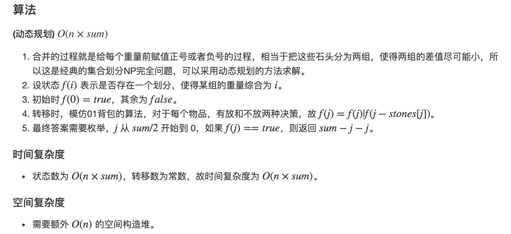

# DP pattern summary

> https://leetcode.com/discuss/general-discussion/458695/Dynamic-Programming-Patterns

## Minimum (Maximum) Path to Reach a Target

Given a target find minimum (maximum) cost / path / sum to reach the target.

### 746. Min Cost Climbing Stairs

You are given an integer array `cost` where `cost[i]` is the cost of `ith` step on a staircase. Once you pay the cost, you can either climb one or two steps.

You can either start from the step with index `0`, or the step with index `1`.

Return *the minimum cost to reach the top of the floor*.

**Example 1:**

```
Input: cost = [10,15,20]
Output: 15
Explanation: You will start at index 1.
- Pay 15 and climb two steps to reach the top.
The total cost is 15.
```

**Example 2:**

```
Input: cost = [1,100,1,1,1,100,1,1,100,1]
Output: 6
Explanation: You will start at index 0.
- Pay 1 and climb two steps to reach index 2.
- Pay 1 and climb two steps to reach index 4.
- Pay 1 and climb two steps to reach index 6.
- Pay 1 and climb one step to reach index 7.
- Pay 1 and climb two steps to reach index 9.
- Pay 1 and climb one step to reach the top.
The total cost is 6.
```

 

**Constraints:**

- `2 <= cost.length <= 1000`
- `0 <= cost[i] <= 999`

dp[i] min cost to reach ith stair.

```c
for (int i = 2; i <= n; ++i) {
  	// on last step, there is no need to proceed further. 
   dp[i] = min(dp[i-1], dp[i-2]) + (i == n ? 0 : cost[i]); 
}
return dp[n]
```

**with optimization**

```c
int p1 = 0, p2 = 0;
for (int i = 2; i <= cost.size(); ++i) {
    int p = min(p1 + cost[i - 1], p2 + cost[i - 2]);
    p2 = p1;
    p1 = p;
}
return p1;
```

### 64. Minimum Path Sum

Given a `m x n` `grid` filled with non-negative numbers, find a path from top left to bottom right, which minimizes the sum of all numbers along its path.

**Note:** You can only move either down or right at any point in time.

 

**Example 1:**


```
Input: grid = [[1,3,1],[1,5,1],[4,2,1]]
Output: 7
Explanation: Because the path 1 → 3 → 1 → 1 → 1 minimizes the sum.
```

**Example 2:**

```
Input: grid = [[1,2,3],[4,5,6]]
Output: 12
```

 

**Constraints:**

- `m == grid.length`
- `n == grid[i].length`
- `1 <= m, n <= 200`
- `0 <= grid[i][j] <= 100`

dp[i][j]: min sum to reach x=i,y=j, dp[i][j] = min(dp[i-1][j], dp[i][j-1]) + cost[i][j]

```c
for (int i = 1; i < n; ++i) {
   for (int j = 1; j < m; ++j) {
       grid[i][j] = min(grid[i-1][j], grid[i][j-1]) + grid[i][j];
   }
}
 
return grid[n-1][m-1]
```

### 322. Coin Change

You are given an integer array `coins` representing coins of different denominations and an integer `amount` representing a total amount of money.

Return *the fewest number of coins that you need to make up that amount*. If that amount of money cannot be made up by any combination of the coins, return `-1`.

You may assume that you have an infinite number of each kind of coin.

 

**Example 1:**

```
Input: coins = [1,2,5], amount = 11
Output: 3
Explanation: 11 = 5 + 5 + 1
```

**Example 2:**

```
Input: coins = [2], amount = 3
Output: -1
```

**Example 3:**

```
Input: coins = [1], amount = 0
Output: 0
```

 

**Constraints:**

- `1 <= coins.length <= 12`
- `1 <= coins[i] <= 231 - 1`
- `0 <= amount <= 104`

dp[j]: min # of coins to be used for j amount

```c
for (int j = 1; j <= amount; ++j) {
   for (int i = 0; i < coins.size(); ++i) { // try all coins
       if (coins[i] <= j) { // only try the one that is less than total required
           dp[j] = min(dp[j], dp[j - coins[i]] + 1);
       }
   }
}
return dp[amount];
```

#### Why this cannot be solved by greedy algorithm?

Exception:
> But for some coin sets, there are sums for which the greedy algorithm fails. For example, for the set {1, 15, 25} and the sum 30, the greedy algorithm first chooses 25, leaving a remainder of 5, and then five 1s for a total of six coins. But the solution with the minimal number of coins is to choose 15 twice.

> In any case where there is no coin whose value, when added to the lowest denomination, is lower than twice that of the denomination immediately less than it, the greedy algorithm works.
i.e. {1,2,3} works because [1,3] and [2,2] add to the same value however {1, 15, 25} doesn't work because (for the change 30) 15+15>25+1

### 931. Minimum Falling Path Sum

Given an `n x n` array of integers `matrix`, return *the **minimum sum** of any **falling path** through* `matrix`.

A **falling path** starts at any element in the first row and chooses the element in the next row that is either directly below or diagonally left/right. Specifically, the next element from position `(row, col)` will be `(row + 1, col - 1)`, `(row + 1, col)`, or `(row + 1, col + 1)`.

 

**Example 1:**


```
Input: matrix = [[2,1,3],[6,5,4],[7,8,9]]
Output: 13
Explanation: There are two falling paths with a minimum sum as shown.
```

**Example 2:**


```
Input: matrix = [[-19,57],[-40,-5]]
Output: -59
Explanation: The falling path with a minimum sum is shown.
```

 

**Constraints:**

- `n == matrix.length == matrix[i].length`
- `1 <= n <= 100`
- `-100 <= matrix[i][j] <= 100`

A[i][j]: min sum from all upper level to current level i and position j, to get the ans, just find the min on the last row

```c
int minFallingPathSum(vector<vector<int>>& A) {
  int m = A.size(), n = A[0].size();
  int res = INT_MAX;
  for (int i = 1; i < m; ++i) {
    for (int j = 0; j < n; ++j) {
      A[i][j] += min(
          {A[i - 1][j], A[i - 1][max(0, j - 1)], A[i - 1][min(m - 1, j + 1)]});
    }
  }
  for (int i = 0; i < n; ++i) res = min(res, A[m - 1][i]);
  return res;
}
```

### 983. Minimum Cost For Tickets

You have planned some train traveling one year in advance. The days of the year in which you will travel are given as an integer array `days`. Each day is an integer from `1` to `365`.

Train tickets are sold in **three different ways**:

- a **1-day** pass is sold for `costs[0]` dollars,
- a **7-day** pass is sold for `costs[1]` dollars, and
- a **30-day** pass is sold for `costs[2]` dollars.

The passes allow that many days of consecutive travel.

- For example, if we get a **7-day** pass on day `2`, then we can travel for `7` days: `2`, `3`, `4`, `5`, `6`, `7`, and `8`.

Return *the minimum number of dollars you need to travel every day in the given list of days*.

 

**Example 1:**

```
Input: days = [1,4,6,7,8,20], costs = [2,7,15]
Output: 11
Explanation: For example, here is one way to buy passes that lets you travel your travel plan:
On day 1, you bought a 1-day pass for costs[0] = $2, which covered day 1.
On day 3, you bought a 7-day pass for costs[1] = $7, which covered days 3, 4, ..., 9.
On day 20, you bought a 1-day pass for costs[0] = $2, which covered day 20.
In total, you spent $11 and covered all the days of your travel.
```

**Example 2:**

```
Input: days = [1,2,3,4,5,6,7,8,9,10,30,31], costs = [2,7,15]
Output: 17
Explanation: For example, here is one way to buy passes that lets you travel your travel plan:
On day 1, you bought a 30-day pass for costs[2] = $15 which covered days 1, 2, ..., 30.
On day 31, you bought a 1-day pass for costs[0] = $2 which covered day 31.
In total, you spent $17 and covered all the days of your travel.
```

 

**Constraints:**

- `1 <= days.length <= 365`
- `1 <= days[i] <= 365`
- `days` is in strictly increasing order.
- `costs.length == 3`
- `1 <= costs[i] <= 1000`

dp[i]: min cost for ith day. Note: if there is no travel plan, the cost will stay the same as the i-1 th day.

```c
int mincostTickets(vector<int>& days, vector<int>& costs) {
  unordered_set<int> travel(begin(days), end(days));
  int dp[366] = {};
  for (int i = 1; i < 366; ++i) {
    if (travel.find(i) == travel.end()) dp[i] = dp[i - 1];
    else dp[i] = min({ dp[i - 1] + costs[0], dp[max(0, i - 7)] + costs[1], dp[max(0, i - 30)] + costs[2]});
  }
  return dp[365];
}
```

### 650. 2 Keys Keyboard

There is only one character `'A'` on the screen of a notepad. You can perform two operations on this notepad for each step:

- Copy All: You can copy all the characters present on the screen (a partial copy is not allowed).
- Paste: You can paste the characters which are copied last time.

Given an integer `n`, return *the minimum number of operations to get the character* `'A'` *exactly* `n` *times on the screen*.

 

**Example 1:**

```
Input: n = 3
Output: 3
Explanation: Intitally, we have one character 'A'.
In step 1, we use Copy All operation.
In step 2, we use Paste operation to get 'AA'.
In step 3, we use Paste operation to get 'AAA'.
```

**Example 2:**

```
Input: n = 1
Output: 0
```

 

**Constraints:**

- `1 <= n <= 1000`

dp[i]: min steps to get to get i 'A' characters.

```c
int dp[n + 1];
memset(dp, 0, sizeof dp);
for (int i = 2; i <= n; ++i) {
    dp[i] = i; // initially assume copy one and paste one by one
    for (int j = i - 1; j >= 1; --j) {
        if (i % j == 0) {
            dp[i] = dp[j] + i / j; // j is the maximum, so no need to check the rest
            break;
        }
    }
}
return dp[n];
```

**Optimize**

```c
int s = 0;
for (int d = 2; d <= n; d++) {
    while (n % d == 0) {
        s += d;
        n /= d;
    }
}
return s;
```

### 279. Perfect Squares

Given an integer `n`, return *the least number of perfect square numbers that sum to* `n`.

A **perfect square** is an integer that is the square of an integer; in other words, it is the product of some integer with itself. For example, `1`, `4`, `9`, and `16` are perfect squares while `3` and `11` are not.

 

**Example 1:**

```
Input: n = 12
Output: 3
Explanation: 12 = 4 + 4 + 4.
```

**Example 2:**

```
Input: n = 13
Output: 2
Explanation: 13 = 4 + 9.
```

 

**Constraints:**

- `1 <= n <= 10^4`

dp[i]: min # of perfect squares to form i

```c
int numSquares(int n) {
    int dp[n + 1], inf = 0x3f3f3f3f;
    memset(dp, inf, sizeof dp);
    for (int i = 0; i <= n; ++i) {
        for (int j = 1; j * j <= i; ++j) {
            if (i - j * j >= 0) dp[i] = min(dp[i], dp[i - j * j] + 1);
            if (j * j == i) dp[i] = 1;
        }
    }
    return dp[n];
}
```

### 1049. Last Stone Weight II

You are given an array of integers `stones` where `stones[i]` is the weight of the `ith` stone.

We are playing a game with the stones. On each turn, we choose any two stones and smash them together. Suppose the stones have weights `x` and `y` with `x <= y`. The result of this smash is:

- If `x == y`, both stones are destroyed, and
- If `x != y`, the stone of weight `x` is destroyed, and the stone of weight `y` has new weight `y - x`.

At the end of the game, there is **at most one** stone left.

Return *the smallest possible weight of the left stone*. If there are no stones left, return `0`.

 

**Example 1:**

```
Input: stones = [2,7,4,1,8,1]
Output: 1
Explanation:
We can combine 2 and 4 to get 2, so the array converts to [2,7,1,8,1] then,
we can combine 7 and 8 to get 1, so the array converts to [2,1,1,1] then,
we can combine 2 and 1 to get 1, so the array converts to [1,1,1] then,
we can combine 1 and 1 to get 0, so the array converts to [1], then that's the optimal value.
```

**Example 2:**

```
Input: stones = [31,26,33,21,40]
Output: 5
```

 

**Constraints:**

- `1 <= stones.length <= 30`
- `1 <= stones[i] <= 100`



```c
int lastStoneWeightII(vector<int>& stones) {
  int n = stones.size(), sum = 0;
  for (int s : stones) sum += s;
  vector<bool> dp(sum + 1, false);
  dp[0] = true;
  for (int i = 0; i < n; ++i) {
    for (int j = sum / 2; j >= stones[i]; --j)
      dp[j] = dp[j] | dp[j - stones[i]];
  }
  for (int i = sum / 2; i >= 0; --i)
    if (dp[i]) return sum - i - i;
  return sum;
}
```

### 120. Triangle

Given a `triangle` array, return *the minimum path sum from top to bottom*.

For each step, you may move to an adjacent number of the row below. More formally, if you are on index `i` on the current row, you may move to either index `i` or index `i + 1` on the next row.

 

**Example 1:**

```
Input: triangle = [[2],[3,4],[6,5,7],[4,1,8,3]]
Output: 11
Explanation: The triangle looks like:
   2
  3 4
 6 5 7
4 1 8 3
The minimum path sum from top to bottom is 2 + 3 + 5 + 1 = 11 (underlined above).
```

**Example 2:**

```
Input: triangle = [[-10]]
Output: -10
```

 

**Constraints:**

- `1 <= triangle.length <= 200`
- `triangle[0].length == 1`
- `triangle[i].length == triangle[i - 1].length + 1`
- `-104 <= triangle[i][j] <= 104`

 

**Follow up:** Could you do this using only `O(n)` extra space, where `n` is the total number of rows in the triangle?

dp[i]: min cost from bottom to i-th row

```c
int minimumTotal(vector<vector<int>>& triangle) {
  vector<int> dp(triangle.back());
  int n = triangle.size();
  for (int i = n - 2; i >= 0; --i) {  // rows
    for (int j = 0; j <= i; ++j) {    // num of elem in each row = i + 1
      dp[j] = min(dp[j], dp[j + 1]) + triangle[i][j]; // left: dp[j], right: dp[j + 1]
    }
  }
  return dp[0];
}
```

### 474. Ones and Zeroes

You are given an array of binary strings `strs` and two integers `m` and `n`.

Return *the size of the largest subset of `strs` such that there are **at most*** `m` `0`*'s and* `n` `1`*'s in the subset*.

A set `x` is a **subset** of a set `y` if all elements of `x` are also elements of `y`.

 

**Example 1:**

```
Input: strs = ["10","0001","111001","1","0"], m = 5, n = 3
Output: 4
Explanation: The largest subset with at most 5 0's and 3 1's is {"10", "0001", "1", "0"}, so the answer is 4.
Other valid but smaller subsets include {"0001", "1"} and {"10", "1", "0"}.
{"111001"} is an invalid subset because it contains 4 1's, greater than the maximum of 3.
```

**Example 2:**

```
Input: strs = ["10","0","1"], m = 1, n = 1
Output: 2
Explanation: The largest subset is {"0", "1"}, so the answer is 2.
```

 

**Constraints:**

- `1 <= strs.length <= 600`
- `1 <= strs[i].length <= 100`
- `strs[i]` consists only of digits `'0'` and `'1'`.
- `1 <= m, n <= 100`

My dp[i][j] means with i zeros and j ones, what is the max strings to be chosen from the strs. In order to calculate it, we find there is a relationship between # of 1 and 0, which is # of 1 + # of 0 = string size, this pattern of constraint usually leads to a knapsack problem. We can visualize it with the problem of knapsack:

1. choose current string means dp[i-# of zero for current string][j - # of one for current string] + 1.
2. not choose current string means dp[i][j] which means there is nothing changed as previous state.
Why it has to start from m, n and decrease to 1 (or making sure there is at least # of 0 or 1 spots left in our case)? Because it prevents invalid counting. As we can see, our dp[m][n] is going to be updated sz times, and before we calculate i - zero[k] and j - one[k], they has to be valid. If we start from 0 and increase to m, n, these values will never be updated beforehand.

```c
int findMaxForm(vector<string>& strs, int m, int n) {
  int sz = strs.size();
  int one[sz], zero[sz];
  for (int i = 0; i < sz; ++i) {
    int c1 = 0, c2 = 0;
    for (char c : strs[i]) {
      if (c == '1') c2++;
      if (c == '0') c1++;
    }
    zero[i] = c1, one[i] = c2;
  }
  int dp[m + 1][n + 1];
  memset(dp, 0, sizeof dp);
  for (int k = 0; k < sz; ++k) {
    for (int i = m; i >= zero[k]; --i) {
      for (int j = n; j >= one[k]; --j) {
          dp[i][j] = max(dp[i][j], dp[i - zero[k]][j - one[k]] + 1);
      }
    }
  }
  return dp[m][n];
}
```

### 221. Maximal Square

Given an `m x n` binary `matrix` filled with `0`'s and `1`'s, *find the largest square containing only* `1`'s *and return its area*.

 

**Example 1:**


```
Input: matrix = [["1","0","1","0","0"],["1","0","1","1","1"],["1","1","1","1","1"],["1","0","0","1","0"]]
Output: 4
```

**Example 2:**


```
Input: matrix = [["0","1"],["1","0"]]
Output: 1
```

**Example 3:**

```
Input: matrix = [["0"]]
Output: 0
```

 

**Constraints:**

- `m == matrix.length`
- `n == matrix[i].length`
- `1 <= m, n <= 300`
- `matrix[i][j]` is `'0'` or `'1'`.


Here the`dp[i][j]`the same as `matrix[i][j]`, and it means the maximum width of the square that includes `matrix[i][j]` as the right down side of the resulting square. To expand the area to any directions (right, down), we check the `matrix[i][j-1]`, `matrix[i-1][j]` and `matrix[i-1][j-1]` and choose the minimal from them. The final answer is the maximum `matrix[i][j] * matrix[i][j]` from all the values we have filled.

```c++
for (int i = 0; i < m; ++i) {
  for (int j = 0; j < n; ++j) {
    if (matrix[i][j] == '0' || i == 0 || j == 0) continue;
    matrix[i][j] = min({matrix[i][j - 1] - '0', 
                        matrix[i - 1][j] - '0', 
                        matrix[i - 1][j - 1] - '0'}) + '1';
    res = max(res, matrix[i][j] - '0');
  }
}
return res * res;
```

### 1240. Tiling a Rectangle with the Fewest Squares

[analysis link](../../1240.-Tiling-a-Rectangle-with-the-Fewest-Squares)

### 174. Dungeon Game

[analysis link](../../0174.-Dungeon-Game)


# Distinct Ways

# Merging Intervals

# DP on Strings

# Decision Making