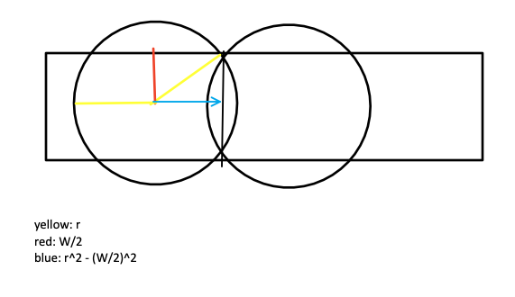

「一本通 1.1 例 3」喷水装置

https://loj.ac/problem/10002

# Analysis



每次记录中心点的两端，两端只能取蓝色的长度，因为只有蓝色长度才可以保证所有的点从中心点到终点是完全cover到的。然后根据左点排序（从小到大），每次greedy取可以cover到的最右点，当可以取到的最右点比当前的面积的长度要大的时候，那么便停止。

# Code

```c
/*
 * 喷水装置.cpp
 * Copyright (C) 2020 Haoyang <peter@peterchen.xyz>
 *
 * Distributed under terms of the MIT license.
 */
#include <bits/stdc++.h>
using namespace std;
const int maxn = 2e4 + 5;
int cnt;
int n, L, W;
struct line {
  double x, y;
};
line lines[maxn];
bool cmp(line a, line b) { return a.x < b.x; }
void read() {
  cin >> n >> L >> W;
  cnt = 0;
  int x, r;
  for (int i = 1; i <= n; i++) {
    cin >> x >> r;
    if (r <= W / 2) continue; // skip if height cannot cover
    cnt++;
    double len = sqrt(r * r - W * W / 4.0); // blue len 
    lines[cnt].x = x - len;
    lines[cnt].y = x + len;
  }
}
void work() {
  sort(lines + 1, lines + cnt + 1, cmp);
  double last = 0;
  int ans = 0;
  while (last < L) {
    ans++;
    double s = last;
    for (int i = 1; i <= cnt; i++) {
      if (lines[i].x <= s) {
        last = max(last, lines[i].y);
      } else {
        break;
      }
    }
    if (last == s && s < L) {
      cout << -1 << endl;
      return;
    }
  }
  cout << ans << endl;
}
int main() {
  int k;
  cin >> k;
  for (int j = 0; j < k; j++) {
    read();
    work();
  }

  return 0;
}

```

