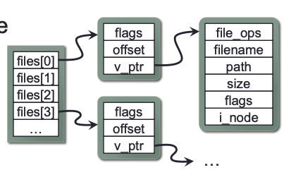
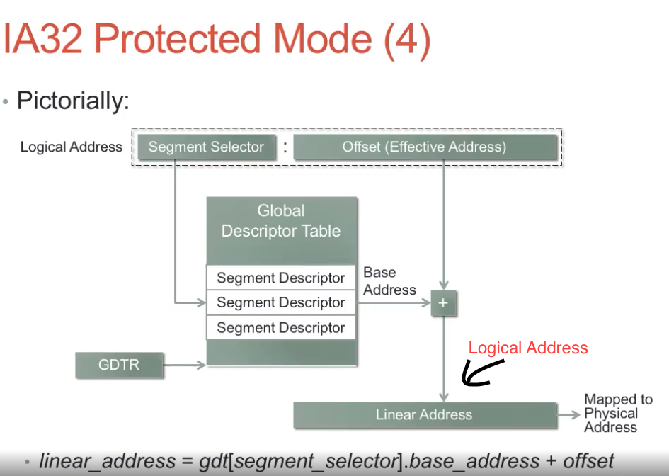

## Protection and Security

* Feature 1: multiple processor operating modes -- kernel mode (part of OS running) + user mode
* Feature 2: virtual memory
  1. The processor maps virual address with physical address using a page table
  2. The memory management unit (MMU) performs this translation
  3. Translation Lookaside Buffer (TLB) cache page table entries to avoid memory access overhead when translating address.
  4. Only the kernel can manipulate the MMU's configuration. -- if user-mode code tries to access kernel space, processor notifies OS.
  5. Virual memory allows OS to give each process its own isolated address space.

## Console and FileIO

* read and write for standard input: 
  1. `basic_istream& read( char_type* s, std::streamsize count );`: read `count` size of input from `s`.
  2. `basic_ostream& write( const char_type* s, std::streamsize count );`: write `count` size of data input `s`.
  3. EOF indicates by 0 return-value, error indicated by values < 0.
  4. Both `read` and `write` are syscalls, which takes a long time (milliseconds or microseconds because of context switches to another proces until I/O subsystem fires an interrupt to signal completion).
  5. `filedes`: file descriptor (ID represents a specific file or device). If there are multiple files open, all the `filedes` will be stored in an array (as pointers pointing to file object). Each file consists of current read/write offset within the file.
  

## UNIX command shell Operation

1. Wait for a command to be entered on the shell's stdin
2. Tokenize the command into an array of `tokens`
3. If `token[0]` is an internal shell command, then handle the internal command and go back to 1.
4. Otherwise, `fork()` off a child process to execute the program. `wait()` for the child process to terminate, then go back to 1.

**child process**
1. If the parsed command specifies any redirection, modify stdin/stdout/stderr based on the command, and remove these tokens from the tokenized command
2. `execve()` the program specified in `tokens[0]`, passing tokens as the program’s arguments
3. If we got here, execution failed (e.g. file not found)! Report error.

## IA32 Architecture

* supports several different memory addressing mechanisms
* IA32 has a segmented memory model: mapping from logical to linear address
 - linear_address = gdt[segment_selector].base_address + offset
